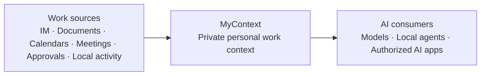
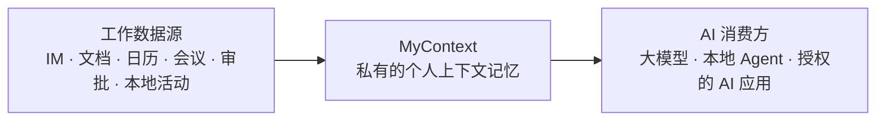

# MyContext

**English** | [中文](#mycontext我的上下文)

## Your work already has context. MyContext makes it usable.

MyContext is a persistent personal work context layer for every individual. It is designed to connect the signals scattered across instant messaging, documents, calendars, meetings, approvals, local activity, and other work sources, then continuously organize them into a private, evolving view of what you know, who you work with, and what you are working on.

Instead of making every AI start from an empty prompt, MyContext provides a durable context layer that large language models, local agents, and authorized external AI applications can retrieve from and reason over. Your personal context stays under your control, and consequential actions stay behind explicit approval.

## Core experiences

### Personal context graph

MyContext connects people, projects, topics, events, conversations, and supporting facts into a personal context graph. You can explore relationships from your own point of view, follow connections across sources, and return to the underlying evidence instead of relying on isolated summaries.

### Digital self

Your digital self uses your personal context, communication patterns, and relationship-specific history to help handle everyday work conversations. It can understand incoming messages, recall relevant background, and prepare replies in your style. You remain in control: sending and other consequential actions require explicit authorization.

### Search and answers

Ask questions across your work history in natural language. MyContext combines local full-text search, semantic retrieval, and graph queries, then lets an agent assemble an answer with traceable source material. If the agent runtime is unavailable, search falls back to ranked local results instead of silently inventing an answer.

## From many sources to one personal context

MyContext separates source access from context consumption:

- **Source connectors** bring in authorized data from different work systems through a shared interface.
- **Incremental ingestion** keeps local copies current, tracks progress, and fills gaps without rereading everything.
- **Local storage** preserves conversations, documents, source references, indexes, and derived context in the user's own data directory.
- **Context processing** turns raw work records into structured facts, personal preferences, relationship context, and reusable working knowledge.
- **Retrieval and graph services** combine full-text search, semantic similarity, entity relationships, and source-scoped evidence.
- **Agent runtime** gives search and the digital self controlled access to the context they need, with isolated workspaces and scoped permissions.
- **Action guardrails** keep sending, deletion, and other consequential operations behind explicit user confirmation.

## Data sources

The current codebase includes working ingestion paths for instant messaging conversations, documents, and meeting records. The source model is designed to expand to calendars, tasks and approvals, mail, local work artifacts, agent interactions, and additional online or offline sources without coupling the rest of the product to any single provider.

MyContext is not intended to become another silo. Its role is to connect personal work data once, maintain a coherent personal context over time, and make that context available to the AI tools the user chooses.

## Architecture

The repository is organized into independent layers:

- **Channels** — authorization, source discovery, reading, and controlled actions across work systems.
- **Ingest** — scheduling, normalization, checkpoints, retries, and incremental synchronization.
- **Store** — the local database, migrations, source records, message indexes, and user-scoped state.
- **Context pipeline** — structured personal context, preferences, relationships, and evidence processing.
- **Retrieval** — full-text and semantic recall with source references.
- **Knowledge graph** — entity, fact, relationship, and community processing and queries.
- **Persona** — the digital-self runtime, conversation policy, context recall, drafting, and safety controls.
- **Agent runtime** — isolated agent sessions, tool access, streaming events, and model gateway configuration.
- **Desktop** — the Electron and React application that brings the system together.

## Principles

- **Personal context first** — organize information around the individual, not around the application that produced it.
- **Local by default** — personal work data and indexes live on the user's machine.
- **Multiple sources, one context** — preserve source boundaries while linking related information across them.
- **Evidence before answers** — keep source references available for review and verification.
- **AI is a consumer, not the owner** — models and agents use the context through controlled interfaces; the user owns the data and permissions.
- **Human control over actions** — irreversible or externally visible operations require explicit confirmation.

## Status

MyContext is under active development. Its core desktop flow, local data layer, search and answer experience, personal context graph, and digital-self workflow are implemented, while supported sources and external integrations continue to expand. Treat it as an evolving working prototype rather than a finished product. Issues and pull requests are welcome.

## License

Licensed under the [Elastic License 2.0](./LICENSE) — a source-available license: you may use, modify, and self-host it (including inside a company), but you may not offer it to third parties as a hosted or managed service. See [LICENSE](./LICENSE) for the full terms; third-party components under `kl-graph/` and `vendor/` keep their own licenses.

---

# MyContext（我的上下文）

[中文](#mycontext我的上下文) | [English](#mycontext)

## 你的工作本来就有上下文，MyContext 让它真正可用

MyContext 是为每个人构建的个人工作上下文记忆层。它面向即时通讯、文档、日历、会议、审批、本地活动及其他线上线下工作数据源，将原本散落的信息持续整理为一份私有、可演进的个人上下文：你知道什么、你在和谁协作、你正在推进什么。

MyContext 不让每个 AI 都从一段空白提示词重新开始，而是提供一层可持续使用的上下文，让大模型、本地 Agent 和经过授权的外部 AI 应用能够检索、理解并使用这些信息。个人上下文始终由用户掌控，有实际后果的操作始终需要明确授权。

## 核心产品能力

### 记忆图谱

MyContext 将人物、项目、话题、事件、会话和相关事实连接成个人记忆图谱。用户可以从“我”的视角探索关系，沿着不同数据源之间的线索继续追溯，并回到原始依据，而不是只看到彼此孤立的摘要。

### 数字分身

数字分身使用你的个人上下文、沟通习惯和针对不同关系的历史信息，辅助处理日常工作对话。它可以理解新消息、召回相关背景，并以你的表达方式准备回复。控制权仍属于你：发送消息和其他有实际后果的操作需要明确授权。

### 搜索问答

用自然语言询问自己的工作历史。MyContext 结合本地全文检索、语义召回和图谱查询，再由 Agent 基于可追溯的来源组织答案。当 Agent 运行环境不可用时，搜索会明确降级为本地相关结果，而不是悄悄生成没有依据的答案。

## 从多个数据源到一份个人上下文

MyContext 将数据源接入与上下文消费解耦：

- **数据源连接器**：通过统一接口接入用户授权的不同工作系统。
- **增量采集**：持续更新本地副本，记录进度并补齐缺口，避免每次全量重读。
- **本地存储**：在用户自己的数据目录保存对话、文档、来源引用、索引和派生上下文。
- **上下文处理**：将原始工作记录整理为结构化事实、个人偏好、关系上下文和可复用的工作知识。
- **检索与图谱服务**：组合全文检索、语义相似度、实体关系和限定来源范围的事实依据。
- **Agent 运行时**：通过隔离工作区和权限范围，让搜索问答与数字分身只访问完成任务所需的上下文。
- **操作安全闸**：发送、删除和其他有实际后果的操作始终需要用户明确确认。

## 数据源

当前代码已经打通即时通讯对话、文档和会议记录的采集链路。统一数据源模型可以继续扩展到日历、待办与审批、邮件、本地工作产物、Agent 交互，以及更多线上或线下来源，而不让产品其他模块绑定某一个具体平台。

MyContext 不希望成为另一个信息孤岛。它的作用是一次连接个人工作数据，持续维护统一的个人上下文，再将这份上下文提供给用户选择的 AI 工具。

## 技术架构

仓库按职责拆分为相互独立的层：

- **Channels** — 工作系统的授权、数据源发现、读取与受控操作。
- **Ingest** — 调度、标准化、检查点、重试和增量同步。
- **Store** — 本地数据库、迁移、来源记录、消息索引和用户级状态。
- **Context Pipeline** — 处理结构化个人上下文、偏好、关系和事实依据。
- **Retrieval** — 带来源引用的全文与语义召回。
- **Knowledge Graph** — 实体、事实、关系、社区的处理与查询。
- **Persona** — 数字分身运行时、会话策略、上下文召回、回复起草与安全控制。
- **Agent Runtime** — 隔离的 Agent 会话、工具访问、流式事件与模型网关配置。
- **Desktop** — 将各层组合到一起的 Electron 与 React 桌面应用。

## 产品原则

- **个人上下文优先**：围绕用户本人组织信息，而不是围绕产生信息的应用组织。
- **默认本地**：个人工作数据与索引保存在用户自己的机器上。
- **多个数据源，一份记忆**：保留来源边界，同时连接不同来源中的相关上下文。
- **先有依据，再有答案**：保留来源引用，支持回看和验证。
- **AI 是使用方，不是所有者**：模型和 Agent 通过受控接口使用上下文，数据与权限归用户所有。
- **操作由人掌控**：不可逆或对外可见的操作需要明确确认。

## 当前状态

MyContext 正在持续开发中。桌面端核心流程、本地数据层、搜索问答、记忆图谱和数字分身工作流已经实现，数据源覆盖与外部集成仍在扩展。现阶段请将它视为一个持续演进的可用原型，而不是已经完成的产品。欢迎提交 issue 与 PR。

## 许可

采用 [Elastic License 2.0](./LICENSE) —— 一份「源码可用」许可：可以使用、修改、自行部署（含在企业内部使用），但**不得将其作为托管/管理服务提供给第三方**。完整条款见 [LICENSE](./LICENSE)；`kl-graph/` 与 `vendor/` 下的第三方组件各自适用其自身许可。
