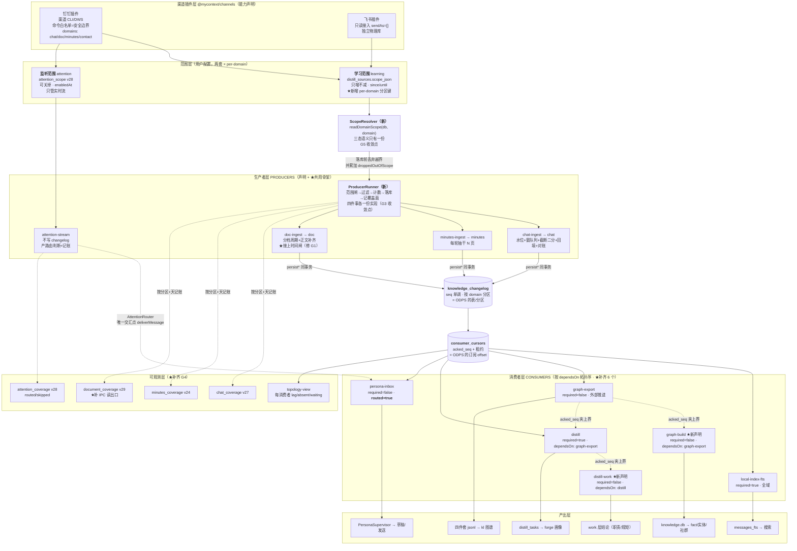
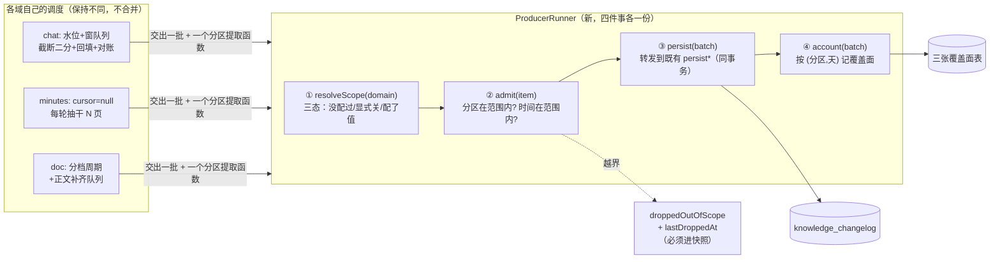
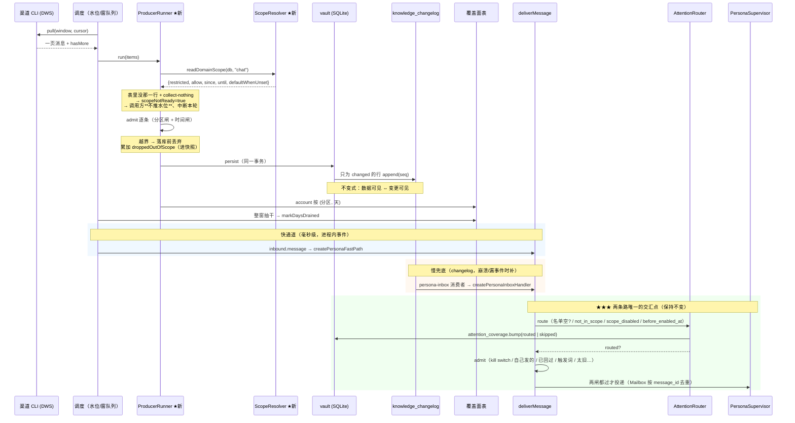
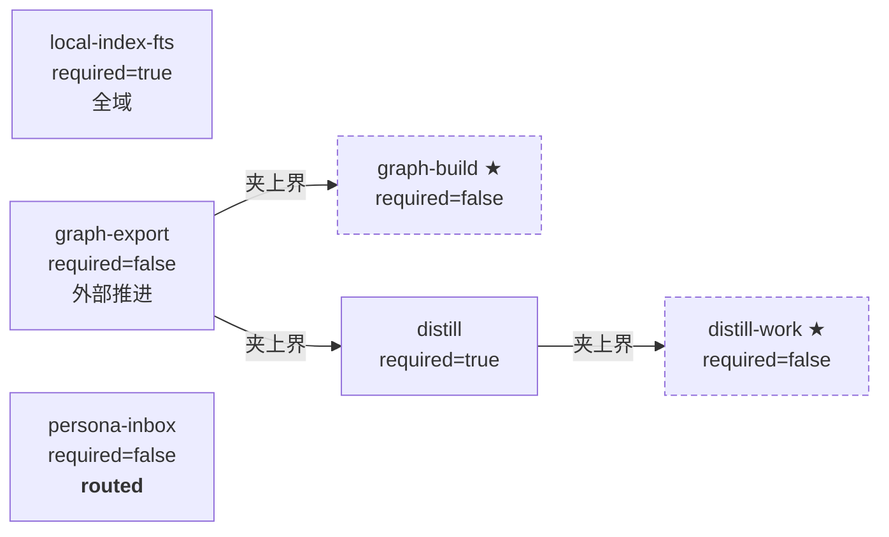

# 渠道数据平面 v2：生产者 / 消费者 / 路由的完整架构方案

> **状态：已实施 + CDP 实测通过。** 五个阶段全部落地，见文末 §12「实施结果」。
>
> 前一版落地文档在 `docs/design/channel-data-plane.md`。那份文档描述的骨架
> **确实已经在代码里**（我逐个文件核过，见 §1）。本文回答的是另一个问题：
> 那个骨架离「一套最好扩展的生产者/消费者配置」还差什么，以及差的那几处
> **各自是什么性质的缺口**（有的是正确性 bug，有的只是声明没收敛）。
>
> ★ 下面 §0–§11 是**规划时**写的，刻意保留原样（包括那些后来被实测推翻的
> 判断）—— 实施过程中发现的偏差集中记在 §12，那样"计划与现实的差距"本身
> 是可读的。实施中**新发现了两个规划时不知道的缺口**（G8 / G9），
> 其中一个是正在发生的隐私问题。

---

## 0. 先说结论

现状不是「没有 ODPS 式架构」，而是**这套架构只覆盖了链路的下半段**：

```
渠道 CLI ──→ 采集器 ──→ vault 规范表 ──→ knowledge_changelog ──→ 消费者
             ↑                                    ↑
        这一段是手写的                       这一段是声明式的（已 ODPS 化）
        每个域一套独立调度                    PRODUCERS/CONSUMERS/runCycle
        三个 tick 各自实现范围闸
```

所以这一版要做的事可以概括成一句话：**把生产者侧也变成声明式的**，
让「域 → 生产者 → 范围闸 → 覆盖面记账 → changelog」这条链在每个域上
走同一段代码，而不是三份长得像的实现。

七个缺口，按性质分三类（详见 §3）：

| #   | 缺口                                       | 性质         | 严重度 |
| --- | ------------------------------------------ | ------------ | ------ |
| G1  | 文档采集**完全不看**学习范围的时间下界     | 隐私/正确性  | 高     |
| G2  | 两个真实消费者不在 `CONSUMERS` 声明里      | 可观测性缺失 | 中     |
| G3  | 生产者只有声明、没有共用执行骨架           | 扩展性       | 中     |
| G4  | 三种覆盖面的读出口不齐（doc/attention 缺） | 可观测性缺失 | 中     |
| G5  | 范围闸的三态语义在三个域上不一致           | 正确性隐患   | 中     |
| G6  | 域没有「per-domain 范围」这个概念          | 扩展性       | 低     |
| G7  | `local-index-vector` 声明了但从未接线      | 声明漂移     | 低     |

---

## 1. 现状核对（哪些已经是真的）

我读了这些文件确认骨架存在，不是文档里的愿望：

| 概念               | 文件                                               | 状态                                      |
| ------------------ | -------------------------------------------------- | ----------------------------------------- |
| 拓扑声明 + 自检    | `packages/ingest/src/topology.ts:98-358`           | ✅ `DOMAINS`/`PRODUCERS`/`CONSUMERS` 都在 |
| 拓扑序驱动         | `topology.ts:445` `runCycle`                       | ✅ 被 `ingest.service.ts:2588` 真的调用   |
| 依赖闸（夹上界）   | `packages/ingest/src/consumer.ts:141-171`          | ✅ 夹到上游 `acked_seq`，上游缺席时不夹   |
| 同事务写 changelog | `packages/ingest/src/outbox.ts:64,165,231`         | ✅ 三个域各有 `persist*`，都在一个事务里  |
| 监听范围路由器     | `packages/store/src/attention-router.ts`           | ✅ 挂在 `deliverMessage`（两条路交汇点）  |
| 学习范围唯一权威   | `packages/store/src/collection-scope.ts`           | ✅ 纯函数，采集/蒸馏/导出都调它           |
| 覆盖面共用基类     | `packages/store/src/repositories/coverage-base.ts` | ✅ chat(v27)/document(v29) 共用五条判据   |
| 引导两步分开       | `onboarding/{sources,attention}-step.tsx`          | ✅ `attention` 已是独立步（`a8701b8a`）   |
| 状态页拓扑卡       | `shell/data-plane-topology-panel.tsx`              | ✅ 区分 absent/waiting/lagging/rebuild    |

**所以本方案不重写这些。** 用户说「可以完全重构」，但重写 `OutboxConsumer`
就是把租约抢占、`acked_seq` 重放、`required` 与裁剪的关系重新踩一遍 ——
那些注释里记的每一条都对应一次实测事故。要重构的是**生产者侧**。

---

## 2. 领域模型：两个范围 + 三层数据

### 2.1 两个范围（保持现有语义，补齐 per-domain 维度）

|          | **学习范围** learning                       | **监听范围** attention       |
| -------- | ------------------------------------------- | ---------------------------- |
| 回答     | 往回挖多少历史、挖哪些会话/空间             | 盯哪些会话的**新**消息       |
| 存储     | `distill_sources.scope_json`（per kind）    | `attention_scope`（v28）     |
| 时间语义 | `since`/`until`，可回溯                     | `enabledAt`，**不回溯**      |
| 决定     | 什么数据**进库**（进而进 changelog）        | 什么数据**投给分身管控层**   |
| 能否变小 | **不能**（只增不减）                        | **能**（`active=0`，不删行） |
| 消费者   | fts / graph-export / distill / distill-work | persona-inbox                |
| 配置入口 | 引导第 4 步 + 设置页                        | 引导第 5 步 + 设置页         |

「只增不减」只约束学习范围，判据是**缩小会不会让已有产出与配置矛盾**：
图谱/画像/FTS 都派生自学习范围，缩小后图里仍有那段知识（配置说没学过、
产出说学过）；而 `attention_scope` 不被任何消费者的产出引用
（`knowledge-feed`/`distill`/`persona` 三个包零引用），关掉它不可能让
任何产出不自洽。混成一条规则会得出「用户永远无法让分身停下来」的荒谬结论。

### 2.2 三层数据（ODPS 术语对齐）

| ODPS 概念      | 这里                                | 落点                             |
| -------------- | ----------------------------------- | -------------------------------- |
| ODS（原始层）  | `raw_records`（未裁剪原始 JSON）    | `repositories/raw-records.ts`    |
| DWD（明细层）  | `messages`/`minutes`/`documents`    | 各自 repository                  |
| 表/分区        | `knowledge_changelog`，按 `domain`  | `v2-raw-normalized`              |
| 订阅 offset    | `consumer_cursors.acked_seq` + 租约 | `repositories/changelog.ts`      |
| 任务依赖 DAG   | `ConsumerSpec.dependsOn`            | `topology.ts`                    |
| 数据质量卡点   | `required`（落后时不许裁历史）      | `retention.ts:390` retainableSeq |
| 路由/分发      | `AttentionRouter`                   | `store/attention-router.ts`      |
| 作业调度一轮   | `runCycle()`                        | `topology.ts:445`                |
| 元数据自检     | `checkTopologyConsistency()`        | `topology.ts:297`                |
| **生产者作业** | **← 这一层现在没有共用骨架**        | **本方案 §4.2 要补**             |

---

## 3. 七个缺口（每条都给了核对位置）

### G1 — 文档采集完全不看学习范围的时间下界 【隐私/正确性，高】

**事实**：`runDocuments()`（`ingest.service.ts:1498`）第一行就是
`await documents.list({})` —— 一个空 spec。而 `documentsTimeRange` 这个方法
**在整个文件里出现 0 次**（我 grep 过），也就是不存在。对比听记那侧：
`runMinutes()` 有 `minutesTimeRange()`（`:1357`）且每轮现读、透传 since/until。

而**引导确实给 doc 写了 since/until**：`onboarding-view.tsx:537-540` 的保存
循环对非 chat 源写 `{since, until}`。

后果：用户在引导里选「学最近 30 天」，文档侧会把知识库里**全部历史文档**
拉回来并落库、发 changelog、进图谱与画像。按 CLAUDE.md §5，
「严格遵守用户在引导里选的范围。超范围采集是隐私问题，不是"多采点没坏处"」
—— 这一条正在被违反。

**这个缺口有一个放大器**：`ChannelDocuments.list()` 的契约
（`channels/src/types.ts:641`）**没有 since/until 参数**，只有 cursor/limit。
所以修它不只是"补一个 range 参数"，而是要先决定过滤在哪一层做（见 §5.1）。

### G2 — 两个真实消费者不在声明里 【可观测性，中】

`CONSUMERS` 声明了 4 个。而实际会往 `consumer_cursors` 注册的有 **6 个**：

| consumer_id        | 注册点                         | 在 `CONSUMERS` 里？ |
| ------------------ | ------------------------------ | ------------------- |
| `local-index-fts`  | `ingest.service.ts:1035`       | ✅                  |
| `distill`          | `ingest.service.ts:1036`       | ✅                  |
| `persona-inbox`    | `ingest.service.ts:1037`       | ✅                  |
| `graph-export`     | `graph-sync.ts:168`            | ✅                  |
| **`graph-build`**  | `graph-sync.ts:170`            | ❌ **缺**           |
| **`distill-work`** | `distill.service.ts:1096,1444` | ❌ **缺**           |

`graph-build` 的水位正是仪表盘那句「图谱只消化了 X%」的分母
（`dashboard-trends.service.ts:227` 直接按字符串 `"graph-build"` 读它）。
它不在声明里的三个后果：

1. **状态页的拓扑卡看不到它** —— 而它恰恰是最容易卡住的那个（建图是小时级）；
2. **`buildConsumerStatuses` 按 `CONSUMERS` 遍历**（`topology-view.ts:109`），
   所以游标表里有行、界面上没有这一行 —— 反过来 §4.1 那条自检也抓不到；
3. `dashboard-trends.service.ts` 只能**硬编码字符串**读它，
   而 `topology.test.ts` 那条「id 必须与真实常量一致」的门禁管不到它。

### G3 — 生产者只有声明、没有共用执行骨架 【扩展性，中】

`PRODUCERS`（`topology.ts:147`）是**纯声明**，注释里明写「这里只声明，
不含写入实现」。而三个域的执行各自手写在 `ingest.service.ts` 里：

| 域      | tick            | 调度                                   | 范围闸                                     | 覆盖面记账              |
| ------- | --------------- | -------------------------------------- | ------------------------------------------ | ----------------------- |
| chat    | `tickPull:2206` | 水位 + 窗队列 + 截断二分 + 回填 + 对账 | `persist():3428` 逐条判两个谓词            | `ChatCoverage` @2395    |
| minutes | `tickMinutes`   | 每轮从 cursor=null 抽干 20 页          | `minutesTimeRange():1357` 透传 since/until | `MinutesCoverage`       |
| doc     | `tickDocuments` | 分档周期 + 正文补齐队列                | **无**（G1）                               | `DocumentCoverage`@1583 |

这三段调度**确实应该不同**（消息有水位语义、听记没有、文档要补正文），
所以不是"合并成一个 tick"。但下面这四件事在三个域上是**同一件事**，
现在有三份：

1. 读这个域的范围（三态：没配过 / 显式关 / 配了值）；
2. 按范围过滤（丢弃越界的，并**累加一个可见的丢弃计数**）；
3. 落库 + 同事务发 changelog；
4. 按 (分区, 天) 记覆盖面 + 抽干时 `markDaysDrained`。

而这四件事每一件都有踩过的坑：三态判错 = 采全部（G5）、丢弃不计数 =
静默漏采、覆盖面五条判据抄错 = 数字静默偏移。所以它们该有**一份实现**。

### G4 — 三种覆盖面的读出口不齐 【可观测性，中】

用户原话要「显示出来要多少和共已经有了多少了，**不管是消息还是听记，
文档等**」。三张表都写了，但**读出口只有消息那一条完整**：

| 域        | 写入                        | IPC 读出口                                                         | UI                      |
| --------- | --------------------------- | ------------------------------------------------------------------ | ----------------------- |
| chat      | `chat_coverage` v27 ✅      | `chatCoverage`（`contract.ts:56`）✅                               | `scope-coverage.tsx` ✅ |
| minutes   | `minutes_coverage` v24 ✅   | 塞在 `IngestSnapshot.minutesCoverage`（只有 `drained` 一个布尔）⚠️ | 仪表盘一句 hint ⚠️      |
| doc       | `document_coverage` v29 ✅  | **无**（只有 `DocumentCoverageRepository` 在主进程被写）❌         | **无** ❌               |
| attention | `attention_coverage` v28 ✅ | 塞在 `attentionScope` 返回里 ✅                                    | 需确认面板是否展示 ⚠️   |

`document_coverage` 的整套聚合方法（`listDays`/`summarize`/`listBySpace`）
在 `apps` 侧**零调用** —— 表在写、没人读。这正是「两类能回答、一类不能」
那个最难解释的状态，v29 的文件头自己写了这句话，而读出口没跟上。

### G5 — 范围闸三态语义在三个域上不一致 【正确性隐患，中】

同一个问题「表里没有这一行怎么办」，三个域给了**三个不同的答案**：

| 域      | 判据位置                  | 「没配过」时                        |
| ------- | ------------------------- | ----------------------------------- |
| chat    | `collection-scope.ts:121` | **一个都不采**（restricted + 空集） |
| minutes | `ingest.service.ts:1330`  | **默认开、不限时间**                |
| doc     | `ingest.service.ts:1398`  | **默认开、不限时间**                |

chat 那个方向是对的且有长注释解释（默认值只能是空，否则「清空渠道数据」
会变成陷阱）。minutes/doc 那个方向的理由也写了（引导默认勾了它们）。
**两个理由都成立** —— 问题不是哪个对，而是**这个判据分散在三处**，
每处一份三态判断，加第四个域时会出现第四个答案。

而且已经有一处**明确记着的隐患**：`minutesTimeRange` 的注释自己写了
「拿 chat 的范围去卡听记在这个应用里恰好等价，但那是**巧合而不是契约**
—— 用户将来能分源配范围时就错了，而错的方向是采了不该采的」。

### G6 — 域没有「per-domain 范围」这个概念 【扩展性，低】

`DistillScope`（`onboarding.ts:71`）的字段是
`{since, until, chatKinds, conversationIds}` —— 全部是**聊天**的概念。
文档要按**空间**（`workspace_id`）切范围时没有字段可用；
`document_coverage` 已经按空间分区了，而范围侧没有对应物。

后果：用户只能"要么全部知识库、要么一个都不要"。

### G7 — `local-index-vector` 声明了但从未接线 【声明漂移，低】

`VECTOR_CONSUMER_ID = "local-index-vector"` 与 `createVectorHandler` 都导出了
（`local-index.ts:29,119`），但 grep 全仓：**apps 侧零引用**，
只有 `packages/ingest/src/index.ts` 的 re-export。它也不在 `CONSUMERS` 里。

这一条与 G2 相反：G2 是「跑着但没声明」，这是「有实现但没跑」。
两者都是声明与事实的分歧，只是方向不同。**这一条的正确处理可能是"不接"**
（见 §7），但要在声明里说清，而不是留一个看不出状态的导出。

---

## 4. 架构设计

### 4.1 全景图



### 4.2 生产者骨架（G3 的收敛点，本方案的核心新增）

这是唯一一处真正的"重构"。做法是把三个域**重合的那四件事**抽成一个类，
而各自的**调度**（水位/翻页/正文补齐）留在原处。



**为什么这样切**（判据）：

- 骨架收的是**判据**（范围三态、越界怎么算、覆盖面五条），
  那些是抄错就静默出错的东西；
- 骨架**不收调度**（水位不变式、截断二分、正文配额），
  那些各域天生不同，硬合并会让 chat 那段本已很难的水位逻辑再加分支 ——
  而水位算错是这条链路上最贵的错误（永久漏采或永久重拉）。

**接口形状**（`packages/ingest/src/producer.ts`，新文件）：

```ts
// 一个域的生产者运行时。★ 不含调度 —— 调度在调用方。
export interface DomainProducer<TItem> {
  readonly domain: DataDomain
  /** 从一个 item 取分区键（会话 external_id / 空间 external_id） */
  partitionOf(item: TItem): string
  /** 从一个 item 取业务时间（分桶与时间闸都用它） */
  occurredAtOf(item: TItem): number
  /** 落库 + 同事务发 changelog。转发到既有 persistBatch/persistMinutes/persistDocuments */
  persist(items: readonly TItem[]): { changed: number; unchanged: number; seqs: number[] }
  /** 覆盖面记账。转发到对应的 CoverageRepositoryBase 子类 */
  account(input: {
    partitionId: string
    dayBucket: string
    delta: number
    listedTotal?: number | null
    drained?: boolean
  }): void
}

export interface ProducerRunResult {
  changed: number
  unchanged: number
  /** ★ 必须暴露：静默丢弃是本仓库最贵的那类 bug */
  droppedOutOfScope: number
  /** ★ 范围还没就绪（表里没有那一行）→ 调用方必须**不推水位**并中断本轮 */
  scopeNotReady: boolean
}
```

`scopeNotReady` 保留为一等公民：`ingest.service.ts:2320` 那段注释记了
一次真实事故 —— 采集比范围行先跑、拉到的消息全被丢、水位照常前移，
于是那批消息**永远回不来**。这个字段是那次修复的产物，不能在重构里丢掉。

### 4.3 范围解析器（G5 + G6 的收敛点）

```ts
// packages/store/src/domain-scope.ts（新）
export interface DomainScope {
  /** 是否设了分区白名单。false = 不设限 */
  restricted: boolean
  /** 许可的分区（会话/空间 external_id）。restricted=false 时无意义 */
  allow: ReadonlySet<string>
  since: number | null | undefined // null=显式不限；undefined=没配过
  until: number | undefined
  enabled: boolean
  /** ★ 这个域「没配过」时的缺省方向 —— 见下表，由域自己声明 */
  defaultWhenUnset: "collect-nothing" | "collect-all"
}
```

**`defaultWhenUnset` 必须是域声明的一部分，不是解析器里的 if-else**：

| 域      | 缺省方向          | 理由（代价不对称的方向不同）                               |
| ------- | ----------------- | ---------------------------------------------------------- |
| chat    | `collect-nothing` | 默认放宽是隐私事故；且「清空渠道数据」后读成不限会全量拉回 |
| minutes | `collect-all`     | 引导默认勾了它，收紧 = 功能静默消失                        |
| doc     | `collect-all`     | 同上                                                       |

把它写进 `DomainSpec` 之后，第四个域接进来时**必须表态**（类型必填），
而不是靠读者去比对三处实现。这与 `producedBy: "active"|"absent"` 是同一手法
（`topology.ts:86` 已经证明这个手法在这个代码库里成立）。

**注意 chat 与 minutes/doc 的缺省方向相反，这不是要统一的 bug** ——
统一它会造成两个方向的伤害之一。要统一的是"这个判据在哪里表达"。

### 4.4 一条消息的完整旅程（路由位置不变）



**路由与 `admit()` 仍然分开**，两者问的不是同一个问题：

| 谁    | 问的是                       | 不通过会怎样                    |
| ----- | ---------------------------- | ------------------------------- |
| 路由  | 这条消息属于分身的关心范围吗 | 不属于 → 根本不该进管控层       |
| admit | 这条消息现在该触发一次回复吗 | 不该 → 进了但被丢弃，有理由可查 |

混成一个 reason 会让「范围外」与「暂时不回」用同一句话表达，
而一个是配置问题、一个是时机问题 —— 用户排查时需要的正是这个区别。

### 4.5 消费者 DAG（补齐后）



**为什么用「夹上界」而不是「干等」**（`consumer.ts:131-158` 的既有取舍，
本方案继承）：夹上界让本轮仍处理上游已消化的那一段，慢上游只是让下游
按它的节奏走；干等会在两个消费者互相等待时**死锁**，且一个慢上游会把
整条链停住。两条必须保留的细节：

- **上游没注册时不夹** —— 那说明这套部署没起 kl 服务，夹成 0 会让蒸馏永久停住；
- **「被夹住」的判据是"还有夹在外面的活"**，不是"刚好处理到上界"
  （后者会在处理完最后一批时误报"在等上游"，`consumer.ts:186-200` 有实测记录）。

**新增两条边的理由**：

| 新边                         | 理由                                                                     |
| ---------------------------- | ------------------------------------------------------------------------ |
| `graph-build ← graph-export` | 建图读的是**已导出**的四件套。跑在导出前面就是拿旧快照建图，而它会"成功" |
| `distill-work ← distill`     | work 层抽长期结论，引用的是蒸馏产出。抢跑会引用还不存在的结论            |

★ 这两条边**目前是隐式成立的**（都由同一个 `FeedService`/`DistillService`
的顺序调用保证）。声明它们的价值是：那个顺序从"记得写对"变成"算出来的"，
且状态页能说出「work 在等 distill」而不是「work 没进展」。

---

## 5. 关键设计决策（含被否决的选项）

### 5.1 文档时间过滤放在哪一层（G1 的修法）

三个选项：

| 选项                                           | 代价                                                                                          |
| ---------------------------------------------- | --------------------------------------------------------------------------------------------- |
| A. 给 `ChannelDocuments.list()` 加 since/until | 要改渠道契约。而**渠道 CLI 未必支持文档按时间筛** —— 加了参数却不生效是最坏的（看起来在过滤） |
| B. 在 `ProducerRunner` 的时间闸里丢弃          | 立刻正确、与 chat/minutes 同一段判据。代价是**列举成本仍然花掉**（拉回来再丢）                |
| **C. B + 渠道能力自述（推荐）**                | `ChannelDocuments.supportsTimeFilter?: boolean`，支持就下推、不支持就在闸上丢                 |

**选 C，但分两步做**：先做 B（正确性优先，隐私问题不该等契约设计），
再按渠道实测决定要不要下推。理由是代价不对称：现在是**在采不该采的数据**，
而 B 的代价只是多花列举调用。

★ B 的实现里有一条必须写对的判据：文档的业务时间是
`updatedAt ?? createdAt ?? fetchedAt`（与 `toDocumentChangelogEntry:288`
和 `rebuildFromDocuments` 的分桶**同一个判据**）。用 `fetchedAt` 做时间闸
会让所有文档看起来都是"今天更新的"，于是闸形同不存在。

### 5.2 为什么不重写 `OutboxConsumer`

| 它现在承载的                    | 重写会重新犯的错                        |
| ------------------------------- | --------------------------------------- |
| 租约抢占 + 心跳续租             | 两个进程同时消费 → 重复发送（不可逆）   |
| 从 `acked_seq` 重放（要求幂等） | 抢占后漏掉一段                          |
| `required` 决定能不能裁历史     | 裁掉 required 消费者还没读的 → 永久丢失 |
| 一批失败不卡游标、错误单独计数  | 远程限流把纯本地的 FTS 也卡住           |
| 依赖闸夹上界 + 上游缺席时不夹   | 死锁 / 蒸馏永久停住                     |

每一条都对应文件里一段带实测数据的注释。**保留**。

### 5.3 为什么不把 changelog 换成真消息队列

单机桌面端、单进程消费。SQLite 的 `seq` 单调 + 租约已经给了 offset 语义
与抢占安全，而引入 MQ 会带来一个必须常驻的额外进程 —— 桌面端多一个进程
就多一处"用户发现它没起来"的故障面。

### 5.4 为什么消费者不并发跑

`dependsOn` 要求下游看到上游**这一轮**的结果。并发会让依赖闸读到上游
**上一轮**的 `acked_seq`，于是每轮慢一拍。不错，但没必要。

### 5.5 为什么不合并 kl-graph 与 forge 的导出器

两者 sink 天生不同：kl 要全量 `records.jsonl` 快照（他们的 loader
`load_all_messages` 没有增量入口，追加会让同一条消息出现两行且不去重），
forge 要按时间窗切的 `distill_tasks`。

**已经合并的是真正重合的那一层**：语料谓词（`corpus-predicate.ts`）——
在那次合并之前两侧对"空正文"的判据不同（`content_text <> ''` vs
`trim(content_text) <> ''`，而后者在 SQLite 里不去换行/制表）。
再往上共享就会开始互相迁就。

### 5.6 为什么不合并三张覆盖面表

**分区语义不同**：聊天按会话翻页（"这个会话齐了"是成立的话），
文档按空间翻页（一篇文档不存在"翻完"），听记按全量列举（没有时间窗语义）。
合表之后 `markDaysDrained` 要按 kind 分叉，而"某些行的某列没有意义"
是最容易被读错的形状。

**共用行为**（`CoverageRepositoryBase`）、**分开存储**，是这两个约束的唯一交集。

### 5.7 为什么覆盖面不给百分比

分母在渠道 API 里**不存在**：`ChannelPullPage` 只有 `hasMore`/`nextCursor`，
没有"某会话某天共 N 条"。编一个分母就是上次那句假的「才学了 0.0%」。
所以只说能观测到的两件事：`drained=true` 的天数（那些天的条数就是全部）、
`drained=false` 的天数（条数是**下界**）。

---

## 6. 实施计划（分五阶段，按风险递增排序）

### 阶段 1 — 修 G1（隐私正确性，独立可发）

| 改什么                                                          | 落点                         |
| --------------------------------------------------------------- | ---------------------------- |
| 加 `documentsTimeRange()`（照 `minutesTimeRange` 的三态）       | `ingest.service.ts`          |
| `runDocuments` 列举后按业务时间闸过滤，累加 `droppedOutOfScope` | 同上 `:1498`                 |
| 门禁：造一个含超范围文档的假渠道，断言它不进 `documents` 表     | `tests/unit/desktop/` 新用例 |
| **反证**：把闸改成永真放行 ⇒ 那条用例必须转红                   | —                            |

★ 这一阶段**不改渠道契约**，所以可以独立合并、独立回滚。

### 阶段 2 — 修 G2 + G7（声明与事实对齐）

| 改什么                                                              |
| ------------------------------------------------------------------- |
| `CONSUMERS` 补 `graph-build`、`distill-work` 两行（含 `dependsOn`） |
| `dashboard-trends.service.ts:227` 的硬编码字符串换成导入的常量      |
| `local-index-vector`：在 `CONSUMERS` 里标一个新状态（见下）         |
| `checkTopologyConsistency` 加第 ④ 条判据（见下）                    |

**第 ④ 条自检**：「所有会往 `consumer_cursors` 注册的 id 都必须在 `CONSUMERS` 里」。
这条不能靠扫源码（脆），做法是让**注册路径经过声明**：
`OutboxConsumer.register()` 与 `GraphSyncService.register()` 都改成从
`CONSUMERS` 查自己那一行取 `required`，查不到就抛。这样"跑着但没声明"
在结构上不可能 —— 而现在它是可能的（G2 就是它的产物）。

**`local-index-vector` 的处理**：给 `ConsumerSpec` 加
`wiring: "wired" | "unwired"` + `unwiredReason`，与 `DomainSpec.producedBy`
同一手法。它现在的真实状态是"有实现、没接线"，而那既不是 bug 也不是
待办 —— embedding 是远程付费调用，接不接是产品决定。标出来比留一个
看不出状态的导出好。

### 阶段 3 — 建 `ScopeResolver`（G5 + G6 的地基）

| 改什么                                                                                                    |
| --------------------------------------------------------------------------------------------------------- |
| 新 `packages/store/src/domain-scope.ts`：`readDomainScope(db, domain)`                                    |
| `DomainSpec` 加必填 `defaultWhenUnset`                                                                    |
| `readCollectionScope` 改成 `readDomainScope(db, "chat")` 的薄封装（**保留旧名与旧签名**，四处调用方不动） |
| `minutesEnabled`/`minutesTimeRange`/`documentsEnabled`/`documentsTimeRange` 四个私有方法改为调它          |
| 门禁：同一组用例对三个域各跑一遍（照 `coverage.test.ts` 的做法）                                          |

★ **`readCollectionScope` 必须保留**：它是四处调用方共用的唯一权威，
改签名就要同时改采集/蒸馏/forge/导出四处 —— 而那四处不一致过一次，
后果是库里 55% 的消息属于用户没勾的会话（`collection-scope.ts` 文件头有实测数字）。

### 阶段 4 — 建 `ProducerRunner`（G3）

| 改什么                                                                       |
| ---------------------------------------------------------------------------- |
| 新 `packages/ingest/src/producer.ts`：`ProducerRunner` + `DomainProducer`    |
| 三个域各写一个 `DomainProducer` 适配器（转发到既有 `persist*` 与覆盖面仓储） |
| `ingest.service.ts` 的三个 tick 改成：调度留在原处、四件事交给 runner        |
| 门禁：同一组"越界该被丢弃"用例对三个域各跑一遍                               |
| **反证**：任一域的时间闸改成永真 ⇒ 该域那条转红                              |

**这一阶段风险最高**，因为它动 `ingest.service.ts`（4297 行）里最难的那段。
两条纪律：

1. **不动水位相关的任何一行**（`commitProgress`/`confirmedEnd`/`splitIfTruncated`/
   `queue` 不变式）。runner 只在"拿到一页之后、落库之前"插进去；
2. `scopeNotReady` 的语义必须**逐字保留** —— 它是"不推水位并中断本轮"，
   不是"跳过这一页"。

### 阶段 5 — 补 G4（三种覆盖面的读出口）

| 改什么                                                              |
| ------------------------------------------------------------------- |
| 契约加 `documentCoverage` 通道（照 `chatCoverage` 的形状）          |
| `minutesCoverage` 从"一个布尔"扩成按天聚合（与另两个同形）          |
| 设置页/引导第 4 步：三个域各一行覆盖面（复用 `ScopeCoverage` 组件） |
| `attention_coverage` 在监听范围面板显示 routed/skipped              |

★ 三行文案的判据：`drained` 的天说「已采完」，未 drained 的说「还在回溯」，
**都不给百分比**（§5.7）。且「还没有记账数据」与「这段时间没有数据」
必须是两句不同的话 —— 前者我们不知道，后者是事实。

---

## 7. 扩展性验收：加一个新东西要改几处

| 要加什么         | 改哪里                                                                                                                             | 处数 |
| ---------------- | ---------------------------------------------------------------------------------------------------------------------------------- | ---- |
| 新消费者         | `CONSUMERS` 一行 + 一个 handler + `runnables` 注册一行                                                                             | 3    |
| 新数据域         | `DOMAINS` 一行（含 `defaultWhenUnset`）+ `CHANGELOG_DOMAINS` + 一个 `to*ChangelogEntry` + `PRODUCERS` 一行 + 一个 `DomainProducer` | 5    |
| 新渠道           | 一个 `ChannelPlugin`（`capabilities.domains` 自述）                                                                                | 1    |
| 新覆盖面表       | 一个迁移 + 继承 `CoverageRepositoryBase` 的子类（只写改名转发）                                                                    | 2    |
| 新消费者依赖     | 那一行的 `dependsOn`                                                                                                               | 1    |
| 消费者执行顺序   | **不用改**（`resolveConsumerOrder` 算出来）                                                                                        | 0    |
| 新域的范围闸     | **不用写**（`ProducerRunner` + `defaultWhenUnset` 覆盖）★ 这是本方案的收益                                                         | 0    |
| 新域的覆盖面记账 | **不用写**（`ProducerRunner.account` 覆盖）★ 同上                                                                                  | 0    |
| 快照字段         | **只改契约一处**（主进程从它派生）                                                                                                 | 1    |

### 7.1 加消费者那 3 处能不能压到 1 处

能，但**不该做**。做法是把 handler 工厂也放进 `ConsumerSpec`。代价是
`topology.ts` 会从"纯声明、可测试、不启动管线就能读"变成"要 import
四个包的实现" —— 而那份声明现在能被单测直接锁住 id 与顺序，
正是因为它没有副作用。

3 处里有 2 处（handler、注册）是**真实的实现工作**。真正的重复只有
"声明 + 注册"这一对，而阶段 2 的第 ④ 条自检把它变成了结构性保证。

### 7.2 飞书怎么对齐

飞书是**只读接入**（`plugins/feishu/index.ts` 明写 no persona/send），
所以它只涉及学习范围那侧的四个消费者，不涉及 `persona-inbox`。

1. **学习范围必须有 chat 行** —— `readDomainScope` 对缺行返回
   `collect-nothing`（chat 的缺省方向），所以缺配置的表现是**停采**而不是超采；
2. **白名单是 per-channel 的**：一次只存一个渠道。跨库复制 `cid…` 会按
   一批不存在的 id 过滤 → 恒零（实测飞书白名单 28 个 id 里 24 个是钉钉形状）；
3. **监听范围那栏不显示**：`capabilities.sendAs` 为空 ⇒ 分身跑不了；
4. **每渠道一个物理库 + 一份 `feedDirs`** —— 少了它导出会落回主渠道目录互相覆盖。

---

## 8. 不做什么（以及为什么）

| 不做                            | 理由                                                                     |
| ------------------------------- | ------------------------------------------------------------------------ |
| 重写 `OutboxConsumer`           | §5.2 那五条都是踩过坑才对的                                              |
| changelog 换成真消息队列        | §5.3 单机桌面端，SQLite seq + 租约已够                                   |
| 消费者并发跑                    | §5.4 依赖闸会读到上游上一轮的 `acked_seq`                                |
| 合并 kl-graph 与 forge 的导出器 | §5.5 sink 天生不同；真正重合的那层（语料谓词）已经合了                   |
| 合并三张覆盖面表                | §5.6 分区语义不同；共用行为、分开存储                                    |
| 给覆盖面/lag 加百分比           | §5.7 分母在渠道 API 里不存在                                             |
| 让监听范围也"只增不减"          | §2.1 那会让用户永远无法让分身停下来                                      |
| 给 `contact` 做采集器           | PII 类命令不进白名单（CLAUDE.md §5）。标 `planned` 是不会兑现的承诺      |
| 把三个 tick 合并成一个          | 调度天生不同（水位/无水位/正文补齐）。合并会让 chat 那段水位逻辑再加分支 |
| 改 `kl-graph/` 下的任何东西     | 那是算法团队的仓库副本，改了会被同步覆盖                                 |
| 接线 `local-index-vector`       | embedding 是远程付费调用，接不接是产品决定 —— 但要在声明里标出状态       |

---

## 9. 门禁与反证清单

每个阶段都要能回答「这道测试真的能抓到那个缺陷吗」。反证的做法是
**故意破坏一处，确认对应用例转红**：

| 阶段 | 破坏什么                                       | 期望                           |
| ---- | ---------------------------------------------- | ------------------------------ |
| 1    | 文档时间闸改成永真放行                         | 超范围文档用例转红             |
| 1    | 时间闸用 `fetchedAt` 而不是 `updatedAt`        | 分桶用例转红                   |
| 2    | `CONSUMERS` 删掉 `graph-build` 一行            | 第 ④ 条自检转红                |
| 2    | 某个 `register()` 用一个没声明的 id            | 注册抛错（结构性保证）         |
| 3    | 把 chat 的 `defaultWhenUnset` 改成 collect-all | 「清空后不该全量拉回」用例转红 |
| 3    | 把 minutes 的改成 collect-nothing              | 「没配过默认开」用例转红       |
| 4    | 任一域的分区闸改成永真                         | 该域越界用例转红               |
| 4    | 去掉 `scopeNotReady` 的中断                    | 「范围未就绪不推水位」用例转红 |
| 5    | 覆盖面按天聚合用 `MAX(drained)` 而非 `MIN`     | 三张表的用例一起转红           |

提交前必跑（CLAUDE.md §3）：

```bash
pnpm run verify   # format + lint + typecheck + check:all + test + smoke
```

时间不够时至少 `pnpm run typecheck && pnpm run check:all`。
★ `check:no-local-data` 在没有本机 vault 时**跳过而非失败**，
所以它绿了不等于安全 —— 要在有真实数据的机器上跑过才算。

---

## 10. 代码位置索引

| 概念                           | 文件                                                              | 本方案会否改动 |
| ------------------------------ | ----------------------------------------------------------------- | -------------- |
| 拓扑声明 + 自检                | `packages/ingest/src/topology.ts`                                 | 改（阶段 2/3） |
| 拓扑展示视图（纯函数）         | `packages/ingest/src/topology-view.ts`                            | 不改           |
| 消费者骨架（租约/重放/依赖闸） | `packages/ingest/src/consumer.ts`                                 | 只改 register  |
| **生产者骨架**                 | `packages/ingest/src/producer.ts`                                 | **新增（4）**  |
| 生产者写入（同事务）           | `packages/ingest/src/outbox.ts`                                   | 不改           |
| 采集调度 / 回填                | `packages/ingest/src/scheduler.ts`                                | 不改           |
| 学习范围（唯一权威）           | `packages/store/src/collection-scope.ts`                          | 变薄封装（3）  |
| **域范围解析器**               | `packages/store/src/domain-scope.ts`                              | **新增（3）**  |
| 学习范围只增合并               | `distill-source.service.ts` `mergeScopeOnlyGrowing`               | 不改           |
| 监听范围表 + 纯判据            | `packages/store/src/repositories/attention-scope.ts`              | 不改           |
| 监听范围路由器（两条路共用）   | `packages/store/src/attention-router.ts`                          | 不改           |
| 覆盖面共用基类                 | `packages/store/src/repositories/coverage-base.ts`                | 不改           |
| 三张覆盖面                     | `repositories/{chat-coverage,document-coverage,media-minutes}.ts` | 不改           |
| 语料谓词（两消费者共用）       | `packages/store/src/corpus-predicate.ts`                          | 不改           |
| 消费者接线 / runCycle / 快照   | `apps/desktop/src/main/services/ingest.service.ts`                | 改（1/3/4）    |
| 图谱消费者（export + build）   | `packages/knowledge-feed/src/graph-sync.ts`                       | 只改 register  |
| 蒸馏消费者                     | `packages/distill/src/consumer.ts`                                | 不改           |
| work 层消费者                  | `apps/desktop/src/main/services/distill.service.ts`               | 只改 register  |
| 分身消费者（路由在这）         | `packages/persona/src/inbox-consumer.ts`                          | 不改           |
| 引导：学习范围                 | `renderer/features/onboarding/sources-step.tsx`                   | 改（5）        |
| 引导：监听范围                 | `renderer/features/onboarding/attention-step.tsx`                 | 不改           |
| 设置页：两个范围               | `shell/{collection-scope,attention-scope}-panel.tsx`              | 改（5）        |
| 状态页拓扑卡                   | `shell/data-plane-topology-panel.tsx`                             | 不改           |
| 覆盖面组件                     | `shell/scope-coverage.tsx`                                        | 改（5）        |

---

## 11. 已核对的事实 vs 未核对的

**已核对**（读了源码逐条确认）：

- §1 表格里九处骨架都在，行号是真的；
- G1：`documentsTimeRange` 在 `ingest.service.ts` 里出现 **0** 次
  （`grep -c` 结果为 0）；`runDocuments` 第一行是 `documents.list({})`；
  而 `onboarding-view.tsx:537-540` 确实给非 chat 源写了 `{since, until}`；
- G2：`grep` 全仓的 `cursors.register(` 得到 6 个 id，`CONSUMERS` 里 4 个；
- G4：`DocumentCoverageRepository` 在 apps 侧只有一处引用
  （`ingest.service.ts:1583`，是**写**），聚合方法零调用；
- G5：三个域的三态判断分别在 `collection-scope.ts:121` /
  `ingest.service.ts:1330` / `:1398`；
- G7：`VECTOR_CONSUMER_ID` 与 `createVectorHandler` 在 apps 侧零引用。

**未核对**（如实说明）：

- **没有跑过任何测试或门禁** —— 本轮只做设计，一行代码都没改，
  所以 §9 那些"期望转红"是设计意图，不是实测结果；
- **没有在真机上验证 G1 的实际影响面** —— 我没查本机 vault 里
  `documents` 表有多少篇落在用户选的范围之外。那个数字要在有真实数据的
  机器上查，而查到的数字不能贴进仓库（CLAUDE.md §1.5）；
- **G6（per-domain 分区范围）没有具体的字段设计** —— 它依赖"渠道能不能
  按空间列文档"这个实测问题，而我没有验证渠道 CLI 的能力。所以它在
  §6 里只出现在阶段 3 的地基里，没有独立阶段；
- **阶段 4 的工作量没有估算** —— 它动的是 `ingest.service.ts` 里最难的那段，
  真实成本取决于三个 tick 里"调度"与"四件事"能不能干净地切开。
  建议阶段 4 开工前先做一次纯读的切分验证（不改代码，只标出边界）。

---

## 12. 实施结果（规划 vs 现实）

> 这一节是**实施之后**补的。上面 §0–§11 保留规划时的原样，包括后来被实测
> 推翻的判断 —— 那样"计划错在哪"本身是可读的。

### 12.1 七个缺口的落点

| #   | 缺口                              | 状态        | 落点                                                               |
| --- | --------------------------------- | ----------- | ------------------------------------------------------------------ |
| G1  | 文档采集不看学习范围              | ✅ 已修     | `ingest.service.ts` `runDocuments` 加时间闸                        |
| G2  | 两个消费者不在声明里              | ✅ 已修     | `CONSUMERS` 补 `graph-build` / `distill-work` + 自检判据⑤          |
| G3  | 生产者没有共用执行骨架            | ✅ 部分实施 | `packages/ingest/src/producer.ts`（见 12.3 —— 边界比规划时更窄）   |
| G4  | 三种覆盖面读出口不齐              | ✅ 已修     | `chatCoverage` 加 `domain` 参数 + 三行 UI                          |
| G5  | 范围三态语义分散在三处            | ✅ 已修     | `packages/store/src/domain-scope.ts`                               |
| G6  | 域没有 per-domain 分区范围        | ⬜ 未做     | 地基已铺（`partitionOf` 已给对空间键），但 `DistillScope` 没加字段 |
| G7  | `local-index-vector` 声明了没接线 | ✅ 已修     | `ConsumerSpec.wiring` + `unwiredReason`                            |

### 12.2 ★★★ 实施中**新发现**的两个缺口（规划时不知道）

这两个都是"按计划做纯读的切分验证"时撞到的，而它们比规划里的 G2/G4 更严重。

#### G8 — 聊天的时间闸被会话闸挡住（隐私，正在发生）

`persist()` 里的范围过滤**整段包在 `if (scope.restricted)` 里面**，
而 `restricted` 的语义是"设了**会话**白名单"。于是
「配了 since、但没配 conversationIds」这个组合下 `since` **完全失效**。

★ 那不是假想的组合，它是**每一个非主渠道的真实形状**：
`syncTimeWindowToSources()` 给非主渠道库写 `{since, until, chatKinds}`
而刻意不带 `conversationIds`（跨渠道复制 `cid…` 会按一批不存在的 id 过滤
→ 恒零，比超采更糟）。所以飞书天然处在这个组合下。

**实测探针**（改动前）：配 `since = 30 天前`，一条 100 天前的消息照样落库。

修法是 `admitByScope()` —— 两道闸**并列**而不是嵌套。

#### G9 — 覆盖面那三行整块不渲染（CDP 抓到）

`CollectionScopePanel` 把**原始的** `channelId` 传给 `ScopeCoverage`，
而后者对 `null` 直接 `return null` —— 而 picker 没选过时那个 prop 就是 null
（那是常态，不是边缘情况）。后果：三个源都开着、IPC 全通，而界面上那三行
**一个字都没有**。

★ 这个文件自己的注释警告过：`activeChannel` 提出来的理由是"五处都要用它"。
覆盖面是**第六处**。

### 12.3 ★★ G3 的边界比规划时更窄（这是一次刻意的收缩）

规划里写的是"三个 tick 改成：调度留原处、四件事交给 runner"。
实际做的是：**聊天那条路只共用判据**（`admitByScope`），没有整段搬进 runner。

判据：G8 暴露出真正的风险是**判据有多份**，而不是"没有骨架"。
共用判据已经拿到了全部收益（漂不了），而整段搬要动 `runPull` 里的水位
不变式 —— 那是这条链路上最贵的错误（永久漏采或永久重拉）。

所以 `ProducerRunner` 存在且有 32 条门禁，但当前只有文档那条路的形状适合
整段走它；聊天那条路走 `admitByScope`。**这个差别写在 `producer.ts` 文件头**，
不是遗漏。

### 12.4 规划里说错的地方

| 规划里怎么说                                    | 实际                                                                                                                             |
| ----------------------------------------------- | -------------------------------------------------------------------------------------------------------------------------------- |
| G5「两个方向相反、都对，只收敛表达位置」        | 对，但**坏 JSON** 那一格我改了方向：原来 minutes 侧返回"不限、照采"，那是超范围（不可撤回）；现在两个域都按最严 + 都留痕         |
| §6 阶段 2「让 register 抛错」                   | 做不到 —— `register` 在 store 层而 `CONSUMERS` 在 ingest 层，抛错会让分层反向。改成**自检判据⑤**（单测 + `snapshot()` 各跑一次） |
| §6 阶段 3「`defaultWhenUnset` 进 `DomainSpec`」 | 放在 store 的 `DOMAIN_SCOPE_DEFAULTS` —— 闸在 store 层执行，放 ingest 会让 store 反向依赖                                        |

### 12.5 反证清单（每条都真的跑过）

| 破坏什么                                         | 结果                    |
| ------------------------------------------------ | ----------------------- |
| 文档时间闸改成永真放行                           | 4 条转红                |
| 去掉"没设界则放行"那个判断                       | 1 条转红（配对用例）    |
| `DOMAIN_SCOPE_DEFAULTS.doc` 改成 collect-nothing | 1 条转红                |
| 坏 JSON 回落到"不限"（旧行为）                   | 1 条转红                |
| 删掉 `CONSUMERS` 里 `graph-build` 那行           | 4 条转红（含判据⑤）     |
| 运行时自检不传真实游标 id                        | 1 条转红                |
| 把时间闸包回 `if (scope.restricted)`             | 三个域 + 真数据那条全红 |
| 覆盖面 key 分隔符换成空格                        | 1 条转红                |
| `partitionOf` 的 null 改成 `?? ""`               | 1 条转红                |
| 空批也报 `scopeNotReady`                         | 1 条转红                |
| `kept.length === 0` 报 `scopeNotReady`           | 1 条转红                |
| 去掉 rebuildFromDocuments                        | 4 条转红                |
| 听记 `drained` 缺省改 true                       | 1 条转红                |
| 把 `domain` 从 queryKey 里去掉                   | 1 条转红                |

★ 反证还抓出**四处我自己写错的地方**：

1. 覆盖面那条断言用 `.get()` 读第一行，而两篇文档落在不同 `day_bucket`
   ⇒ 闸门被破坏时它照样绿。改成跨行求和；
2. doc 采集路只用时间闸、不看 `restricted` ⇒ `DOMAIN_SCOPE_DEFAULTS`
   对文档是**装饰性的**（改了方向一条用例都不红）。补 `collectsNothing()`；
3. 一个 `&& !scope.unreadable` 是**死代码**（坏 JSON 已被 `collectsNothing`
   覆盖）—— 反证显示去掉它没有任何用例转红。删掉，因为"看起来在把关、
   实际不起作用"的条件会让下一个人在别处漏掉它；
4. 分隔符注释说的是空格，实际是 NUL；那条测试第一版**恒绿**。

### 12.6 CDP 实测（真应用）

探针：`scripts/probe-data-plane-v2.mjs`

```
consumers: 7 个全部注册（wiring / unwiredReason / 两条新 dependsOn 边都对）
拓扑卡:   7 行全画出来，unwired 那行显示"向量检索要远程 embedding…"
覆盖面:   三个域 IPC 全通，界面三行各带域名（消息 / 会议听记 / 文档）
自检:     主进程日志 0 条 topology inconsistent
```

★ 探针跑在**一次性数据目录**上（`--user-data-dir` + `MYCONTEXT_DATA_DIR`），
不碰真实 vault。单实例锁是 Chromium profile 级的，光给 `MYCONTEXT_DATA_DIR`
不够 —— 这一条写在探针文件头。

### 12.7 门禁

```
pnpm vitest run --exclude 'tests/externals/**' → 269 文件 / 4762 条全绿
npx tsc -b / prettier --check . / eslint 全仓  → 干净（除下面两条既存）
check:no-local-data → 通过（★ 在**有真实 vault** 的机器上跑的：
                       11595 个已跟踪文件比对 75111 个真实值）
其余 check:*         → 通过
```

既存问题（`git stash` 后同样报，三处我都没碰）：
`kl-server.service.ts` 两条 lint、`settings-view.tsx:593` 一个不存在的
typography 类、`vendor/` 下 25 处 `__pycache__`（跑应用的副产物）。

### 12.8 还没做的

- **G6**（per-domain 分区范围）：`DistillScope` 没加空间白名单字段。
  它依赖"渠道 CLI 能不能按空间列文档"这个我没验证的实测问题；
- **没有在真机上验证 G1/G8 的实际影响面** —— 没查本机 vault 里有多少
  文档/消息落在用户选的范围之外。那个数字要在有真实数据的机器上查，
  而查到的数字不能贴进仓库（CLAUDE.md §1.5）；
- **CDP 探针跑的是空 vault**（一次性数据目录）—— 所以"三行覆盖面显示
  真实数字"这件事没验过，验过的是"三行各自带域名地渲染出来了"。
