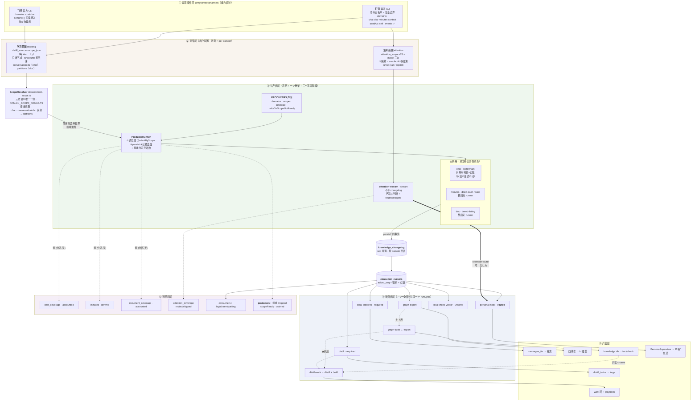
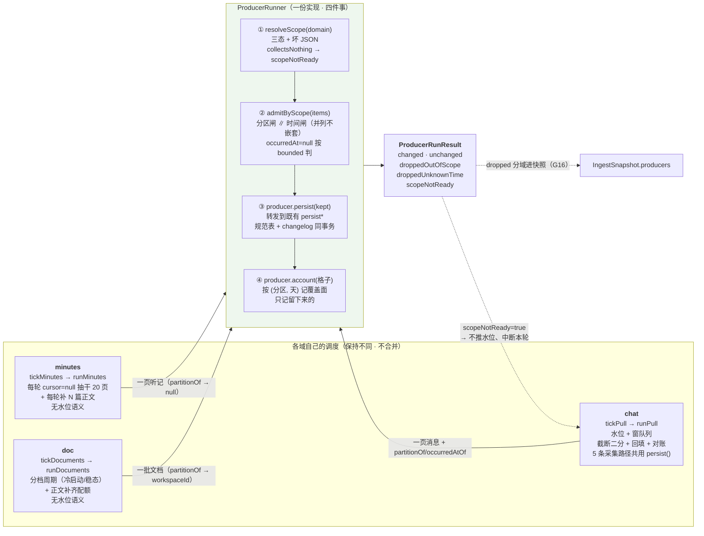
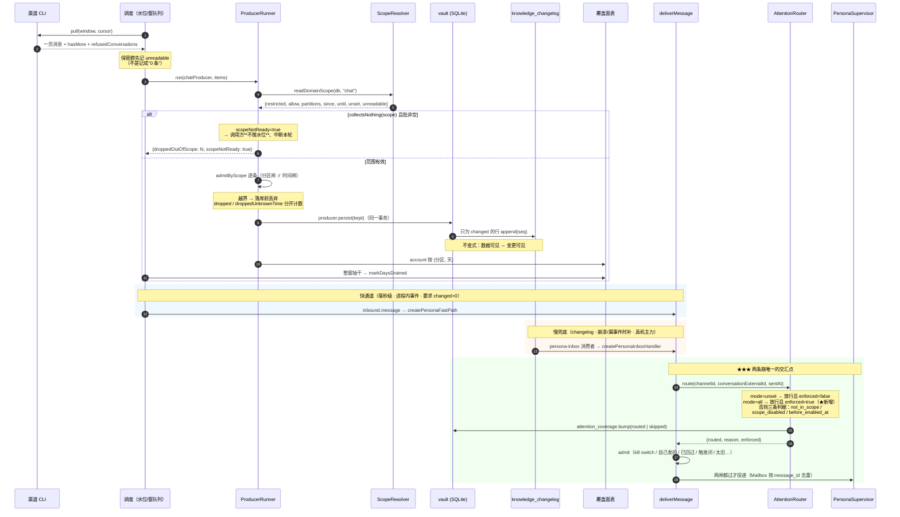
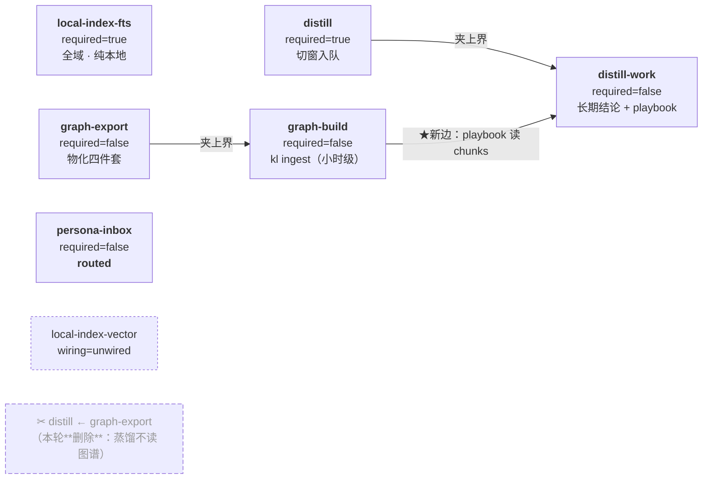
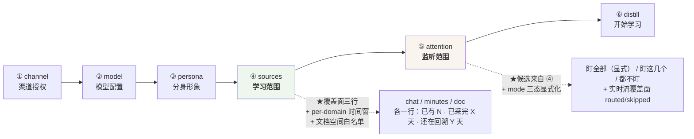

# 渠道数据平面 v3：ODPS 式生产者 / 消费者 / 路由

> **状态：十个缺口全部实施完成。** 4829 条门禁全绿，`check:all` 通过
> （`check:no-local-data` 在**有真实 vault** 的机器上跑过）。
>
> 三个提交：`b9a3627a`（声明有执行力）· `185e246e`（per-domain 范围）·
> `f0f8d336`（生产者接线 + 运行时视图）。
>
> **怎么读这份文档**
>
> | 想知道什么             | 看哪节                                              |
> | ---------------------- | --------------------------------------------------- |
> | 这套架构现在长什么样   | §1 全景图 · §2 领域模型                             |
> | 某个设计为什么是这样   | §3 十个缺口（每条都是一次真实的失败） · §5 关键决策 |
> | 具体的类型 / 存储形状  | §4                                                  |
> | 引导与设置页怎么表达   | §6                                                  |
> | 加一个新东西要改几处   | §7 扩展性验收                                       |
> | 实施与规划的差距       | §8 实施结果（含三处规划里说错的地方）               |
> | 哪些是实测的、哪些不是 | §9                                                  |
>
> **前两版**：`channel-data-plane.md`（v1：消费者侧声明式）·
> `channel-data-plane-v2.md`（v2：修 G1–G7，范围判据收成一份）。
> 本文把 v2 §12 自己承认的两处"未兑现"（`ProducerRunner` 只有测试没接线、
> G6 未做）算成起点。

---

## 0. 一句话概括

**每一个缺口都是同一种形状：声明说了一件事，而代码没有执行它 —— 且不报错。**

改动前的真实状态：

```
渠道 CLI ──→ 三个手写 tick ──→ vault 规范表 ──→ knowledge_changelog ──→ 7 个消费者
             ↑                                                          ↑
        ProducerRunner 存在、32 条门禁全绿                        声明齐了，但 3 个
        而**生产代码零引用** —— 收益只在测试里                     不进 runCycle，
        （G10）                                                    于是 dependsOn
                                                                   **没有执行力**（G12）
```

十个缺口修完之后，这条链上的每一句声明都有一处代码在执行它，
而每一处丢弃都有一个**按域**的数字可查。

### 0.1 十个缺口一览

| #   | 缺口                                              | 性质        | 严重度 | 落点  |
| --- | ------------------------------------------------- | ----------- | ------ | ----- |
| G10 | `ProducerRunner` 有 32 条门禁，**生产代码零引用** | 声明漂移    | 高     | §3.1  |
| G11 | 监听范围「名单为空 = 全放行」把三个意图挤成一个   | 正确性/隐私 | 高     | §3.2  |
| G12 | 三个消费者不进 `runCycle`，`dependsOn` 没有执行力 | 正确性隐患  | 高     | §3.3  |
| G13 | `distill` 声明依赖图谱，而它**不读图谱**          | 声明与事实  | 中     | §3.4  |
| G6' | 闸门传对了空间键，而白名单**读不到**              | 扩展性/隐私 | 中     | §3.5  |
| G14 | 引导算一次 `since` 写给所有域                     | 表达力      | 中     | §3.6  |
| G15 | 三个域的覆盖面精度不同，而界面说得像一样          | 可观测性    | 中     | §3.7  |
| G16 | 生产者没有运行时状态（谁丢的 / 就绪没 / 抽干没）  | 可观测性    | 中     | §3.8  |
| G17 | 域声明是全局的，而渠道能力按渠道不同              | 扩展性      | 低     | §3.9  |
| G18 | `contact` 永久不可采，却与三个活域同级            | 声明形状    | 低     | §3.10 |

---

## 1. 全景图



### 1.1 哪些是 v1/v2 就有的（本轮不重写）

| 概念                                    | 文件                                               |
| --------------------------------------- | -------------------------------------------------- |
| 消费者骨架（租约/重放/依赖闸/错误隔离） | `packages/ingest/src/consumer.ts`                  |
| 同事务写 changelog                      | `packages/ingest/src/outbox.ts`                    |
| 范围三态唯一实现                        | `packages/store/src/domain-scope.ts`               |
| 闸门判据唯一实现                        | `packages/ingest/src/producer.ts` `admitByScope`   |
| 覆盖面共用基类（五条判据）              | `packages/store/src/repositories/coverage-base.ts` |
| 路由器（两条投递路交汇点）              | `packages/store/src/attention-router.ts`           |
| 采集调度 / 水位 / 回填                  | `packages/ingest/src/scheduler.ts`（**一行没动**） |

**重写 `OutboxConsumer` 是明确否决的**（§5.3）：租约抢占、从 `acked_seq`
重放、`required` 与裁剪的关系、依赖闸的"夹上界 vs 干等" —— 每一条都对应
一段带实测数据的注释。

---

## 2. 领域模型

### 2.1 两个范围（本轮补齐 per-domain 维度）

|              | **学习范围** learning                                     | **监听范围** attention            |
| ------------ | --------------------------------------------------------- | --------------------------------- |
| 回答         | 往回挖多少历史、挖哪些会话/空间                           | 盯哪些会话的**新**消息            |
| 存储         | `distill_sources.scope_json`（per kind 一行）             | `attention_scope`（v28）          |
| 时间语义     | `since` / `until`，**可回溯**                             | `enabledAt`，**不回溯**           |
| 决定         | 什么数据**进库**（进而进 changelog）                      | 什么数据**投给分身管控层**        |
| 能否变小     | **不能**（`mergeScopeOnlyGrowing`）                       | **能**（`active=0`，不删行）      |
| 消费者       | fts / graph-export / graph-build / distill / distill-work | persona-inbox                     |
| 覆盖面       | `drained`（已采完 / 还在回溯）                            | `routed` / `skipped`（放行/跳过） |
| 配置入口     | 引导第 4 步 + 设置页学习范围卡                            | 引导第 5 步 + 设置页监听范围卡    |
| **本轮新增** | per-domain 分区白名单 + per-domain 时间窗                 | 「显式全选」与「未配置」可区分    |

**「只增不减」只约束学习范围**，判据是**缩小会不会让已有产出与配置矛盾**：
图谱 / 画像 / FTS 都派生自学习范围，缩小后图里仍有那段知识（配置说没学过、
产出说学过）；而 `attention_scope` 不被任何消费者的**产出**引用
（`knowledge-feed` / `distill` / `persona` 三个包对它零引用，只有
`AttentionRouter` 在读），关掉它不可能让任何产出不自洽。

把两条合成一条规则会得出「用户永远无法让分身停下来」这个荒谬结论 ——
所以两条规则**必须分开**，这一点 v2 已确立，本轮不动。

### 2.2 三层数据（ODPS 术语对齐）

| ODPS 概念      | 这里                                 | 落点                            |
| -------------- | ------------------------------------ | ------------------------------- |
| ODS（原始层）  | `raw_records`（未裁剪原始 JSON）     | `repositories/raw-records.ts`   |
| DWD（明细层）  | `messages` / `minutes` / `documents` | 各自 repository                 |
| 表 / 分区      | `knowledge_changelog`，按 `domain`   | 迁移 `v2-raw-normalized`        |
| 订阅 offset    | `consumer_cursors.acked_seq` + 租约  | `repositories/changelog.ts:190` |
| 任务依赖 DAG   | `ConsumerSpec.dependsOn`             | `topology.ts:220`               |
| 数据质量卡点   | `required`（落后时不许裁历史）       | `retention.ts` `retainableSeq`  |
| 路由 / 分发    | `AttentionRouter`                    | `store/attention-router.ts`     |
| 作业调度一轮   | `runCycle()`                         | `topology.ts:606`               |
| 元数据自检     | `checkTopologyConsistency()`         | `topology.ts:414`               |
| **生产者作业** | **← 这一层的声明与执行现在是断开的** | **本方案 §4 要接上（G10）**     |

### 2.3 为什么 changelog 就是「表」，不需要真的 MQ

单机桌面端、单进程消费。SQLite 的 `seq` 单调 + 租约已经给了 offset 语义
与抢占安全，而引入 MQ 会带来一个必须常驻的额外进程 —— 桌面端多一个进程
就多一处「用户发现它没起来」的故障面。这一条 v2 §5.3 已论证，本轮继承。

---

## 3. 十个缺口

> **每一条的形状都相同**：声明说了一件事，代码没有执行它，而它不报错 ——
> 只在界面上、或在一次隐私事故里显形。
>
> 每一节给三样东西：**核对**（当时的事实，含 grep 结论）·**代价**（不修会
> 怎样）·**修法**（落到哪个文件）。改动前的行号刻意保留 —— 那是"当时长什么样"
> 的证据，而现在的形状看 §4。

### 3.1 · G10 — `ProducerRunner` 有 32 条门禁，而生产代码零引用

**核对**：`grep -rn "ProducerRunner" apps packages --include="*.ts"` 的结果：

| 位置                                         | 是什么                              |
| -------------------------------------------- | ----------------------------------- |
| `packages/ingest/src/producer.ts:250`        | 类定义                              |
| `packages/ingest/src/index.ts:89`            | re-export                           |
| `tests/unit/ingest/producer-gate.test.ts:26` | 门禁（18 个 `it`，v2 说 32 条断言） |
| `apps/desktop/.../ingest.service.ts:3648`    | **只出现在一句注释里**              |

也就是：那一层的**判据**（`admitByScope`）确实被两条路共用了（chat 在
`ingest.service.ts:3655`、doc 在 `:1636`），而它的**执行骨架**
（`run()` → 读范围 → 判闸 → 落库 → 记覆盖面 → 报 `scopeNotReady`）
**一次都没跑在真应用里**。

v2 §12.3 把这个称为"一次刻意的收缩"，并给了理由（不动 `runPull` 的水位
不变式）。那个理由对**聊天**成立。但它对**文档与听记**不成立，而 v2 自己
写的是"当前只有文档那条路的形状适合整段走它" —— 文档那条路**也没走**。

后果不是 bug，是**这一层的收益只兑现在测试里**：

- 文档那条路仍然自己拼 `droppedOutOfScope` 累加 + 自己记日志
  （`ingest.service.ts:1651-1665`，与 `ProducerRunner.noteDropped` 重复）；
- 听记那条路**压根没有分区闸**（`runMinutes` 只透传 `since/until`，
  没有 `admitByScope`）—— 也就是 G6' 一旦落地，听记会是第四份判据；
- `scopeNotReady` 只有 chat 那条路有（`ingest.service.ts:3734`），
  文档与听记若遇到"范围行还没写"会**照常推进**（它们没有水位，所以
  代价不是永久漏采，而是那一轮白采 + 白丢，日志里两个数字都对）。

**修法**：文档与听记两条路**整段**走 runner；聊天那条路只共用
判据（`admitByScope`）与记账（`noteDroppedFor`）—— 它推进一个不可回退的水位
（§4.4 / §5.1）。★ 有门禁锁住那条纪律：runner 不许调任何水位方法。

### 3.2 · G11 — 「名单为空 = 全放行」把三个意图挤成一个

**核对**：

- `attention_router.ts` 的 `route()`：名单 `activeCount === 0` 时放行，
  `enforced: false`；
- 引导第 5 步 `attention-step.tsx:124-128` 的文案：
  「一个都不勾 = 分身会盯上一步所有已勾选的会话」；
- `onboarding-view.tsx` 的 `DEFAULT_SOURCES.attentionConversationIds: []`，
  且保存分支 `if (sources.attentionConversationIds.length > 0)` ——
  **空数组时整个不调保存接口**。

这三处**逐个都有正确的理由**（迁移期不能让存量用户的分身静默；契约要求
`.min(1)`；不替用户写一份更难撤回的名单）。但合起来的效果是：

> 一个**新装机**的用户走完引导、一个会话都没勾监听 →
> `attention_scope` 表是空的 → 路由放行**全部已学习会话** →
> 分身对着几十个群的新消息起草回复。

而用户在那一步看到的是一个**空列表 + 一句解释**。按 CLAUDE.md §5
「发送类动作要用户确认」，实际发送仍有 `SendGuard` 与草稿模式挡着，
所以这不是"会乱发消息"级别的问题；但它是**范围的默认值方向错了** ——
学习范围的缺省是 `collect-nothing`（`DOMAIN_SCOPE_DEFAULTS.chat`），
而监听范围的缺省是"全部"。两个范围在同一个引导里、相邻两步、方向相反。

★ **不能靠把默认值改成"不放行"来修** —— 那会让存量用户的分身在一次升级后
静默停摆（v2 §2.1 与路由注释都记了这条）。正确的修法是让
**「从没配过」与「配了但清空」在存储上可区分**（§4.2）。

**修法**：`AttentionMode` 三态（§4.2）。★ 真正修掉它的不是改 `unset` 的方向，
而是 `disable()` 顺带把 mode 钉成 `explicit` —— 见 §8.2 那处规划里说错的地方。

### 3.3 · G12 — 三个消费者不进 `runCycle`，于是 `dependsOn` 没有执行力

**核对** `ingest.service.ts:2780-2786` 的 `runnables`：只有三个 ——
`local-index-fts`、`distill`、`persona-inbox`。而 `CONSUMERS` 有 7 个。

| consumer_id          | 谁驱动它                                      | 在 `runCycle` 里？ |
| -------------------- | --------------------------------------------- | ------------------ |
| `local-index-fts`    | `runSharedConsumersOnce`                      | ✅                 |
| `distill`            | 同上                                          | ✅                 |
| `persona-inbox`      | 同上                                          | ✅                 |
| `graph-export`       | `FeedService.graphTimer`（10 min 独立定时器） | ❌                 |
| `graph-build`        | `FeedService.tickGraphSync` 内部顺序调用      | ❌                 |
| `distill-work`       | `DistillService.maybeRefreshWorkLayer`        | ❌                 |
| `local-index-vector` | 没接线（`wiring: "unwired"`，声明里说明了）   | ❌（正确）         |

于是 `dependsOn` 那道闸对这三条边**没有执行力**：

- `distill` 声明 `dependsOn: ["graph-export"]`，而这一条**是**生效的
  —— 因为闸在 `OutboxConsumer` 里读游标，与谁驱动上游无关
  （`ingest.service.ts:922` 真的传了 `dependsOn`）；
- 而 `graph-build ← graph-export` 与 `distill-work ← distill` 这两条
  **只存在于声明里**：`GraphSyncService` 与 `DistillService` 都不是
  `OutboxConsumer`，它们自己读写游标（`graph-sync.ts:219`、
  `distill.service.ts:1445`），**不经过依赖闸**。

v2 `topology.ts:333` 的注释自己写了这句话：「这条边原来是**隐式**成立的
（同一个 `FeedService` 顺序调用），声明它的价值是：顺序从"记得写对"
变成"算出来的"」。**而它没有变成算出来的** —— 它仍然是"记得写对"，
只是现在多了一行声明说它是算出来的。

★ 这一条的危险方向很具体：将来有人把 `tickGraphSync` 里的两步拆开
（比如让建图走独立定时器以免阻塞导出），那条边就断了，而**声明仍然说它在**。
届时状态页会显示「建图在等导出」而实际两者在赛跑。

**修法**：`data-plane-runnables.ts` 三个 `CycleRunnable` 适配器（§5.4）。
★ 周期**不统一**：判据留在 `decideAutoBuild` / `decideWorkRefresh`。

### 3.4 · G13 — `distill` 声明依赖图谱，而它不读图谱

**核对**：

- `topology.ts:343-347`：`distill` 的 `dependsOn: ["graph-export"]`，
  注释说「蒸馏引用图谱抽出的 fact」；
- `packages/distill/src/consumer.ts`：handler 只做一件事 ——
  把 changelog 里的 seq 映射成时间窗、`enqueue` 进 `distill_tasks`。
  它 import 的是 `DistillTaskRepository` / `MessageRepository`，**没有图谱**；
- 真正读 kl 图库的是 `playbook-chunks.ts`（`chunks` 表，只读），
  而它由 `DistillService.maybeInducePlaybooks()` 调用 —— 那属于
  **`distill-work`** 这个消费者的活，不是 `distill` 的。

也就是说：`distill ← graph-export` 这条边**贴错了消费者**。真正需要它的是
`distill-work`（它读 kl 的 chunk），而 `distill-work` 声明的依赖是
`["distill"]`，没有 `graph-export`。

后果：

1. `distill` 被一个它不需要的上游夹住 —— 而 `graph-export` 是外部消费者，
   kl 服务没起时它压根不注册，此时闸不生效（`consumer.ts:146` 的
   "上游没注册就不夹"），所以**平时看不出来**；
2. 但 kl 服务**起着而导出慢**时（实测导出 1 秒、建图 2 小时），
   `distill` 会白等 —— 而它要的语料在 `messages` 表里，跟图谱无关；
3. `distill-work` 真正需要 chunk 时**没有闸**保护它 ——
   `maybeInducePlaybooks` 里有一个手写的 `graphBusy` 判断
   （`distill.service.ts:353`），那是第二份判据。

**修法**：`distill.dependsOn` 清空；那条边挂到 `distill-work` 上，
而且上游是 **build** 不是 export（chunks 要等 `kl ingest` 跑完，两者差小时级）。

### 3.5 · G6' — 闸门传对了空间键，而白名单读不到

**核对** `packages/store/src/repositories/onboarding.ts:71` 的 `DistillScope`：

```ts
export interface DistillScope {
  since?: number | undefined
  until?: number | undefined
  chatKinds?: ("direct" | "group")[] | undefined // ← 聊天概念
  conversationIds?: string[] | undefined // ← 聊天概念
}
```

四个字段里两个是聊天专属。而 `document_coverage`（v29）**已经按空间分区**
（`space_external_id`），`admitByScope` 在文档路上**已经传对了分区键**
（`ingest.service.ts:1637` `item.workspaceId ?? ""`）——

也就是说：**闸门已经准备好按空间过滤，而范围里没有空间白名单可读**。
`readDomainScope` 对 doc 行读 `scope.conversationIds`（恒 undefined）
→ `restricted: false` → 分区闸恒放行。

后果：用户只能"要么全部知识库、要么一个都不要"。而知识库里可能有
与工作无关的空间（个人笔记、他人共享），那些不该进画像语料。

★ v2 §12.8 把这一条列为"未做"，理由是"依赖渠道 CLI 能不能按空间列文档"
这个未验证的实测问题。**本轮认为那个前提不必要**：过滤在闸上做（拉回来再丢）
就已经正确，下推只是省调用（v2 §5.1 的选项 B vs C，同一条判据）。

**修法**：`DistillScope.partitions`（域中立新键）+ `readDomainScope` 按域挑键

- `purgeOutOfScopeDocuments`（§4.3）。★ 越界清理必须同时做，否则是半个隐私修复。

### 3.6 · G14 — 引导算一次 `since` 写给所有域

**核对** `onboarding-view.tsx` 的保存循环：`since` / `until` 各算**一次**，
然后 `for (const source of distillSources.data ?? [])` 给**每个** kind
写同一对值。`sources-step.tsx` 的 `SourcesDraft` 也只有一个 `rangeDays` /
`customRange`。

而三个域的合理范围天然不同：

| 域      | 用户的真实意图                             | 一组范围的后果              |
| ------- | ------------------------------------------ | --------------------------- |
| chat    | 「学最近 90 天的聊天」（量大、时效性强）   | —                           |
| doc     | 「文档不分新旧，规范文档三年前写的也有效」 | 90 天限制会把规范文档全排除 |
| minutes | 「会议听记学最近半年」                     | 与聊天的 90 天绑死          |

`ingest.service.ts:1420-1424` 的注释自己写了这句话：「拿 chat 的范围去卡
听记在这个应用里**恰好等价**（引导给两者写的是同一对 since/until），
但那是**巧合而不是契约** —— 用户将来能分源配范围时就错了」。

本轮就是那个"将来"。

**修法**：`SourcesDraft.perDomainRange` + `PerDomainRangeEditor`（§6.2）。
★ 「跟随」= **删掉那个键**，不是写一个等于全局的值（否则会静默脱钩）。

### 3.7 · G15 — 三个域的覆盖面精度不同，而界面说得像一样

**核对**：三个域都能通过 `chatCoverage` 这个 IPC 通道查
（`contract.ts:645` 的 `domain` 参数，缺省 chat），但**内部实现三条路**：

| 域      | 数据来源                                      | `listedTotal` | `drained` 粒度     |
| ------- | --------------------------------------------- | ------------- | ------------------ |
| chat    | `chat_coverage` 表（写入侧记账）              | ✅ 有         | per (会话, 天)     |
| doc     | `document_coverage` 表（写入侧记账）          | ✅ 有         | per (空间, 天)     |
| minutes | **从 `minutes` 表现算** `listDaysFromMinutes` | ❌ 恒 null    | **整渠道一个布尔** |

听记那条路的理由写在 `media-minutes.ts:410-435`（真值已在 `minutes` 表里、
量级小三个数量级、加一张 per-day 表要一次迁移 + 一条写入路径）。
**那个理由成立**，本轮不推翻它。

但由此产生的**表达不一致**是真实代价：契约里
`chatCoverageDaySchema.pendingConversations` 对听记域恒 0
（`contract.ts:668` 的注释承认了这一点），而界面上三行并排 ——
用户看到的是"文档还有 3 个空间没齐、听记还有 0 个没齐"，
而后者的 0 是**"这个概念不适用"**，不是"都齐了"。

**修法**：`pendingConversations` 改 nullable + 加 `source` / `partitionKind`（§4.5）。

### 3.8 · G16 — 生产者没有运行时状态

**核对**：消费者侧有完整的运行时视图（`buildConsumerStatuses` →
`IngestSnapshot.consumers`，含 lag / absent / waiting / stale / unwired）。
而生产者侧只有：

- `IngestSnapshot.scope`（`contract.ts:2419`）：**一个全局的**
  `droppedOutOfScope` / `lastDroppedAt` —— chat 与 doc 两条路**累加进同一对
  字段**（`ingest.service.ts:1651` 与 `:3661` 都写它）；
- `PRODUCERS`（`topology.ts:147`）：纯声明，没有对应的 `buildProducerStatuses`。

后果：

1. 「文档被闸门挡掉 300 篇」与「聊天被挡掉 300 条」在界面上**同一个数字**；
2. 「这个域的范围还没就绪」（`scopeNotReady`）**完全不可见** ——
   而它是那次"飞书一条都采不到"的根因（`producer.ts:222` 记着）；
3. 「上一轮这个生产者跑了吗、抽干了吗」只能从三个不同的地方拼：
   `minutesCoverage.drained`（快照里）、文档的 warn 日志、chat 的 `backfill`。

**修法**：`buildProducerStatuses`（纯函数）+ `IngestSnapshot.producers`

- 状态页 `ProducerRow`（§4.4）。

### 3.9 · G17 — 域声明是全局的，而渠道能力按渠道不同

**核对**：

- `DOMAINS`（`topology.ts:98`）是**一张全局表**，`producedBy` 是全局判断；
- 而 `capabilities.domains` 是**per-channel** 的：钉钉
  `["chat","contact","doc","minutes"]`（`dingtalk/index.ts:42`），飞书
  `["chat","doc"]`（`feishu/index.ts:25`）；
- 飞书没有 `minutes`、没有 `events`、`sendAs: []`。

于是在一个只连了飞书的部署里，状态页会显示 `minutes` 域"active、0 条" ——
而事实是这个渠道没有听记。这与 `contact` 那条被 `absentReason` 解决的
问题**形状完全相同**（v2 §G2 的 `producedBy` 就是为它设计的），
只是那一条是"我们没做"，这一条是"这个渠道没有"。

**修法**：`DomainSpec.channels` + 自检判据⑥ + `buildDomainStatuses` 按能力过滤（§4.1）。

### 3.10 · G18 — `contact` 永久不可采，却与三个活域同级

`DataDomain = "chat" | "minutes" | "doc" | "contact"`，而 `contact`
永久 `absent`（PII 命令不进白名单，CLAUDE.md §5）。它同时出现在：

- `CHANGELOG_DOMAINS`（`types.ts:245`）—— 必须留（历史库里可能有行）；
- `DOMAIN_SCOPE_DEFAULTS`（`domain-scope.ts:72`）—— 标 `collect-nothing`；
- `coverageDomainSchema`（`contract.ts:642`）—— **不含它**（只有三个活域）。

三处形状不同，而第三处（契约）是对的。这不是 bug，但它意味着
「域」这个概念现在有**两种**：可采的域与仅保留的域。本轮把它显式化（§4.1）。

---

**修法**：`DomainSpec.kind = "legacy-only"`，界面按它过滤（§4.1）。

### 4.2 生产者：声明 + 调度内核 + 薄适配器（修 G10）

这是本轮唯一一处真正的"重构"。做法**不是**把三个 tick 合并成一个 ——
那三段调度天生不同，硬合并会让最难的那段（chat 的水位不变式）再加分支，
而水位算错是这条链路上最贵的错误（永久漏采或永久重拉）。

做法是**把边界画清，然后真的走过去**：



**为什么这样切**（判据）：

- 骨架收的是**判据**（范围三态、越界怎么算、覆盖面五条），那些是抄错
  就静默出错的东西 —— 已经漂出过两个真实的隐私缺陷（文档没有闸、
  聊天的时间闸被会话闸挡住）；
- 骨架**不收调度**（水位不变式、截断二分、正文配额），那些各域天生不同。

**接线的三条路各自的形状**（这是 v2 没做完的那一段）：

| 域      | 现状                                      | 本轮改成                                                | 风险 |
| ------- | ----------------------------------------- | ------------------------------------------------------- | ---- |
| doc     | 手写 `admitByScope` + 手写累加 + 手写日志 | 整段走 `runner.run(docProducer, items, {drained})`      | 低   |
| minutes | 只透传 `since/until`，**无分区闸**        | 整段走 runner（`partitionOf → null`，见 §4.3）          | 低   |
| chat    | `persist()` 里调 `admitByScope`           | **只换成 runner 的 admit 段**，水位相关一行不动（见下） | 中   |

★ **chat 那条路的纪律**（这一条必须写死，否则整轮的风险都在这里）：

1. **不动水位相关的任何一行** —— `commitProgress` / `confirmedEnd` /
   `splitIfTruncated` / `queue` 不变式；runner 只在"拿到一页之后、
   落库之前"插进去；
2. `scopeNotReady` 的语义**逐字保留** —— 它是"不推水位并中断本轮"，
   不是"跳过这一页"（`ingest.service.ts:2511-2524` 记着那次事故：
   采集比范围行先跑 1 秒、9 条全丢、水位照常前移 → 永远回不来）；
3. `persist()` 仍是**五条采集路径的唯一漏斗**（增量主窗 / 对账 / 回填 /
   补空洞 / 定向补拉），所以 runner 接在它里面，**不是**接在 `runPull` 里 ——
   接在后者会让另外四条路绕过闸门。

### 4.3 一条消息的完整旅程



**路由与 `admit()` 仍然分开**，两者问的不是同一个问题：

| 谁      | 问的是                       | 不通过会怎样                    |
| ------- | ---------------------------- | ------------------------------- |
| 路由    | 这条消息属于分身的关心范围吗 | 不属于 → 根本不该进管控层       |
| `admit` | 这条消息现在该触发一次回复吗 | 不该 → 进了但被丢弃，有理由可查 |

混成一个 reason 会让「范围外」与「暂时不回」用同一句话表达，
而一个是配置问题、一个是时机问题 —— 用户排查时需要的正是这个区别。

### 4.4 消费者 DAG（修 G12 + G13 后）



**为什么用「夹上界」而不是「干等」**（`consumer.ts:131-158` 的既有取舍，
本轮继承）：夹上界让本轮仍处理上游已消化的那一段，慢上游只是让下游
按它的节奏走；干等会在两个消费者互相等待时**死锁**，且一个慢上游会把
整条链停住。两条必须保留的细节：

- **上游没注册时不夹** —— 那说明这套部署没起 kl 服务，夹成 0 会让蒸馏永久停住；
- **「被夹住」的判据是"还有夹在外面的活"**，不是"刚好处理到上界"
  （后者会在处理完最后一批时误报"在等上游"，`consumer.ts:186-200` 有实测记录）。

**三条边的改动理由**：

| 边                           | 动作   | 理由                                                                                |
| ---------------------------- | ------ | ----------------------------------------------------------------------------------- |
| `distill ← graph-export`     | **删** | 蒸馏 handler 只读 `messages` + 写 `distill_tasks`，全文不 import 任何图谱（§3 G13） |
| `distill-work ← graph-build` | **加** | `playbook-chunks.ts` 读 kl 的 `chunks` 表 —— 建图没跑完时那张表是旧的/空的          |
| `graph-build ← graph-export` | 保留   | 建图读**已导出**的四件套；跑在导出前面就是拿旧快照建图，而它会"成功"                |

★ 加 `distill-work ← graph-build` 之后，`distill.service.ts:353` 那个手写的
`graphBusy` 判断**不删** —— 两者管的不是同一件事：依赖闸问"图建到哪个 seq"，
`graphBusy` 问"现在正忙吗"（建图期间 kl 的 HTTP 在忙，而 playbook 归纳要花钱）。
删掉任一个都会让 v2 §12 那类"看起来在把关、实际不起作用"的条件出现。

---

## 4. 具体设计（类型 / 存储 / 契约）

### 4.1 域声明：加 `kind` 与 `perChannel`（修 G17 + G18）

```ts
// packages/ingest/src/topology.ts
export interface DomainSpec {
  id: DataDomain
  /**
   * ★新增：这个域是**可采的业务域**，还是**仅为历史兼容保留**。
   *
   * `collectable` = 有采集契约、有覆盖面表、进 coverageDomainSchema；
   * `legacy-only` = 只因为 `knowledge_changelog.domain` 是 TEXT 列
   *   而历史库里可能有行才保留（contact 就是），**不出现在任何界面上**。
   *
   * 为什么不用现有的 `producedBy: "absent"` 表达：那个说的是
   * "当前没有生产者"（一个运行时/排期事实），而 contact 的真实状态是
   * "永远不会有"（安全边界，CLAUDE.md §5）。混在一起会让界面
   * 无法决定"要不要给它一行"。
   */
  kind: "collectable" | "legacy-only"
  producedBy: "active" | "absent"
  purpose: string
  absentReason?: string
  /**
   * ★新增：哪些渠道**有能力**产这个域。`null` = 全部。
   *
   * 判据来源是 `capabilities.domains`（per-channel），而这张表是全局的。
   * 不表达它的后果：只连飞书的部署会显示 `minutes` 域 "active、0 条"
   * —— 而事实是这个渠道没有听记（G17）。
   *
   * ★ 这里存的是**声明侧的期望**，运行时仍要与 `capabilities.domains`
   * 对账（自检判据⑥）—— 两者不一致说明有人加了插件没改声明。
   */
  channels?: readonly ChannelId[] | null
}
```

`activeDomains()` 增加一个 per-channel 重载：

```ts
/** 这个渠道当前**真的有生产者**的可采域。界面与消费者的 domains 都按它过滤。 */
export function activeDomainsForChannel(
  channelId: ChannelId,
  capabilities: readonly DataDomain[],
  domains: readonly DomainSpec[] = DOMAINS,
): readonly DataDomain[]
```

★ 它收 `capabilities` 作为参数而不是自己去 import 插件：`topology.ts`
必须保持"纯声明、不启动管线就能测"（那是它现在能被单测锁住的全部理由）。

### 4.2 监听范围：`mode` 三态（修 G11）

问题的根因是**存储表达不了"用户显式选了全部"**：

| 用户做了什么              | `attention_scope` 里 | `route()` 的判断 | 用户的预期   |
| ------------------------- | -------------------- | ---------------- | ------------ |
| 从没配过（新装/存量升级） | 空                   | 放行、不记账     | ？           |
| 引导里一个都没勾          | 空                   | 放行、不记账     | 「盯全部」✅ |
| 设置里把全部关掉          | 有行、`active=0`     | 全部 skipped     | 「都不盯」✅ |
| 勾了 3 个                 | 3 行 `active=1`      | 只放行那 3 个    | ✅           |

**第 1 行与第 2 行在存储上同形**，而它们的正确处置不同：

- 存量升级：必须放行（否则分身静默 = 功能回归，路由注释记着这条）；
- 引导里明确不勾：也放行，**但这是用户的一次决定**，应该记账、
  应该在设置页显示成「盯全部（你在引导里选的）」而不是「还没配置」。

**设计**：新增一个 **per-channel 标量**，走既有的 `vault_settings` 键值表
（`SettingsRepository`，**不加迁移**）：

```ts
/** `attention.mode.<channelId>` 的值。读不到（存量库）就是 `unset`。 */
export type AttentionMode =
  /** 从没配过 —— 放行全部、**不记账**、界面显示"还没配置" */
  | "unset"
  /** 用户显式选了"盯全部已学习会话" —— 放行全部、**记账**、界面这么说 */
  | "all"
  /** 用户给了具体名单 —— 按 attention_scope 判 */
  | "explicit"
```

`AttentionRouter.route()` 相应变成：

```ts
route(input: AttentionRouterInput): AttentionRouterVerdict {
  const mode = this.modeOf(input.channelId)
  // ★ unset 与 all 都放行，区别**只在 enforced 与记账**
  if (mode === "unset") return { routed: true, reason: null, enforced: false }
  if (mode === "all") {
    this.bump(input, true)               // ★ 记账：这是用户的决定
    return { routed: true, reason: null, enforced: true }
  }
  // explicit：名单为空时**一条都不放行**（那是用户把全部关掉了）
  …既有三条判据…
}
```

★★★ **`explicit` + 空名单必须解读成"都不盯"，而不是"盯全部"** ——
那正是现在做不到的事：用户在设置页把最后一个会话关掉，
`activeCount` 归零，于是路由回到"放行全部"。**关掉全部之后分身盯得更多了**，
方向完全相反。这是 G11 里最实际的那一半。

★ 写入点：引导第 5 步保存时写 `all`（空数组）或 `explicit`（有数组），
设置页的「取消全部监听」写 `explicit`（而不是只置 `active=0`）。
存量库不写 → 恒 `unset` → 行为与今天**逐字相同**（这是不能破的那条：
存量用户的分身不许因为一次升级而静默停摆）。

★ 为什么走 `vault_settings` 而不是新表：它是**每渠道一个标量**，
而新表要一次迁移 + 一条读写路径 + 一次 wipe 清单同步
（`wipe-table-list-sync.test.ts` 那条门禁）。带渠道后缀的标量键是这个库里
**既有的做法**：`chatCoverage.backfilled.<channelId>`
（`distill-source.service.ts:596`）与 `runtimeLimits.<channelId>`
（`persona.service.ts:135`）都是它，后者的注释把理由写全了。

★★ 读的顺序必须是 **渠道键 → `unset`**，而**不是** 渠道键 → 某个全局键：
`runtimeLimits` 那侧要回落全局键是因为存量机器上有那个旧键；
而 `attention.mode` 是新概念，没有旧键可回落 —— 编一个会让"读不到"
与"显式 unset"同形。

### 4.3 学习范围：per-domain 分区 + per-domain 时间窗（修 G6' + G14）

`DistillScope` 扩成域中立的形状，**保留既有两个聊天字段**：

```ts
export interface DistillScope {
  since?: number | undefined
  until?: number | undefined
  /** 只蒸馏这些类型的会话（**仅 chat 源有意义** —— 保留原样） */
  chatKinds?: ("direct" | "group")[] | undefined
  /**
   * 会话白名单（**仅 chat 源** —— 保留原样，四处调用方在读它）。
   *
   * ★ 不改名成 `partitions`：`readCollectionScope` / `purgeOutOfScope` /
   * `corpus-predicate` / forge 四处都读这个键，而它们不一致过一次，
   * 后果是库里 55% 的消息属于用户没勾的会话。
   */
  conversationIds?: string[] | undefined
  /**
   * ★新增：**分区白名单**（域中立）。文档域用它装空间 external_id。
   *
   * 为什么与 `conversationIds` **并存**而不是替换它：
   * · chat 那侧的键名进了四处调用方与若干测试 fixture，换名是一次
   *   大范围破坏性变更，而收益只是"名字更好"；
   * · 而 doc 侧现在**没有**任何键，加一个新键零风险。
   *
   * ★ `readDomainScope` 的合并规则（唯一一份）：
   *   chat 域 → 读 `conversationIds`；其余域 → 读 `partitions`。
   *   两个都不存在 → `restricted: false`（不设限）。
   */
  partitions?: string[] | undefined
}
```

**per-domain 时间窗**不需要新字段 —— 表结构本来就是**每个 kind 一行**
（`distill_sources.kind` 是主键），`scope_json` 里已经各有 `since`/`until`。
缺的只是**引导页的表达**：现在算一次 since 写给所有 kind（§3 G14）。

引导侧改成：

```ts
export interface SourcesDraft {
  /** 全局默认（用户不单独设某个域时用它） */
  rangeDays: number | null
  customRange?: { from: string; to: string } | null
  chatKinds: ("direct" | "group")[]
  conversationIds: string[]
  enabledSources: DistillSourceId[]
  /**
   * ★新增：**某个域单独覆盖**的时间范围。缺键 = 跟随全局。
   *
   * ★ 为什么是"覆盖"而不是"三个域各填一份"：绝大多数用户只想说一句
   * "学最近 90 天"。让三个域都必填会把一个常见选择变成三次操作，
   * 而"文档不分新旧"是一个**少数但真实**的需求（规范文档三年前写的也有效）。
   */
  perDomainRange?: Partial<
    Record<
      "chat" | "minutes" | "doc",
      {
        rangeDays: number | null
        customRange?: { from: string; to: string } | null
      }
    >
  >
  /** ★新增：文档域的空间白名单（写进 scope.partitions） */
  documentSpaceIds?: string[]
  attentionConversationIds: string[]
  /** ★新增：监听范围的 mode（见 §4.2）。缺省 undefined = 由勾选数推断 */
  attentionMode?: AttentionMode
}
```

★ **只增不减仍然生效**：`mergeScopeOnlyGrowing`（`distill-source.service.ts:157`）
按字段合并，`partitions` 走与 `conversationIds` 同一条 `widen(…, unionOf)`。
那个函数的三格语义（无→有 / 有→无 / 有→有）本轮**一格都不改** ——
它的注释里记着"第一版按'不设限是最宽'处理，结果范围永远设不进去"。

### 4.4 生产者声明：加 `schedule` 与运行时视图（修 G16）

```ts
export interface ProducerSpec {
  id: string
  domains: readonly DataDomain[]
  scope: "learning" | "attention"
  backfills: boolean
  purpose: string
  /**
   * ★新增：调度形状。**这是声明，不是策略** —— 它让"为什么这个域没有
   * 水位"可查，而不必读三个 tick 的实现。
   *
   * · `watermark` —— 时间窗 + 水位 + 截断二分（只有 chat）；
   * · `drain-each-round` —— 每轮从头抽干分页（minutes）；
   * · `tiered-listing` —— 分档周期 + 正文补齐队列（doc）；
   * · `stream` —— 实时流，不写 changelog（attention-stream）。
   */
  schedule: "watermark" | "drain-each-round" | "tiered-listing" | "stream"
  /**
   * ★新增：这个生产者报不报 `scopeNotReady`。
   *
   * 只有 `watermark` 那种**会推进一个不可回退的水位**的才需要它 ——
   * 另两种每轮从头列举，"这一轮白丢"的代价是一轮 CLI 调用，
   * 不是永久漏采。写成声明是为了让"为什么听记不需要它"可查。
   */
  haltsOnScopeNotReady: boolean
}
```

对应的运行时视图（与 `buildConsumerStatuses` 同构、同为纯函数）：

```ts
// packages/ingest/src/producer-view.ts（新）
export interface ProducerStatus {
  id: string
  purpose: string
  domains: readonly DataDomain[]
  scope: "learning" | "attention"
  schedule: ProducerSpec["schedule"]
  /** 这个域的范围就绪了吗（`!collectsNothing && !unset`） */
  scopeReady: boolean
  /** 范围**读不出来**（坏 JSON）—— 与"没配过"必须分开 */
  scopeUnreadable: boolean
  /** 本进程累计丢弃（★分域，不再是一个全局数字） */
  droppedOutOfScope: number
  droppedUnknownTime: number
  lastDroppedAt: number | null
  /** 上一轮抽干了吗；`null` = 这个调度形状没有"抽干"概念 */
  drained: boolean | null
  /** 这个渠道有这个域的能力吗（G17） */
  supportedByChannel: boolean
}

export function buildProducerStatuses(input: {
  producers?: readonly ProducerSpec[]
  channelDomains: readonly DataDomain[]
  scopes: ReadonlyMap<ScopedDomain, DomainScope>
  counters: ReadonlyMap<string, { dropped: number; unknownTime: number; lastAt: number | null }>
  drained: ReadonlyMap<string, boolean>
}): readonly ProducerStatus[]
```

★ 它**不读库**（与 `topology-view.ts` 同一条纪律）：范围与计数都由调用方
传进来，那样单测能直接打到每个分支，而快照那条已经很贵的路径
（9 个 `COUNT(*)`）不再加查询。

### 4.5 覆盖面：三个域同构地表达"这个概念不适用"（修 G15）

**不合并三张表**（v2 §5.6 的理由本轮继承：分区语义不同 —— 聊天按会话翻页
"这个会话齐了"是成立的话，文档按空间翻页"一篇文档翻完了"不成立，
听记是全量列举没有时间窗）。改的是**契约的表达**：

```ts
export const chatCoverageDaySchema = z.object({
  dayBucket: z.string(),
  localCount: z.number(),
  drained: z.boolean(),
  /**
   * 这一天还有几个**分区**没抽干。
   *
   * ★★★ 改成 nullable：听记域**没有分区概念**（全量列举），
   * 现在恒 0 —— 而 0 读起来是"都齐了"，与"这个概念不适用"完全同形。
   * `null` 让界面能说「听记不按分区统计」而不是「还有 0 个没齐」。
   */
  pendingConversations: z.number().nullable(),
})

export const chatCoverageViewSchema = z.object({
  days: z.array(chatCoverageDaySchema),
  localCount: z.number(),
  dayCount: z.number(),
  drainedDays: z.number(),
  pendingConversations: z.number().nullable(),
  /**
   * ★新增：这个域的覆盖面**怎么算出来的**。
   *
   * · `accounted` —— 有专门的覆盖面表、写入侧逐格记账（chat / doc）；
   * · `derived` —— 从实体表现算（minutes，见 `listDaysFromMinutes`）。
   *
   * 为什么要暴露：`derived` 那条路**没有** `listedTotal`（渠道说有多少），
   * 所以"库里 12 场"是不是全部只能靠整渠道的 `drained` 回答。
   * 不说的话用户会以为三行是同一种精度的数字。
   */
  source: z.enum(["accounted", "derived"]),
  /** 分区粒度的人话名（"会话" / "空间" / null=不按分区）—— i18n key */
  partitionLabelKey: z.string().nullable(),
})
```

★★ **仍然没有 `total` / `percent`** —— 渠道 API 不提供"某天共有多少条"
（`ChannelPullPage` 只有 `hasMore` / `nextCursor`）。编一个分母就是上次
那句假的「才学了 0.0%」。这一条 v2 §5.7 已确立，本轮不动。

---

## 5. 关键设计决策（含被否决的选项）

### 5.1 为什么不把三个 tick 合并成一个生产者循环

| 域      | 调度的复杂度来源                                       | 合并的代价                             |
| ------- | ------------------------------------------------------ | -------------------------------------- |
| chat    | "只推已抽干的连续前缀"这个水位不变式 + 截断二分 + 回填 | 给最难的那段加一个"这一趟不算水位"分支 |
| minutes | 每轮从头抽干（没有水位可推）                           | 要给它编一个不存在的水位语义           |
| doc     | 分档周期 + 正文补齐配额（正文要二次调用）              | 正文队列与列举队列的预算要互相让       |

水位算错是这条链路上最贵的错误（永久漏采或永久重拉），而
`reconcileStale` 的注释（`ingest.service.ts:2815-2827`）已经为**同一个问题**
做过一次同样的取舍：「把它塞进主循环意味着给那段本来就难的逻辑加一个
'这一趟不算水位'的分支 …… 所以这里是一个扁平的翻页循环。代价是重复了
十几行分页代码，换来的是'改主循环时不会顺手改坏对账'」。

**本轮沿用那条判据**：共用**判据**（会静默出错的东西），不共用**调度**。

### 5.2 为什么 `ProducerRunner` 要真的接线，而不是删掉它

有第三个选项：既然它没接线，干脆删掉，让三条路各自调 `admitByScope`
（现在 chat/doc 就是这样）。**否决**，两条理由：

1. **`admitByScope` 只是四件事里的第二件。** 另外三件（读范围的三态、
   覆盖面按 (分区,天) 记账、`scopeNotReady` 的语义）现在**各自有实现**：
   - doc 侧自己拼 `droppedOutOfScope` 累加 + 自己写日志（与
     `noteDropped` 重复）；
   - minutes 侧**没有**分区闸，也不记 per-partition 覆盖面；
   - `scopeNotReady` 只有 chat 有。
     删掉 runner = 承认这三件事永远三份。
2. **G6' 落地后听记会成为第四份判据。** 加空间白名单之后，
   `partitionOf` 的三态处理（返回 null = 不按分区切）必须每条路都对 ——
   而 `producer.ts:87` 的注释记着抄错的方向：「拿一个空串去查白名单
   会让所有听记都被判成'不在名单里'，于是听记整个停采而日志里只有
   一句'丢了 N 条'」。

### 5.3 为什么不重写 `OutboxConsumer`

| 它现在承载的                    | 重写会重新犯的错                        |
| ------------------------------- | --------------------------------------- |
| 租约抢占 + 心跳续租             | 两个进程同时消费 → 重复发送（不可逆）   |
| 从 `acked_seq` 重放（要求幂等） | 抢占后漏掉一段                          |
| `required` 决定能不能裁历史     | 裁掉 required 消费者还没读的 → 永久丢失 |
| 一批失败不卡游标、错误单独计数  | 远程限流把纯本地的 FTS 也卡住           |
| 依赖闸夹上界 + 上游缺席时不夹   | 死锁 / 蒸馏永久停住                     |

每一条都对应文件里一段带实测数据的注释。**保留。**

### 5.4 把 `graph-export` / `graph-build` / `distill-work` 接进 `runCycle`：怎么接

它们**不是** `OutboxConsumer`，所以不能直接塞进 `runnables`。
`runCycle` 只要求 `CycleRunnable`（一个 `runOnce()` 方法，
`topology.ts:585` 刻意做得这么小 —— "只要能 `runOnce()` 就行，便于测试"）。

| 消费者         | 现在谁驱动                             | 接法                                                              |
| -------------- | -------------------------------------- | ----------------------------------------------------------------- |
| `graph-export` | `FeedService.graphTimer`（10 min）     | `GraphSyncService.runOnce()` **已经**是这个形状 → 适配返回值      |
| `graph-build`  | `tickGraphSync` 内部顺序调用           | 拆成独立 `CycleRunnable`，依赖闸保证它不抢跑（这才是 G12 的收益） |
| `distill-work` | `DistillService.maybeRefreshWorkLayer` | 包一层适配器（它返回 void，要报 processed/ackedSeq）              |

★★★ **但周期不能统一。** `runSharedConsumersOnce` 每 2 分钟一轮
（跟着 `tickPull`），而建图是**小时级**、导出是 10 分钟一轮。
把它们塞进 2 分钟的循环 = 每 2 分钟问一次"要不要建图"。

所以接法是：**`runCycle` 负责顺序与依赖闸，各自的"这一轮该不该真干活"
判据留在原处**（`decideAutoBuild` / `decideWorkRefresh` 都是纯函数，
已经在做这件事）。`runOnce()` 在不该干活时返回
`{processed: 0, skipped: 0, …}` —— 那与"没数据"可区分（`runCycle` 已经
按这个约定记日志）。

★ 收益说清：这样做**不会**让建图更频繁，也不会让导出变慢。它换来的是
两件事：① 那两条依赖边从"记得写对"变成"算出来的"；② 状态页能说
「建图在等导出」而不是「建图没进展」——`buildConsumerStatuses` 的
`waitingForUpstream` 现在对这三个恒 `null`（它从 `lastCycle` 取，
而它们不在 `lastCycle` 里）。

### 5.5 为什么不合并 kl-graph 与 forge 的导出器

两者 sink 天生不同：kl 要全量 `records.jsonl` 快照（他们的 loader
`load_all_messages` 没有增量入口，追加会让同一条消息出现两行且不去重），
forge 要按时间窗切的 `distill_tasks`。

**已经合并的是真正重合的那一层**：语料谓词（`corpus-predicate.ts`）——
在那次合并之前两侧对"空正文"的判据不同（`content_text <> ''` vs
`trim(content_text) <> ''`，而后者在 SQLite 里不去换行/制表）。

★ 用户提到「或许 kl-graph 和 forge 的语料都可以合并」。**语料谓词已经合了**；
再往上共享（比如让 forge 直接读 kl 的 chunk 当语料）会开始互相迁就 ——
而那件事的正确形态已经存在：`distill-work` 的 playbook **就是**读 kl 的
`chunks` 表（`playbook-chunks.ts`），且边界写清了「切分与实体归他们，
归纳归我们」。本轮做的是把那条依赖**声明出来**（§4.4 的新边），不是合并两侧。

### 5.6 为什么消费者不并发跑

`dependsOn` 要求下游看到上游**这一轮**的结果。并发会让依赖闸读到上游
**上一轮**的 `acked_seq`，于是每轮慢一拍。不错，但没必要。

★ 而接进三个慢消费者之后这一条更重要了：建图跑 2 小时期间
`runCycle` 会被它占住 —— 所以 `graph-build` 的 `runOnce()` **必须
立即返回**（真正的建图是它内部起的异步任务 + `graphBusy` 守卫），
而不是 await 到建完。这一点 `tickGraphSync` 现在就是这么做的
（`triggerIngest` 的签名是 `() => Promise<boolean | "cancelled">`，
返回的是"起没起来"，不是"建完了"），本轮不改它，只是把这条约束写明。

### 5.7 被否决的几个方案

| 方案                                     | 为什么否决                                                                       |
| ---------------------------------------- | -------------------------------------------------------------------------------- |
| 给 `conversationIds` 改名成 `partitions` | 四处调用方 + 若干 fixture 在读它，而它们不一致过一次 → 库里 55% 越界消息（§4.3） |
| 合并三张覆盖面表（加一列 `kind`）        | 分区语义不同；"某些行的某列没有意义"是最容易被读错的形状（v2 §5.6）              |
| 监听范围也「只增不减」                   | 那会让用户永远无法让分身停下来（v2 §2.1）                                        |
| 把监听范围的默认值直接改成"不放行"       | 存量用户的分身会在一次升级后静默停摆 —— 所以要靠 `mode` 区分"没配过"（§4.2）     |
| 给 `contact` 做采集器                    | PII 类命令不进白名单（CLAUDE.md §5）。标 `planned` 是不会兑现的承诺              |
| changelog 换成真消息队列                 | 单机桌面端，SQLite `seq` + 租约已够；多一个常驻进程 = 多一处故障面（v2 §5.3）    |
| 把三个慢消费者的周期也统一进 2 分钟循环  | 每 2 分钟问一次"要不要建图"；判据留在原处、`runOnce` 快速返回才对（§5.4）        |
| 给覆盖面 / lag 加百分比                  | 分母在渠道 API 里不存在（v2 §5.7）                                               |
| 改 `kl-graph/` 下的任何东西              | 那是算法团队的仓库副本，改了会被同步覆盖                                         |
| 接线 `local-index-vector`                | embedding 是远程付费调用，接不接是产品决定 —— 但声明里已标出状态（v2 G7）        |

---

## 6. 引导：两个范围各自说清「已有多少 / 还缺什么」

用户原话：「现状是给用户的引导，学习的范围和监听范围都要有」+
「要说明现在已有那部分日期的那部分业务数据，以及显示出来要多少和
共已经有了多少了，不管是消息还是听记，文档等」。

### 6.1 六步引导（`ONBOARDING_STEPS` 不变，两步的**内容**扩充）



**步骤顺序仍然是硬约束**（`onboarding.ts:11-19` 与 `attention-step.tsx` 都记着）：

- `attention` 必须在 `sources` **之后** —— 候选来自上一步的选择，且
  `attentionScopeSave` 会把勾中的会话**并入学习范围白名单**
  （消灭"监听了但不采集"这个坏状态：分身收到消息却拿不到上下文，
  于是不回或回得离谱，而用户看不出成因）；
- `distill` 必须最后 —— 它是"用前两步的配置开始干活"。

### 6.2 第 4 步（学习范围）：覆盖面进引导

现在覆盖面**只在设置页有**（`collection-scope-panel.tsx:312`），
引导里没有。而用户问的正是引导时的那个问题：「我选 90 天，现在已经有多少了」。

```
┌─ ④ 学习范围 ─────────────────────────────────────────────┐
│ 它学哪些历史：采多久、采哪些会话。范围只增不减。          │
│                                                          │
│ 时间范围   [30天] [90天▪] [180天] [365天] [不限] [自定义] │
│            ▸ 单独设置某类数据的范围（默认跟随上面）  ★新增 │
│              · 消息    跟随（90 天）                      │
│              · 会议听记 跟随（90 天）                     │
│              · 文档    [不限]  ← 规范文档不分新旧          │
│                                                          │
│ 数据源     ☑ 消息  ☑ 会议听记  ☐ 文档  ☐ 邮件（未接入）  │
│                                                          │
│ ── 现在已经有多少 ──────────────────────  ★新增（进引导） │
│  消息      已有 12,431 条 · 已采完 61 天 · 还在回溯 29 天 │
│  会议听记  已有 37 场 · 上一轮已列全 · 按整轮统计         │
│  文档      还没有记账数据                                 │
│                                                          │
│ 会话选择   ▸ 展开（102 个会话，已勾 18）                  │
│ 文档空间   ▸ 展开（7 个知识库，已勾 0 = 不限）      ★新增  │
└──────────────────────────────────────────────────────────┘
```

三行文案的判据（沿用 `scope-coverage.tsx` 那套，本轮扩两条）：

| 状态                     | 说什么                   | 为什么不说别的                                                             |
| ------------------------ | ------------------------ | -------------------------------------------------------------------------- |
| `drained=true` 的天      | 「已采完 X 天」          | 那些天的 `localCount` 就是全部                                             |
| `drained=false` 的天     | 「还在回溯 Y 天」        | 条数是**下界**，不是总数                                                   |
| 没有任何记账行           | 「还没有记账数据」       | ★ 与「这段时间没有数据」**必须是两句不同的话**：前者我们不知道，后者是事实 |
| `source=derived`（听记） | 「按整轮统计」           | ★新增：它没有 per-day 的 `drained`（G15）                                  |
| 域不被渠道支持           | 「这个渠道没有会议听记」 | ★新增：与「0 场」区分（G17）                                               |

★★★ **不给百分比**。分母在渠道 API 里不存在，编一个就是上次那句假的
「才学了 0.0%」。这一条在引导里尤其重要 —— 引导是用户第一次看到这些数字。

### 6.3 第 5 步（监听范围）：三态显式化

```
┌─ ⑤ 数字分身监听范围 ─────────────────────────────────────┐
│ 分身只处理这些会话**从现在起**的新消息。与上一步不同：    │
│ 它不看历史，也可以随时关掉。                              │
│                                                          │
│  ○ 盯全部已学习的会话（18 个）              ★显式选项     │
│  ● 只盯我挑的这几个                                       │
│  ○ 先都不盯（以后在设置里开）               ★新增选项     │
│                                                          │
│  ☑ 群 A    ☑ 群 B    ☐ 群 C  …（候选 = 上一步已勾的 18 个）│
│                                                          │
│ ── 分身在实时流里见到多少 ────────────────  ★新增         │
│  近 7 天：已放行 128 条 · 已跳过 4,902 条                 │
│  （还没配置过监听范围时这里显示"尚未按配置统计"）         │
└──────────────────────────────────────────────────────────┘
```

**三个单选替换掉现在那句解释性文案**（`attention-step.tsx:124-128`
「一个都不勾 = 分身会盯上一步所有已勾选的会话」）。理由：

- 那句话是**对的**，但它要求用户从一句解释里推断出一个反直觉的默认值；
- 三个单选把同一件事变成一次**显式选择**，而且第三个选项
  （「先都不盯」）**现在压根表达不出来** —— 那正是 G11。

★ 「先都不盯」写 `mode: "explicit"` + 空名单。这需要 §4.2 那个 mode，
否则空名单会被路由读成"盯全部"（方向相反）。

★ 契约的 `attentionScopeSaveInputSchema.conversationExternalIds.min(1)`
要放开成允许空数组 **+ 一个必填的 `mode`** —— 现在空数组时引导
**整个不调保存接口**（`onboarding-view.tsx` 的 `if (…length > 0)`），
于是"我选了都不盯"这个动作**没有任何落库痕迹**。

### 6.4 设置页与引导共用同一个编辑器（不复制）

现状已经是这样（`collection-scope-panel.tsx` 复用 `SourcesStep`，
理由写在那个文件头："重写一份会让两处的判据慢慢分叉，而分叉的那一头
就是漏采或超采"）。本轮的新组件沿用同一条纪律：

| 组件                         | 引导里          | 设置页里                     |
| ---------------------------- | --------------- | ---------------------------- |
| `SourcesStep`                | 第 4 步主体     | 学习范围卡（已复用）         |
| `ScopeCoverage`              | ★新增进第 4 步  | 学习范围卡三行（已有）       |
| `AttentionModePicker` ★新增  | 第 5 步三个单选 | 监听范围卡（替换现在的按钮） |
| `AttentionCoverage` ★新增    | ★新增进第 5 步  | 监听范围卡（现在没有）       |
| `PerDomainRangeEditor` ★新增 | 第 4 步可折叠区 | 学习范围卡同一个可折叠区     |

★★ `ScopeCoverage` 进引导时有一个**已知的坑要避开**：它对
`channelId === null` 直接 `return null`（v2 §12.2 的 G9 就是这个 ——
CDP 抓到整块覆盖面一个字都不渲染）。引导里没有 channel picker，
所以必须传**当前已授权的渠道**，而不是一个可能为 null 的 prop。

---

## 7. 扩展性验收：加一个新东西要改几处

| 要加什么               | 改哪里                                                                                                                           | 处数 |
| ---------------------- | -------------------------------------------------------------------------------------------------------------------------------- | ---- |
| 新消费者               | `CONSUMERS` 一行 + 一个 handler + `runnables` 注册一行                                                                           | 3    |
| 新数据域               | `DOMAINS` 一行（含 `kind`/`channels`）+ `CHANGELOG_DOMAINS` + `DOMAIN_SCOPE_DEFAULTS` + `PRODUCERS` 一行 + 一个 `DomainProducer` | 5    |
| 新渠道                 | 一个 `ChannelPlugin`（`capabilities.domains` 自述）                                                                              | 1    |
| 新覆盖面表             | 一个迁移 + 继承 `CoverageRepositoryBase` 的子类（只写改名转发）                                                                  | 2    |
| 新消费者依赖           | 那一行的 `dependsOn`                                                                                                             | 1    |
| 消费者执行顺序         | **不用改**（`resolveConsumerOrder` 算出来）                                                                                      | 0    |
| 新域的范围闸           | **不用写**（`ProducerRunner` + `DOMAIN_SCOPE_DEFAULTS` 覆盖）★ **已兑现**                                                        | 0    |
| 新域的覆盖面记账       | **不用写**（`ProducerRunner.account` 覆盖）★ **已兑现**                                                                          | 0    |
| 新域的 per-domain 范围 | **不用写**（`scope.partitions` 域中立）★ **已兑现**                                                                              | 0    |
| 新域的生产者运行时状态 | **不用写**（`buildProducerStatuses` 按声明遍历）★ **已兑现**                                                                     | 0    |
| 某渠道不支持某个域     | **不用写**（`DomainSpec.channels` + 自检对账）★ **已兑现**                                                                       | 0    |
| 快照字段               | **只改契约一处**（主进程从它派生）                                                                                               | 1    |

### 7.1 加消费者那 3 处能不能压到 1 处

能，但**不该做**。做法是把 handler 工厂也放进 `ConsumerSpec`。代价是
`topology.ts` 会从"纯声明、可测试、不启动管线就能读"变成"要 import
四个包的实现" —— 而那份声明现在能被单测直接锁住 id 与顺序，
正是因为它没有副作用。

3 处里有 2 处（handler、注册）是**真实的实现工作**。真正的重复只有
"声明 + 注册"这一对，而自检判据⑤（`registeredConsumerIds`）
已经把它变成了可检查的。

### 7.2 飞书怎么对齐

飞书是**只读接入**（`feishu/index.ts` 明写 `sendAs: []`），所以它只涉及
学习范围那侧的五个消费者，不涉及 `persona-inbox`。

1. **学习范围必须有 chat 行** —— `readDomainScope` 对缺行返回
   `collect-nothing`（chat 的缺省方向），所以缺配置的表现是**停采**而不是超采；
2. **白名单是 per-channel 的**：一次只存一个渠道。跨库复制 `cid…` 会按
   一批不存在的 id 过滤 → 恒零（实测飞书白名单 28 个 id 里 24 个是钉钉形状）；
3. **它天然处在"有 since、没有 conversationIds"这个组合下**
   （`syncTimeWindowToSources` 刻意不带白名单）—— 那正是 v2 G8 那个
   时间闸失效的形状，所以那个组合有专门的门禁（`producer-gate.test.ts` 里「时间下界生效，**即使没配会话白名单**」那条）；
4. **监听范围那栏不显示**：`capabilities.sendAs` 为空 ⇒ 分身跑不了；
5. **没有 minutes / events** —— `DomainSpec.channels` 修的正是它（G17）；
6. **每渠道一个物理库 + 一份 `feedDirs`** —— 少了它导出会落回主渠道目录互相覆盖。

---

## 8. 实施结果（规划 vs 现实）

> 十个缺口分三个提交落地。**每个提交都独立可回滚**，且都在合并前跑过
> 全仓门禁。这一节记的是**计划与现实的差距** —— 那本身是可读的。

### 8.1 三个提交

| 提交       | 修了什么                                    | 新增门禁       |
| ---------- | ------------------------------------------- | -------------- |
| `b9a3627a` | G12 + G13 + G11 + G17 + G18（声明有执行力） | 11 + 改写 5 条 |
| `185e246e` | G6' + G14（per-domain 范围）                | 12             |
| `f0f8d336` | G10 + G15 + G16（生产者接线 + 运行时）      | 24             |

全仓：**4829 条全绿**（改动前 4801）· `tsc -b` 干净 · `check:all` 全通过。

★ 三处**既存**问题没碰（`git stash` 后同样报）：`kl-server.service.ts`
两条 lint、`settings-view.tsx:593` 一个不存在的 typography 类。

### 8.2 ★★★ 三处规划里说错的地方（都是门禁当场抓到的）

这一节是这份文档最有价值的部分：**设计推理错在哪，以及是什么抓住了它**。

#### ① `unset` 不能无条件放行 —— 5 条集成断言当场转红

规划里 §4.2 写的是「`unset` → 放行、不记账」，读起来很干净。而它
**会让一个已经配好监听范围的存量库静默失去收窄效果**：

那些库里 `attention_scope` **有行**（用户配过 3 个群），只是没有 mode 键
（它是这一轮新加的）。于是用户明确勾过的 3 个群变成了"盯全部"。

`tests/integration/persona/attention-routing.test.ts` 的 5 条断言当场转红
（范围外的消息全部被放行）。正确的回落是**旧判据**（按名单空不空判）：

```
mode = unset：名单空 → 放行不记账（存量升级）；名单非空 → 按名单判
mode = all：放行 + 记账（那是一次决定）
mode = explicit：按名单判，空名单 = 一条都不放行
```

★★ **而 G11 真正被修掉的地方不是 `unset` 的方向** —— 是 `disable()`
顺带把 mode 钉成 `explicit`。那让"逐个关到最后一个"这条路径落进正确的
语义，而 `unset` 的行为与改动前**逐字相同**。

#### ② 判据不能连注释都不许提 —— 反证自己转红了

规划的 §9 门禁清单里有一条"水位相关的四个不变式一行都没动"。
我把它实现成 `expect(runner).not.toContain("commitProgress")` —— **当场转红**，
因为 runner 的注释里**正在解释**"为什么不碰水位"就提到了那几个名字。

那个失败是对的：**一个连注释都不许提的判据会逼人删掉解释**。
判据改成**调用形状**（`.commitProgress(`），注释里的反引号引用不受影响。

#### ③ 覆盖面的 `snapshot` 语义规划里漏了

规划的 §4.4 只说 runner 要"按 (分区,天) 记覆盖面"，没说**两张表的写入
语义是相反的**：

| 域   | 语义       | 用错的后果                                       |
| ---- | ---------- | ------------------------------------------------ |
| chat | accumulate | 用 snapshot → 每轮把总量覆盖成"这一轮新增的"     |
| doc  | snapshot   | 用 accumulate → 改动频繁的空间篇数**虚高到几倍** |

（文档的覆盖面是快照量：一篇文档被改十次仍然是一篇。）

接线时才发现，于是加了 `DomainProducer.accounting` —— 让它成为**域声明的
一部分**，缺省 `accumulate`（`bumpPartition` 的既有行为），新域要 snapshot
必须**显式**说。

### 8.3 顺带修的两处（不在规划里）

- **一处真实泄漏**：上一个提交在两处代码注释里留了真实工号，
  `check:no-local-data` 抓到。按 CLAUDE.md §1.2 换成假值并保留长度与字符集；
- **一处健壮性**：`snapshot()` 读 `plugin.capabilities.domains` —— 而测试与
  部分装配路径会给一个精简 plugin。那里抛 `Cannot read properties of undefined`
  会让**整个状态页白屏**（它每 250ms 被调），而真因只是 fixture 少一个字段。
  改成 `?.` + 回落"不按渠道过滤"：宁可多显示一行，不该让整页打不开。

### 8.4 门禁与反证：每条都能回答「它真的能抓到那个缺陷吗」

反证的做法是**故意破坏一处，确认对应用例转红**。v2 §12.5 靠这个抓出了
**四处作者自己写错的地方**（含一条恒绿的测试与一处死代码），所以这不是形式。

| 破坏什么                                         | 结果                               |
| ------------------------------------------------ | ---------------------------------- |
| `distill-work` 的 `dependsOn` 去掉 `graph-build` | 依赖边那条转红                     |
| 存量库（无 mode 键）走 `explicit` 分支           | **5 条集成断言转红**（真实发生）   |
| `explicit` + 空名单改成"放行全部"（旧行为）      | "关光了不许盯得更多"转红           |
| `readDomainScope` 对 doc 也读 `conversationIds`  | 空间白名单那组转红（恒放行）       |
| `mergeScopeOnlyGrowing` 不处理 `partitions`      | "只增不减"那条转红                 |
| 去掉文档的越界清理                               | "收窄空间后越界文档必须消失"转红   |
| 时间闸包回 `if (scope.restricted)`               | 三个域 + 真数据那条全红（v2 遗产） |
| 听记的 `partitionOf` 从 `null` 改成 `""`         | "听记不许整体停采"转红             |
| `pendingConversations` 对听记报 0 而不是 null    | 覆盖面表达那组转红                 |
| runner 里 await 建图完成                         | "建图不许把整轮堵住"转红           |
| `contact` 标回 `collectable`                     | "legacy-only 不进界面"转红         |

**提交前跑的**（CLAUDE.md §3）：

```bash
pnpm run typecheck && pnpm run lint && pnpm run check:all && pnpm run test
```

★★ `check:no-local-data` 在**有真实 vault 的机器上**跑过
（11701 个已跟踪文件比对 95412 个真实值）—— 它在没有 vault 时**跳过而非
失败**，所以"绿了"不等于安全。

---

## 9. 哪些是实测的、哪些不是

### 9.1 已核对（读了源码逐条确认，行号是真的）

- **§1 表格里 16 处骨架都在**；
- **G10**：`grep -rn "ProducerRunner" apps packages --include="*.ts"` 只有
  4 处命中 —— 类定义、re-export、测试、以及 `ingest.service.ts:3648`
  的**一句注释**。生产代码零调用；
- **G11**：`attention-router.ts:107` 的 `route()` 第一行是
  `if (this.scope.activeCount(...) === 0) return {routed: true, enforced: false}`；
  `onboarding-view.tsx` 的保存分支确实是 `if (…attentionConversationIds.length > 0)`，
  空数组时整个不调；
- **G12**：`ingest.service.ts:2780-2786` 的 `runnables` 只有三个
  （`FTS_CONSUMER_ID` / `DISTILL_CONSUMER_ID` / `PERSONA_CONSUMER_ID`），
  而 `CONSUMERS` 有 7 个；`graph-export` 由 `feed.service.ts:396` 的
  `setInterval` 驱动，`graph-build` 在 `tickGraphSync` 内部推游标
  （`graph-sync.ts:219`），`distill-work` 在 `distill.service.ts:1445`；
- **G13**：`packages/distill/src/consumer.ts` 的 import 只有
  `@mycontext/kernel` + `@mycontext/store`（`DistillTaskRepository` /
  `MessageRepository`）+ `./runner.js` —— **不 import 任何图谱**。
  `grep -rn "fact" packages/distill/src` 的命中全是 `artifacts` 这个 facet 名，
  没有一处读图谱的 fact；读 kl 图库的是 `playbook-chunks.ts`
  （`chunks` 表），由 `distill.service.ts:1349` `maybeInducePlaybooks()` 调；
- **G6'**：`onboarding.ts:71` 的 `DistillScope` 四个字段里两个是聊天专属；
  而 `ingest.service.ts:1637` 已经给文档传对了分区键（`item.workspaceId ?? ""`）；
- **G14**：`onboarding-view.tsx` 的 `since`/`until` 各算一次，
  然后 `for (const source of distillSources.data ?? [])` 写给每个 kind；
- **G15**：`media-minutes.ts:441` 的 `listDaysFromMinutes` 从 `minutes` 表
  现算（没有 `listed_total`）；`contract.ts:668` 的注释自己承认
  "听记域恒 0"；
- **G16**：`contract.ts:2419` 的 `scope` 是**一个全局对象**，
  而 `ingest.service.ts:1651`（doc）与 `:3661`（chat）都往同一对字段累加；
- **G17**：钉钉 `domains: ["chat","contact","doc","minutes"]`
  （`dingtalk/index.ts:42`），飞书 `["chat","doc"]`（`feishu/index.ts:25`）；
  而 `DOMAINS`（`topology.ts:98`）是一张全局表；
- **§5.2 的存储方案**：`vault_settings` 表存在，`SettingsRepository`
  （`accounts.ts:254`）支持它，且**已经**有两处 per-channel 标量键的先例
  （`chatCoverage.backfilled.<channelId>` 在 `distill-source.service.ts:596`、
  `runtimeLimits.<channelId>` 在 `persona.service.ts:135`，后者的注释
  把"为什么加后缀而不是新开一张表"写全了）；
- **§7.6 的约束**：`triggerIngest` 的签名是
  `(() => Promise<boolean | "cancelled">)`（`graph-sync.ts:120`）——
  返回"起没起来"，不是"建完了"，所以它现在就满足"快速返回"。

### 9.2 规划时未核对、后来在实施中**得到答案**的

这几条在规划时如实标了"没验证"。实施把它们一一变成了事实 ——
留在这里是因为**答案本身有信息量**：

| 规划时的疑问                        | 实施后的答案                                                                                                                         |
| ----------------------------------- | ------------------------------------------------------------------------------------------------------------------------------------ |
| 一轮 `runCycle` 会不会被建图堵住    | 不会 —— 三个 runnable 都只读游标；且有门禁断言 `graph-build.runOnce` **不调** `tickGraphSync`                                        |
| 文档越界清理的派生物清单            | 逐个核过：只有 `document_coverage` 要显式删（没有 FK 指向 documents）；FTS 与向量**不存在**（只挂消息）；changelog 的 doc 行**不删** |
| 判据⑥ 能不能拿到 per-channel 能力   | 能 —— `snapshot()` 从 `plugin.capabilities?.domains` 取，并按 vault 挂的渠道取并集                                                   |
| 4c 的"闸门段与落库段能不能干净切开" | 能，但比规划更窄：chat 只共用**判据 + 记账**（`admitByScope` + `noteDroppedFor`），调度一行没动                                      |

### 9.3 **仍然**没有实测的（如实说明）

这几条需要真机 + 真实数据，而查到的数字不能贴进仓库（CLAUDE.md §1.5）：

- **没有在真机上验证 G11 的影响面** —— 没查本机 vault 里 `attention_scope`
  有多少行、mode 上线后会落在哪一档。行为侧由 36 条单测 + 7 条集成断言锁住
  （含"存量库逐字不变"那条），但**"这台机器上有几个会话受影响"没查**；
- **没有在真机上验证 G6' 的影响面** —— 没查 `documents` 表里有多少篇属于
  用户不会勾的空间。清理逻辑由 12 条门禁锁住（含 dryRun 与真删报同一个数字），
  但**"第一次收窄会删掉多少篇"没查**；
- **文档能不能按空间下推列举没验证** —— G6' 的闸门方案（拉回来再丢）
  不依赖它，但"能不能省掉那些列举调用"这个优化问题，我没验证任一渠道
  CLI 的能力。这与 v2 §5.1 的选项 B vs C 是同一个判据：**先做正确的，
  再按实测决定要不要下推**；
- **没有跑 CDP 探针** —— v2 §12.2 的 G9（覆盖面整块不渲染）是单测抓不到、
  只有 CDP 抓到的那类问题。本轮改了三处 UI（监听三态 picker、per-domain
  范围编辑器、空间 picker、生产者卡），**它们只有渲染层单测覆盖**。
  按 v2 的教训，那不足以断言"用户真的看到了" —— 探针必须跑在一次性
  数据目录上（`--user-data-dir` + `MYCONTEXT_DATA_DIR` 都要给）；
- **G16 的按域计数是进程内的** —— 跨重启不累加（刻意：那个数字回答的是
  "本进程挡了多少"）。所以"这台机器历史上一共挡了多少"这个问题
  **仍然没有出口**，而它可能是用户会问的。

### 9.4 与 v2 的关系：本轮把它的两处"未兑现"算成起点

v2 §12 诚实地记了两件事，本轮直接把它们当作缺口 —— 而这**正是那种诚实的
价值**：一份说"我这里没做完"的文档，让下一轮有明确的起点。

| v2 说的                                                                              | 本轮怎么处理                                               |
| ------------------------------------------------------------------------------------ | ---------------------------------------------------------- |
| §12.3「`ProducerRunner` 存在且有 32 条门禁，但当前只有文档那条路的形状适合整段走它」 | 而文档那条路**也没走** → G10，已修（doc + minutes 整段走） |
| §12.8「G6（per-domain 分区范围）：`DistillScope` 没加空间白名单字段」                | G6'，已修；并否决了它的前置条件（§3.5 末段）               |

★ v2 §12.3 那个"刻意的收缩"对 chat 是**对的判断**（不动水位不变式），
本轮**继承**它。差别在于：v2 停在"共用判据"，本轮把另外三件事
（三态、记账、覆盖面）也收进去，而**调度一行没动**。

### 9.5 这一轮留给下一轮的

按同一条纪律，把没做完的写清（而不是留一个"应该都好了"的印象）：

1. **CDP 探针没跑** —— 四处新 UI 只有渲染层单测覆盖（§9.3）；
2. **G16 没有跨重启的累计出口** —— "历史上一共挡了多少"仍然问不出来（§9.3）；
3. **`attention.mode` 没有迁移路径** —— 存量库靠 `unset` 回落旧判据，
   行为对，但那些库**永远停在 `unset`**（除非用户去设置页点一次）。
   要不要在首次读到"有名单但无 mode"时自动写 `explicit`？
   那是一次**代替用户表态**，所以我没做 —— 但它值得问一次；
4. **per-domain 范围只做了时间窗与文档空间** —— 听记还没有分区概念
   （它是全量列举）。将来渠道给出"按会议室/按参与人"筛选时，
   `partitions` 那个域中立的键已经能装它，而闸门不用改。

---

## 附录 A · 代码位置索引

> 第三列说的是**这一轮做了什么** —— 而"不改"那些同样重要：
> 它们是踩过坑才对的，动它们要有比"更整齐"更好的理由。

### 新增的文件

| 文件                                                       | 是什么                                     |
| ---------------------------------------------------------- | ------------------------------------------ |
| `packages/ingest/src/producer-view.ts`                     | 生产者运行时视图（纯函数，G16）            |
| `apps/desktop/src/main/services/data-plane-runnables.ts`   | 三个慢消费者的 `CycleRunnable` 适配（G12） |
| `renderer/features/onboarding/attention-mode-picker.tsx`   | 监听范围三态 picker（G11）                 |
| `renderer/features/onboarding/per-domain-range-editor.tsx` | per-domain 时间窗（G14）                   |
| `renderer/features/onboarding/document-space-picker.tsx`   | 文档空间白名单（G6'）                      |

### 改了的文件

| 文件                                                 | 改了什么                                                             |
| ---------------------------------------------------- | -------------------------------------------------------------------- |
| `packages/ingest/src/topology.ts`                    | `kind` / `channels` / `schedule` / 判据⑥ / 两条依赖边                |
| `packages/ingest/src/topology-view.ts`               | 域按 `kind` 与渠道能力过滤                                           |
| `packages/ingest/src/producer.ts`                    | `accounting` 语义 / 按域计数 / `noteDroppedFor`                      |
| `packages/store/src/domain-scope.ts`                 | 按域挑键（chat→conversationIds、其余→partitions）                    |
| `packages/store/src/purge-scope.ts`                  | `purgeOutOfScopeDocuments`（文档越界清理）                           |
| `packages/store/src/repositories/attention-scope.ts` | `AttentionMode` 三态 + 读写                                          |
| `packages/store/src/attention-router.ts`             | `route()` 三分支（unset 回落旧判据）                                 |
| `packages/store/src/repositories/documents.ts`       | `listSpaces()`（空间候选集）                                         |
| `packages/store/src/repositories/onboarding.ts`      | `DistillScope.partitions`                                            |
| `packages/ipc-contract/src/contract.ts`              | mode / partitions / 覆盖面 source+partitionKind / snapshot.producers |
| `apps/desktop/.../ingest.service.ts`                 | runner 接线（doc + minutes 整段、chat 记账）+ 快照                   |
| `apps/desktop/.../data-plane.service.ts`             | `externalRunnables` + `getWorkLayer`                                 |
| `apps/desktop/.../distill-source.service.ts`         | mode 读写 / `documentSpaces` / 覆盖面三域表达                        |
| `apps/desktop/.../feed.service.ts`                   | `exportedSeq` / `builtSeq` / `graphBusy`                             |
| `apps/desktop/.../distill.service.ts`                | `refreshWorkLayer` / `workSeq` 公开                                  |
| `apps/desktop/.../startup.ts`                        | `graphBusy` 与 `getWorkLayer` 接线                                   |
| 引导三个文件 + 设置页两个面板 + 状态页拓扑卡         | 见上面"新增"那几个组件的落点                                         |

### **刻意不改**的（每一条都有理由）

| 文件                                               | 为什么不动                                       |
| -------------------------------------------------- | ------------------------------------------------ |
| `packages/ingest/src/scheduler.ts`                 | **水位在这**。算错是这条链路上最贵的错误（§5.1） |
| `packages/ingest/src/consumer.ts`                  | 租约/重放/依赖闸，五条都是踩过坑才对的（§5.3）   |
| `packages/ingest/src/outbox.ts`                    | 「数据可见 ⇔ 变更可见」那个不变式                |
| `packages/store/src/collection-scope.ts`           | 四处调用方的门面，改签名要同时改四处             |
| `packages/store/src/repositories/coverage-base.ts` | 五条判据一份，抄错就是静默的数字错误             |
| `packages/store/src/corpus-predicate.ts`           | 两个消费者真正重合的那一层，已经合过             |
| `packages/distill/src/consumer.ts`                 | 它只做切窗入队 —— 而那正是 G13 的依据            |
| `packages/persona/src/inbox-consumer.ts`           | 路由已在 `deliverMessage`（唯一交汇点）          |
| `kl-graph/`                                        | **算法团队的仓库副本，改了会被同步覆盖**         |

---

## 一句话总结

这套架构的**消费者侧**在 v1 就是 ODPS 式的（声明 + DAG + offset + 租约），
v2 把**范围判据**收成一份。这一轮做完的是剩下那三件事：

1. **让声明有执行力** —— 7 个消费者全部进 `runCycle`（依赖边从"记得写对"
   变成"算出来的"）、`ProducerRunner` 真的在跑（四件事收成一份）；
2. **让两个范围各自说完整的话** —— per-domain 时间窗与分区白名单、
   监听范围的 `unset`/`all`/`explicit` 三态；
3. **让每一处丢弃与缺口可见** —— 按域的 dropped、`scopeReady`、
   三态 `drained`、覆盖面三行同构地表达"这个概念不适用"。

**不做**的同样明确：不重写 `OutboxConsumer`、不合并三个 tick、不合并三张
覆盖面表、不换 MQ、不给覆盖面编分母、不碰 `kl-graph/`、不给 `contact`
做采集器。每一条的理由在 §5。

而**最有价值的一节是 §8.2** —— 三处规划里说错的地方，以及是什么抓住了它们。
那三处都不是打字错误，是**推理错误**：一个干净的设计（`unset` 无条件放行）
会让存量库静默失去收窄效果；一个严格的判据（连注释都不许提）会逼人删掉解释；
一个"显然对称"的抽象（两张覆盖面表同一种写入语义）方向是相反的。

它们都是门禁抓到的，而不是读代码读出来的。
