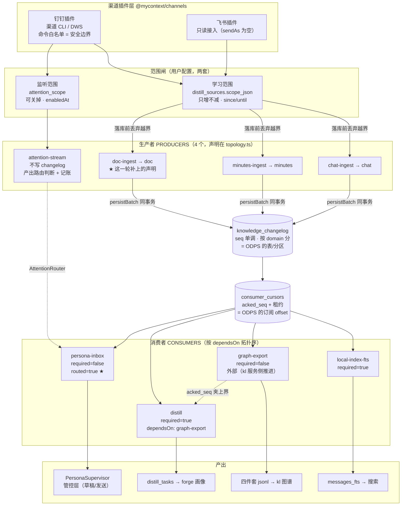
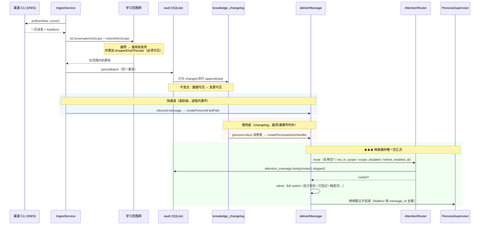
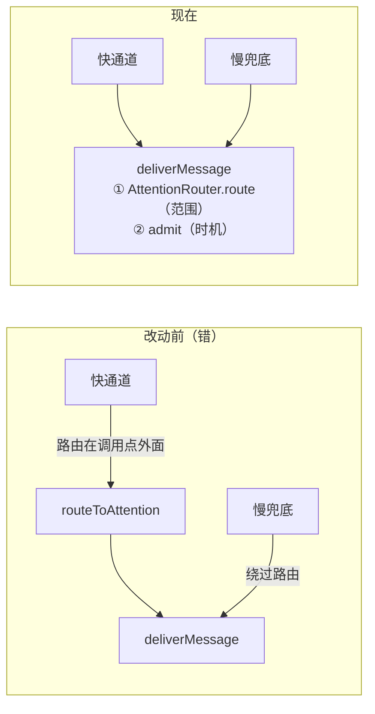
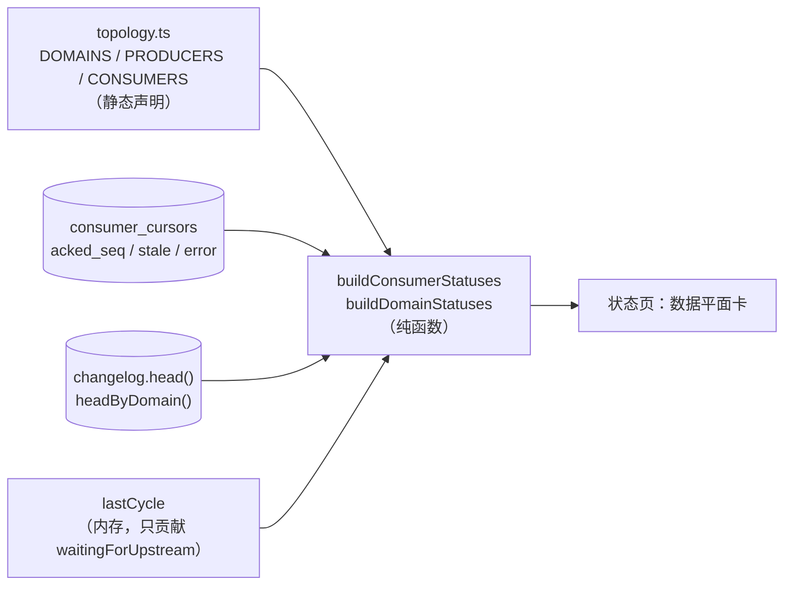
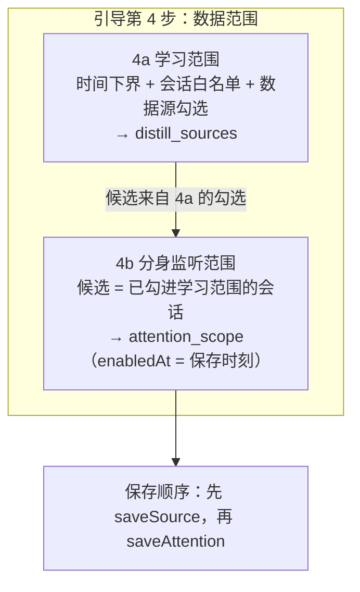

# 渠道数据平面架构（生产者 / 消费者 / 路由）

> 本文档描述**已实施**的架构。所有代码改动已落地并通过门禁 ——
> 4685 条测试全绿、`check:all` 中我改动范围内的项全过、smoke 通过。
>
> 主渠道是钉钉（走渠道 CLI / DWS），飞书按同一套契约接入（只读）。

---

## 0. 这次做了什么

上一版设计文档的结论是"骨架已在，补三个缺口"。四个阶段已全部实施：

| 阶段         | 做了什么                                                    | 落点                                                                                                                                                                                   |
| ------------ | ----------------------------------------------------------- | -------------------------------------------------------------------------------------------------------------------------------------------------------------------------------------- |
| **A** 正确性 | 路由下沉到 `deliverMessage()` —— 快通道与慢兜底共用一道闸   | `packages/store/src/attention-router.ts`（新）<br>`packages/persona/src/inbox-consumer.ts`                                                                                             |
| **B** 可见性 | 每个消费者的状态进快照 + 状态页拓扑卡 + 文档覆盖面（v29）   | `packages/ingest/src/topology-view.ts`（新）<br>`packages/store/src/repositories/{coverage-base,document-coverage}.ts`（新）<br>`apps/desktop/.../data-plane-topology-panel.tsx`（新） |
| **C** 可配置 | 引导第 4 步内部分两块：学习范围 + 分身监听范围              | `apps/desktop/.../onboarding/sources-step.tsx`<br>`apps/desktop/.../onboarding/onboarding-view.tsx`                                                                                    |
| **D** 收敛   | 域声明带 `producedBy` + 补 `doc-ingest` 生产者 + 一致性自检 | `packages/ingest/src/topology.ts`                                                                                                                                                      |

顺带修掉三个**在实施过程中显形**的既存问题（第 5 节）。

---

## 1. 领域模型：两个范围，各管一件事

|            | **学习范围**（learning）                                                  | **监听范围**（attention）                                |
| ---------- | ------------------------------------------------------------------------- | -------------------------------------------------------- |
| 回答的问题 | 往回挖多少历史、挖哪些会话                                                | 盯哪些会话的**新**消息                                   |
| 存储       | `distill_sources.scope_json`                                              | `attention_scope`（v28）                                 |
| 时间语义   | `since` / `until`（往回，可回溯）                                         | `enabledAt`（从此刻往后，**不回溯**）                    |
| 决定什么   | 什么数据**进库**（进而进 changelog）                                      | 什么数据**投给分身管控层**                               |
| 能不能变小 | **不能**（只增不减）                                                      | **能**（关掉 = `active=0`）                              |
| 消费者     | `local-index-fts` / `graph-export` / `distill`                            | `persona-inbox`                                          |
| 覆盖面表   | `chat_coverage`(v27) / `minutes_coverage`(v24) / `document_coverage`(v29) | `attention_coverage`（`routed`/`skipped`，无 `drained`） |
| 配置入口   | 引导第 4 步上半 + 设置页                                                  | 引导第 4 步下半 + 设置页                                 |

### 1.1 为什么"只增不减"只约束学习范围

判据是一句可复核的话：**缩小会不会让已有产出与配置矛盾？**

- 学习范围：图谱、画像、FTS 都派生自它。缩小之后图里仍然有那段被移出范围的
  知识 —— 配置说"我没学过这个群"，产出说"我学过"。两者矛盾且不报错。
- 监听范围：`attention_scope` 不引用任何消息数据；`disable` 只置 `active=0`
  不删行；`knowledge-feed` / `distill` / `persona` 三个包对这张表**零引用**。
  三条都成立 ⇒ 关掉它不可能让任何已有产出不自洽 ⇒ **可逆是对的**。

把两者混成同一条规则会得到一个荒谬结论：用户永远无法让分身停止盯某个群。

### 1.2 两个范围的联动（两层，缺一层都会漏）

「监听了但不采集」是一个**能配出来的坏状态**：`admit()` / `intake` 判"该不该回"
要读**历史**（`message_mentions`、这个会话之前的往来、对方在触发消息之后有没有
又说话）。所以分身会收到消息、却拿不到任何上下文，于是不回或回得离谱 ——
而用户完全看不出成因（他明明勾了监听）。

两层防护都在：

| 层                 | 在哪                                                | 做什么                                                                        |
| ------------------ | --------------------------------------------------- | ----------------------------------------------------------------------------- |
| **前置**（引导）   | `sources-step.tsx` 的 `attentionCandidates`         | 监听候选**只有已勾进学习范围**的会话 ⇒ 那个坏状态配不出来                     |
| **事后**（服务层） | `distill-source.service.ts` 的 `attentionScopeSave` | 勾监听 → 自动并入学习白名单（`source: 'learning'`），只增、记日志、界面标来源 |

设置页那条路没有"已勾选"这个上下文，所以事后那层不能去掉；引导里前置更好
（错误配不出来 > 事后补救）。

---

## 2. 架构

### 2.1 全景图



### 2.2 与 ODPS 的术语对应

| ODPS          | 这里                                              | 落点                            |
| ------------- | ------------------------------------------------- | ------------------------------- |
| 数据表 / 分区 | `knowledge_changelog`，按 `domain` 分             | `v2-raw-normalized`             |
| 生产者写分区  | `persistBatch()` → `ChangelogRepository.append()` | `packages/ingest/src/outbox.ts` |
| 订阅者 offset | `consumer_cursors.acked_seq`（带租约）            | `repositories/changelog.ts`     |
| 任务依赖 DAG  | `ConsumerSpec.dependsOn`                          | `topology.ts`                   |
| 数据质量卡点  | `required`（落后时不许裁历史）                    | `retention.ts`                  |
| 路由 / 分发   | `AttentionRouter`                                 | `store/attention-router.ts`     |
| 作业调度一轮  | `runCycle()`                                      | `topology.ts`                   |
| 元数据自检    | `checkTopologyConsistency()`                      | `topology.ts`                   |

### 2.3 一条消息的完整旅程（★ 路由的位置是这一轮改动的核心）



**路由与 `admit()` 仍然分开** —— 下沉的是"在哪调"，不是"合并成一个"：

| 谁    | 问的是                       | 变了会怎样                      |
| ----- | ---------------------------- | ------------------------------- |
| 路由  | 这条消息属于分身的关心范围吗 | 不属于 → 根本不该进管控层       |
| admit | 这条消息现在该触发一次回复吗 | 不该 → 进了但被丢弃，有理由可查 |

混成一个 reason 会让"范围外"与"暂时不回"用同一句话表达，而它们一个是配置
问题、一个是时机问题 —— 用户排查时需要的正是这个区别。

### 2.4 依赖闸：夹上界而不是干等

`distill` 引用图谱抽出的 fact。若蒸馏游标到 `seq=1000` 而 `graph-export` 只到
`200`，那段的 fact **还不存在** —— 蒸馏会照常"成功"、游标照常推进，
缺失**永久且静默**。

实现是把**批次上界**夹到上游 `acked_seq`：

- 夹上界：本轮仍处理上游已消化的那一段，慢上游只让下游按它的节奏走；
- 干等：两个消费者互相等待时会**死锁**，且一个慢上游会把整条链停住。

两条必须保留的取舍（都在 `consumer.ts`）：

- **上游没注册时不夹** —— 那说明这套部署没起 kl 服务，夹成 0 会让蒸馏永久停住；
- **"被夹住"的判据是"还有夹在外面的活"**，不是"刚好处理到上界"。

---

## 3. 阶段 A：路由下沉（正确性缺陷）

### 3.1 缺陷是什么

改动前路由在 `ingest.service.ts` 的 `inbound.message` 回调里 —— 那是**快通道**。
慢兜底（`persona-inbox` 消费者）的 `inbox-consumer.ts` 全文**零引用**
`attention_scope`。也就是用户勾的监听范围在那条路上不生效。

放大器：`inbound.message` 只在 `backfill !== true` 且 `changed.length > 0` 时
emit。本机历史早已采完（实测 62 个连续页全是 `changed:0 / unchanged:51`），
所以**快通道在真机上几乎不触发** —— 实际生效的多半正是没有路由的那条。

### 3.2 修法



判据：**`deliverMessage` 是两条路唯一的交汇点**。任何新增的第三条投递路径
也必然经过它，所以"忘了加路由"在结构上不可能。

`AttentionRouter`（`packages/store/src/attention-router.ts`）把"执行一次判据
所需的三件事"打包：名单空不空 / 取那一行 / 记账两侧。收益是 statement 复用
（逐条投递时每条都 `new Repository()` 在回溯 20 万条时是分钟级差别）。

`routeToAttention` 仍是纯函数、仍是判据真源 —— 这个类不替代它。

### 3.3 迁移期的正确一侧：名单为空 → 放行

`attention_scope` 是 v28 新表，存量用户是空的。空表判成"什么都不关心"会让
分身**整个静默** —— 用户看到"它不理人了"，日志里一个错都没有。

这一条与 `readCollectionScope` 的「没配过就什么都不采」方向**相反**，
而两者都对 —— 代价不对称的方向不同：

- 采集的默认值若放宽是**隐私事故**（采了用户没同意的历史）；
- 投递的默认值若收紧是**功能消失**（分身不干活，且无从排查）。

★ 名单空时**不记账**：那时的 routed/skipped 不代表用户配置的效果，
记进去会让"范围设窄了"与"还没配范围"在覆盖面上同形。

### 3.4 门禁：测试必须能抓到这个缺陷

`tests/integration/persona/attention-routing.test.ts` 被**重写**了。

上一版的 `routeOne()` 是把生产代码的判据组合**抄了一遍**（自己读
`activeCount`、自己调 `routeToAttention`、自己 `bump`）。于是它锁住的是
"三个零件各自能用"，而**不是**"它们真的挂在投递路上了" ——
那一版 5 条用例**全绿**，而慢兜底整条绕过监听范围。

现在直接调 `createPersonaInboxHandler`（慢兜底真 handler）与
`createPersonaFastPath`。**实测反证**：把 `deliverMessage` 里那道
`if (!route.routed)` 改成永真放行 ⇒ **4 条转红**（另 3 条是"应当放行"的
正向用例，去掉闸门当然还绿）。

同时发现并修掉一条**假绿**：原来那条"早于 enabledAt 的历史消息"用的是
30 天前的消息，而 `admit()` 里的 `MAX_GROUP_DRAFTABLE_AGE_MS`（群 24h）
会先把它拦掉 —— 破坏路由后它照样绿。改成 1 分钟前之后，
`before_enabled_at` 成为唯一可能的拒因。

`tests/unit/store/attention-scope.test.ts` 里那三条**源码文本断言**也重写了：
它们锁死了一个错的位置（路由在 `ingest.service.ts` 里）。现在行为门禁交给
集成测试，源码断言只锁**结构**（路由在 `deliverMessage` 里、两条路共用
同一份仓储、调用点不再各自实现一份）。

---

## 4. 阶段 B / C / D 的实施要点

### 4.1 拓扑可见性（阶段 B）

改动前快照里只有 `ftsLag` 一个数字与一行 `staleConsumers`。三对状况在界面上
**完全一样**，而用户该做的事完全不同：

| 看起来一样          | 实际是                                 | 该做什么         |
| ------------------- | -------------------------------------- | ---------------- |
| 蒸馏没进展          | 被 graph-export 夹住（依赖闸正常工作） | 去看图谱为什么慢 |
| 蒸馏没进展          | 蒸馏自己卡了                           | 去看蒸馏的错误   |
| graph-export 追平了 | 它压根没注册（没起 kl 服务）           | 起服务，或忽略   |

而原料**早就有了**：`CONSUMERS` 声明、`consumer_cursors` 表、`runCycle()` 的
返回值（含 `waitingForUpstream` / `absent`）—— 只是那个返回值原先**只进了日志**。



两条设计判据：

- **`lag` 从游标算，不从上一轮结果算**。进程刚起时 `lastCycle` 是空的，
  而游标里的进度仍然有效 —— 从上一轮取会让重启后显示"全部落后 0 条"（假的）。
- **`absent` 时 lag 报 0 而不是 `head`**。一个没注册的消费者"落后 8000 条"
  是一句没有意义的话，界面靠那个布尔说明情况。

`absent` 的判据是**游标里有没有这一行**，不是"上一轮跑没跑" ——
`graph-export` 不在 `runCycle` 的 runnables 里（那个 map 只有 vault 内的三个），
拿"上一轮没跑"当判据会让一个正常工作的外部消费者永远显示"不存在"。

### 4.2 文档覆盖面 v29 + 共用基类

消息（v27）与听记（v24）都有覆盖面，**文档一直缺着** —— 界面对文档只能给一个
总条数，说不出"这段日期齐没齐"。而"两类能回答、一类不能"是最难解释的状态。

`chat_coverage` 与 `document_coverage` 形状同构，而它们的读写有**五条判据**，
每一条抄错都是一次静默的数字错误：

| #   | 判据                                              | 抄错的后果                             |
| --- | ------------------------------------------------- | -------------------------------------- |
| ①   | `local_count` **累加**而非覆盖                    | 计数在轮次之间反复跳回小值             |
| ②   | `listed_total` 传 null 时 `COALESCE` **保留**旧值 | 实时流那条路把已知值清成 NULL = 丢信息 |
| ③   | `drained` **覆盖**（这一轮的结论）                | 曾经齐过的分区永远显示"已采完"         |
| ④   | 按天聚合用 `MIN(drained)` 而非 MAX                | 91 个会话里 90 个齐了就报"已采完"      |
| ⑤   | `markDaysDrained` 只 UPDATE 不 INSERT             | "这天没数据"与"这天采完 0 条"混成一个  |

所以抽了 `CoverageRepositoryBase`（`repositories/coverage-base.ts`），
**同一组用例对两张表都跑一遍**（`tests/unit/store/coverage.test.ts`）——
任何一条判据被改坏，两边一起红。

两处刻意不同：

- **分区语义**：聊天按会话翻页（"这个会话齐了"成立），文档按**空间**翻页
  （一篇文档不存在"翻完"）。所以不合并成一张物理表 —— 合表之后
  `markDaysDrained` 要按 kind 分叉，而"某些行的某列没有意义"最容易被读错。
- **重建路径**：`rebuildFromMessages` 在子类里，不进基类 —— 文档那侧的
  `workspace_id` 允许 NULL 而 v29 约定空串是默认空间，基类不该知道每张表的
  空值约定。

★ 基类的方法叫 `bumpPartition` 而非 `bump`：子类要用 `bump` / `markDrained` /
`listDays` / `summarize` 这几个**既有公开名字**（调用方与既有测试都用它们），
而 TS 不允许同名不同签名的重写（`TS2416`，第一版正是这么写的，11 条既有用例
连编译都过不了）。基类换名字 ⇒ **零调用方改动**。

### 4.3 引导第 4 步分两块（阶段 C）



**保存顺序有理由，不是随手写的**：`attentionScopeSave` 会把勾中的会话并入学习
白名单。若先存监听，那次并入写进 `distill_sources` 的 id 会被紧随其后的
`saveSource` **整份覆盖** —— 两次写都成功、日志里一个错都没有，
只是并入静默失效。这条顺序由 `tests/renderer/onboarding-attention-scope.test.tsx`
锁住。

界面上必须明说的三句话（都有测试锚定）：

1. **学习范围只增不减** —— 图谱已消费的历史撤不回；
2. **监听范围可以随时关掉** —— 不说的话用户会以为同一条规则也适用，于是不敢勾；
3. **一个都不勾 = 盯全部已学习的会话** —— 用户的直觉是"不勾就是不启用"，
   而存量行为（名单为空 → 放行）恰恰相反。

**候选为空时说清怎么办**（"先在上面勾选要学习的会话"）而不是给一个空列表 ——
空列表读起来像"坏了"，而真相是一个用户能立刻执行的动作。

### 4.4 域与生产者声明收敛（阶段 D）

两个"声明与事实不一致"的问题：

| 问题                                                    | 事实                                                                            | 修法                                               |
| ------------------------------------------------------- | ------------------------------------------------------------------------------- | -------------------------------------------------- |
| `contact` 域在 `CHANGELOG_DOMAINS` 里，但**没有生产者** | 通讯录属 PII，相关渠道命令不在白名单（CLAUDE.md §5）—— 不是排期问题，是边界问题 | `DomainSpec.producedBy: "absent"` + `absentReason` |
| `PRODUCERS` **漏了** `doc-ingest`                       | `normalizer.ts:289` 一直在产 `doc` 域                                           | 补上声明                                           |

为什么不把 `contact` 从类型里删掉：① `knowledge_changelog.domain` 是 TEXT 列，
历史库里可能已有 `contact` 行，从类型里摘掉会让读回的行变成一个类型上不存在的值
（只能靠 `as` 掩盖）；② `ChannelPlugin.capabilities.domains` 里钉钉自述了
`contact` —— 那是**渠道能力**（它确实有通讯录接口），与"我们有没有采集器"是
两件事。

新增 `checkTopologyConsistency()` —— 把拓扑变成**数据**的代价是"漏一行不会
编译失败"。三条判据：active 域必须有生产者、生产者投的域必须声明过、
消费者不该声明消费一个 absent 的域。

★ 只数 `scope: "learning"` 的生产者：`attention-stream` 不写 changelog
（它产的是路由判断），算进来会让一个只有 attention 生产者的域看起来"有人在产"，
而 changelog 里其实永远是空的。

---

## 5. 实施过程中显形的三个既存问题（一并修了）

这三个都不是我这次改动引入的，而是在**收敛的过程中**暴露出来的。

### 5.1 `IngestSnapshot` 有两份声明

`ingest.service.ts` 里有一份**手写的** `IngestSnapshot` 接口（约 110 行），
与 `@mycontext/ipc-contract` 里那份 zod schema 并行存在。两份声明描述同一个
对象，只能靠人同步。

加 `consumers` / `domains` 时立刻撞上：契约加了、这里没加，于是 `snapshot()`
报"consumers 不存在于 IngestSnapshot"，而 `data-plane.service` 那侧同时报
"缺 consumers" —— 同一次改动、两个方向相反的错误。

**更糟的是它们不一致时未必报错**：契约里加一个可选字段、这里不加，类型检查
照过，只是主进程永远不填它，而界面读到 undefined。

修法：主进程改成 `type IngestSnapshot = ContractIngestSnapshot`。
另加 `IngestSnapshotPart = Omit<…, "eventStream" | "perChannel">` ——
那两个字段由 `DataPlaneService` 填（长连接不在采集层，逐渠道汇总要跨多个
`IngestService`），让采集层给 `null` 占位就是让它对一件自己不知道的事表态。

### 5.2 契约里**缺** `scope` 字段

`IngestService.snapshot()` 一直在填 `scope`（范围闸的工作量：许可几个会话、
丢弃了多少条越界消息），而契约里**没有声明** —— 于是它是一个只存在于主进程
内存里的字段：IPC 传过去了，但渲染层的类型看不见它。

这正是 5.1 那两份声明漂移的产物。收敛时立刻显形，已补进契约。

### 5.3 引导第 4 步两处按钮/计数**同文案**

加监听范围块之后，「已选 N 个」与「清空」在同一屏出现了两份 —— 学习范围一份、
监听范围一份。

这不只是测试问题（`getByText(/已选 1 个/)` 命中两个节点、
`find(/清空/)` 点到了错的按钮），**用户也分不清哪个数属于哪个范围**。
而按错「清空」的代价不对称：清学习范围会**同时**把监听候选清掉。

改成「盯 N 个会话」/「取消全部监听」。

另外 `check:typography` 抓到我写了一个不存在的 className
（`typography-body-small-500`）—— 那种类不生成任何样式，文字会静默退回浏览器
默认字号且不报错。已改成 `typography-title-small-500`。

---

## 6. 扩展性：加一个新东西要改几处

| 要加什么     | 改哪里                                                                        | 处数 |
| ------------ | ----------------------------------------------------------------------------- | ---- |
| 新消费者     | `CONSUMERS` 加一行 + 一个 handler + `runnables` 注册一行                      | 3    |
| 新数据域     | `DOMAINS` + `CHANGELOG_DOMAINS` + 一个 `to*ChangelogEntry` + `PRODUCERS` 一行 | 4    |
| 新渠道       | 一个 `ChannelPlugin`（`meta.capabilities.domains` 自述）                      | 1    |
| 新覆盖面表   | 一个迁移 + 继承 `CoverageRepositoryBase` 的子类（只写改名转发）               | 2    |
| 新消费者依赖 | 那一行的 `dependsOn`                                                          | 1    |
| 消费者顺序   | **不用改**（`resolveConsumerOrder` 算出来）                                   | 0    |
| 快照字段     | **只改契约一处**（主进程从它派生）                                            | 1    |

### 6.1 加消费者那 3 处能不能压到 1 处

能，但**不该做**。做法是把 handler 工厂也放进 `ConsumerSpec`。代价是
`topology.ts` 会从"纯声明、可测试、不启动管线就能读"变成"要 import 四个包的
实现"—— 而那份声明现在能被单测直接锁住 id 与顺序，正是因为它没有副作用。

判据：3 处里有 2 处（handler、注册）是**真实的实现工作**，不是重复劳动。
真正的重复只有"声明 + 注册"这一对，而它由
`tests/unit/ingest/topology.test.ts` 那条"id 必须与真实常量一致"的断言兜住。

### 6.2 飞书怎么对齐

飞书是**只读接入**（`plugins/feishu/index.ts` 明写 no persona/send），
所以它只涉及三个消费者（fts / graph-export / distill），不涉及 `persona-inbox`。

1. 学习范围：飞书库的 `distill_sources` 必须有 chat 行 ——
   `readCollectionScope` 读不到那行时返回"一个都不采"（修过的正确方向），
   所以缺配置的表现是**停采**而不是超采；
2. 白名单是**per-channel** 的：一次只存一个渠道。跨库复制 `cid…` 会按一批
   不存在的 id 过滤 → 恒零；
3. 监听范围：`capabilities.sendAs` 为空 ⇒ 分身跑不了 ⇒ 那栏不显示；
4. 每渠道一个物理库、一份 `feedDirs`（少了它导出会落回主渠道目录互相覆盖）。

---

## 7. 不做什么（以及为什么）

| 不做                            | 理由                                                                                                                                                    |
| ------------------------------- | ------------------------------------------------------------------------------------------------------------------------------------------------------- |
| 重写 `OutboxConsumer`           | 租约抢占、从 `acked_seq` 重放、`required` 决定能不能裁历史、快/慢通道按 `message_id` 去重 —— 都是踩过坑才对的                                           |
| 把 changelog 换成真消息队列     | 单机桌面端、单进程消费。SQLite 的 `seq` + 租约已给了 offset 语义与抢占安全                                                                              |
| 让消费者并发跑                  | `dependsOn` 要求下游看到上游**这一轮**的结果。并发会让依赖闸读到上游**上一轮**的 `acked_seq`                                                            |
| 合并 kl-graph 与 forge 的导出器 | 两者 sink 天生不同（全量 `records.jsonl` 快照 vs 按时间窗切的 `distill_tasks`）。已合并的是**语料谓词**（`corpus-predicate.ts`）—— 那是真正重合的那一层 |
| 合并两张覆盖面表                | 分区语义不同（会话可"翻完"、文档不能）。共用**行为**、分开**存储**                                                                                      |
| 改 `kl-graph/` 下的任何东西     | 那是算法团队的仓库副本，改了会被同步覆盖                                                                                                                |
| 给覆盖面/lag 加百分比           | 分母在渠道 API 里不存在（`types.ts` 只有 `hasMore`/`nextCursor`）。编一个就是上次那句假的「才学了 0.0%」                                                |
| 让监听范围也"只增不减"          | 见 §1.1：那会让用户永远无法让分身停下来                                                                                                                 |
| 给 `contact` 做采集器           | PII 类命令不进白名单（CLAUDE.md §5）。标 `planned` 反而是一个不会兑现的承诺                                                                             |

---

## 8. 验证结果（都真的跑过）

### 8.1 门禁

```
pnpm vitest run --exclude 'tests/externals/**'   → 263 文件 / 4685 条全绿
npx tsc -b                                       → 干净（我的改动范围）
npx tsc -p tests/tsconfig.json                   → 干净（我的改动范围）
npx prettier --check .                           → All matched files use Prettier code style
npx eslint <我改动的目录>                          → 0 problems
node scripts/check-migration-checksums.mjs       → ✓ 已发布迁移的 schema 未被改动（本机 5 个库对账）
node scripts/check-trademarks.mjs                → 通过
node scripts/check-package-wiring.mjs            → 通过（14 个包）
node scripts/check-typography-classes.mjs        → 我引入的那条已修
node scripts/check-{desktop-bundle,kl-skill-sync,figure-slots-sync,gate-parity}.mjs → 全 OK
node scripts/smoke.mjs                           → SMOKE_OK
```

### 8.2 反证（"这些测试真的能抓到缺陷"）

| 破坏什么                                                 | 结果                                            |
| -------------------------------------------------------- | ----------------------------------------------- |
| 把 `deliverMessage` 里 `if (!route.routed)` 改成永真放行 | **4 条转红**（慢兜底 3 条 + 两条路一致性 1 条） |
| 把监听候选从"已勾选的"改成"整个列表"                     | **2 条转红**                                    |
| `PRODUCERS` 删掉一行 / `DOMAINS` 标错 `producedBy`       | `checkTopologyConsistency` 的 4 条用例转红      |

### 8.3 未做的验证（如实说明）

- **没有在真机上跑过完整应用**（没起 Electron 看界面）。UI 侧由 656 条渲染层
  测试覆盖，但"打开状态页看到拓扑卡长什么样"没有实测过；
- `check:no-local-data` 全仓扫描超过 2 分钟被我掐了。我改用正则单独扫了我新增
  的文件（真实 ID 形态、本机路径、邮箱、手机号），无命中 —— 但那不等于整仓
  门禁绿了。**在有真实数据的机器上跑过才算**（CLAUDE.md §1.3）；
- `check:vendor-clean` 报 `__pycache__` 副产物 —— 那是既存状态（`find vendor
-name __pycache__ -exec rm -rf {} +` 可清），与本次改动无关；
- 仓库里有**并发进程**在改别的功能（存储维护、图谱 facts）。它们的在途状态
  造成过一些无关的 typecheck/lint 报错（`kl-server.service.ts` 2 条 lint、
  `tests/externals/ego-graph-real.test.ts` 若干），我逐条确认过 `git diff` 为空
  （不是我引入的），没有去改它们。

---

## 9. 代码位置索引

| 概念                             | 文件                                                                                                 |
| -------------------------------- | ---------------------------------------------------------------------------------------------------- |
| 拓扑声明 + 自检                  | `packages/ingest/src/topology.ts`                                                                    |
| 拓扑展示视图（纯函数）           | `packages/ingest/src/topology-view.ts`                                                               |
| 消费者骨架（租约/重放/依赖闸）   | `packages/ingest/src/consumer.ts`                                                                    |
| 生产者写入（同事务）             | `packages/ingest/src/outbox.ts`                                                                      |
| 采集调度 / 回填                  | `packages/ingest/src/scheduler.ts`                                                                   |
| 学习范围（唯一权威）             | `packages/store/src/collection-scope.ts`                                                             |
| 学习范围只增合并                 | `apps/desktop/src/main/services/distill-source.service.ts` `mergeScopeOnlyGrowing`                   |
| 监听范围表 + 纯判据              | `packages/store/src/repositories/attention-scope.ts`                                                 |
| **监听范围路由器**（两条路共用） | `packages/store/src/attention-router.ts`                                                             |
| 覆盖面共用基类                   | `packages/store/src/repositories/coverage-base.ts`                                                   |
| 聊天覆盖面                       | `packages/store/src/repositories/chat-coverage.ts`                                                   |
| 文档覆盖面                       | `packages/store/src/repositories/document-coverage.ts` + `migrations/vault/v29-document-coverage.ts` |
| 听记覆盖面                       | `packages/store/src/repositories/media-minutes.ts`                                                   |
| 语料谓词（两个消费者共用）       | `packages/store/src/corpus-predicate.ts`                                                             |
| 消费者接线 / runCycle / 快照     | `apps/desktop/src/main/services/ingest.service.ts`                                                   |
| 图谱消费者                       | `packages/knowledge-feed/src/graph-sync.ts`                                                          |
| 蒸馏消费者                       | `packages/distill/src/consumer.ts`                                                                   |
| **分身消费者（路由在这）**       | `packages/persona/src/inbox-consumer.ts`                                                             |
| 引导（两个范围）                 | `apps/desktop/src/renderer/features/onboarding/sources-step.tsx`                                     |
| 设置页（两个范围）               | `apps/desktop/src/renderer/features/shell/collection-scope-panel.tsx`                                |
| 状态页拓扑卡                     | `apps/desktop/src/renderer/features/shell/data-plane-topology-panel.tsx`                             |

### 测试

| 锁什么                             | 文件                                                  |
| ---------------------------------- | ----------------------------------------------------- |
| 慢兜底真的过路由（行为）           | `tests/integration/persona/attention-routing.test.ts` |
| 路由挂在交汇点（结构）             | `tests/unit/store/attention-scope.test.ts`            |
| 拓扑声明自洽 + 顺序算出来          | `tests/unit/ingest/topology.test.ts`                  |
| 三对"同形但出路相反"的状态可区分   | `tests/unit/ingest/topology-view.test.ts`             |
| 覆盖面五条判据（两张表同跑）       | `tests/unit/store/coverage.test.ts`                   |
| 引导监听范围（候选/文案/保存顺序） | `tests/renderer/onboarding-attention-scope.test.tsx`  |
