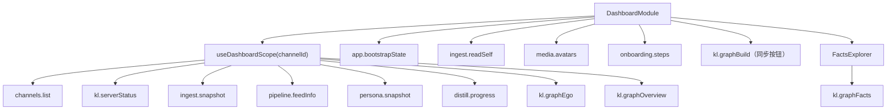
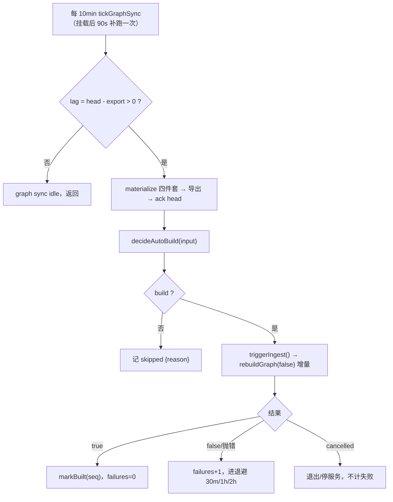

# 仪表盘、KL 接口与建图机制

> 本文档基于代码实测整理（引用格式 `path:line`）。KL（知识图谱 kl-server）是算法团队仓库副本，只读不改，其接口按 `kl-graph/kl_server.py` 现有代码陈述。
>
> 覆盖三块：① 仪表盘展示了什么、用了哪些接口、还能展示什么；② kl-server 全部 HTTP 接口与桌面端封装；③ 建图的全量/增量、触发时机、间隔配置。

---

## 一、仪表盘（Dashboard）

仪表盘是**唯一一页**，入口 `DashboardModule`（`apps/desktop/src/renderer/features/dashboard/dashboard-module.tsx:106`）。全部数据从一个聚合 hook 来：`useDashboardScope(activeChannelId)`（`use-dashboard-scope.ts:137`）。页头 `ScopeChip`（`scope-chip.tsx:46`）选渠道，页面每个数字都跟着当前渠道走。

### 1.1 数据收口：一个 scope hook 汇总多个接口

`useDashboardScope`（`use-dashboard-scope.ts:153-190`）聚合：

| 子 hook | IPC 通道 | 返回类型 | 契约位置 |
|---|---|---|---|
| `useChannels()` | `channels.list` | `ChannelSummary[]` | `contract.ts:1945` |
| `useKlServerStatus()` | `kl.serverStatus` / `kl.onStatus` | `KlServerStatus` | `contract.ts:2891` |
| `useIngestSnapshot(true)` | `ingest.snapshot` | `IngestSnapshot` | `contract.ts:2146` |
| `useFeedInfo(true, channelId)` | `pipeline.feedInfo` | `FeedInfo` | `contract.ts:2716` |
| `usePersonaSnapshot(true)` | `persona.snapshot` | `PersonaSnapshotView` | `contract.ts:1074` |
| `useDistillProgress(true)` | `distill.progress` | `DistillProgressView` | `contract.ts:1016` |
| `useKlGraphEgo(building, channelId)` | `kl.graphEgo` | `KlGraphEgo` | `contract.ts:3285` |
| `useKlGraphOverview(building, channelId)` | `kl.graphOverview` | `KlGraphOverview` | `contract.ts:3128` |

页面顶层还直接调：`useOnboardingSteps()`（`:168`）、`useBootstrapState()`（`:171`）、`useSelfIdentity()`（`:225`）、`useContactAvatars()`（`:239`）、`useAdoptableSession()`（`:360`）、`useKlGraphBuild()`（`:119`）、`useKlGraphFacts()`（经 `FactsExplorer`，`facts-explorer.tsx:84`）。



### 1.2 六个 UI 区域展示什么

| 区域 | 展示内容 | 主要接口来源 |
|---|---|---|
| ① 问候行 | 头像 + 「下午好，{账号名}」 | `channels.list`（`status.userName`）+ `media.avatars` + `ingest.readSelf`（openId） |
| ② 六个清点数 | 会话 / 图片与文件 / 消息（来自 `ingest.snapshot`）；认识的人和事物 / 记住的事 / 关系（来自 `kl.graphOverview` 的 entities/facts/edges） | `ingest.snapshot` + `kl.graphOverview` |
| ③ 数字分身卡 | 形象+名字+运行状态点+四数（待确认/可自动回复/正在排队/常驻会话） | `persona.snapshot` + `onboarding.steps`（名字形象） |
| ④ 问题提示行 | 身份未确认 / 采集问题 / 听记覆盖 / 分身降级 四类 ProblemLine | `ingest.snapshot` + `channels.adoptableSession` |
| ⑤ 「它认识的人与事」 | 建图详情 popover + 「同步」按钮 + Ego 关系图 + 邻居列表 + 实体类型分布 + 事实检索（FactsExplorer） | `kl.graphOverview` + `kl.graphEgo` + `kl.graphBuild` + `kl.graphFacts` |
| ⑥ 三块统计图（TrendsSection） | **已下线**：调用点被注释（`dashboard-module.tsx:722`），组件/hook/IPC 全保留 | `dashboard.trends`（未拉取） |

### 1.3 信息展示完整度：已返回但仪表盘没用的字段

这是"还能展示什么"的直接依据——接口已返回、白拿，只是没渲染：

- **`KlGraphOverview`**（已拉取，`contract.ts:3128`）:
  - `topEntities[]`（name/type/mentions）——全图最常被提到的人/系统排名（现邻居排名只靠 ego 边权推导）。
  - `recentFacts[]`（text/type/confidence/at）——"图里最新知道的几件事"。
  - `chunks` / `messages`——图侧已切块数 vs 消息数，可显消化率。
  - `lastBuild.unitsDiscovered`；`buildSchedule.maxAgeMs` / `lastBuiltAt` / `syncIntervalMs`。
- **`PersonaSnapshotView`**（已拉取，`contract.ts:1074`）:
  - `degradedReason`——降级**具体原因码**（`llm_not_configured` / `opencode_missing` / `opencode_too_old:*`）。现降级文案是本地重判，可换成精确指引。
  - `generating[]`——"分身此刻正在为哪些会话生成"，可显实时活动。
  - `residents[]` 的具体会话（现只显数量）。
- **`IngestSnapshot`**（已拉取，字段最丰富，`contract.ts:2146`）:整套 `consumers[]`（数据平面拓扑）、`backfill`（采集范围 vs 实际覆盖，"还差 N 天"）、`scope`（越界丢弃计数）、`eventStream`（实时通路健康/投递数/订阅覆盖）、`storage`（库体积/向量数）、`unjudged`、`ftsIndexed` 等。**当前仅在「运行状态」页展示**——是产品刻意的"仪表盘只答能不能用"。
- **`KlGraphFacts`**:`facts[].confidence`（每条事实置信度）未展示。
- **`AuthStatus`**:`daysUntilRefreshExpiry`（可做"授权 N 天后过期"提醒）。
- **`DashboardTrends`**（整份下线）:节律曲线、消化漏斗五级、三组覆盖度——恢复 = 去掉 `dashboard-module.tsx:722` 那行注释。

> ⚠️ 注释保质期风险（CLAUDE.md §4）：`describeKl`（`dashboard-data.ts:329`）仍读 `KlServerStatus.buildProgress`，而契约（`contract.ts:2922`）明确该字段"Phase B 恒 40%、别渲染进度"。目前仪表盘副标题只用 `klView.text` 未渲染百分比，未违反；若将来渲染其百分比会踩坑。

---

## 二、KL（kl-server）接口全集

服务是**单文件 FastAPI 应用** `kl-graph/kl_server.py`（约 3725 行）。桌面端在 `apps/desktop/src/main/services/kl-server.service.ts` 用 `fetch` 直连 `http://127.0.0.1:{port}`，**全仓库只用到 5 个端点**。`graph-query.service.ts` 不自己发 HTTP，而是通过回调委托给 `KlServerService`。

### 2.1 端点总表（23 个，桌面端用 5 个）

| 方法 | 路径 | 入参 | 返回关键字段 | 用途 | 桌面端 |
|---|---|---|---|---|---|
| GET | `/status` `kl_server.py:1066` | 无 | `graph_backend`、`knowledge:{messages,entities,facts,edges}`、`ingest:{state,phase,percent}` | 健康+后端无关统计+ingest 进度 | ✅ `defaultReadStatus:3254` |
| GET | `/health` `:3607` | 无 | `{status:"ok"/"starting"}` | 快速探活（warmup 回 starting） | ✅ `defaultProbeHealth:3148` |
| POST | `/ingest` `:1234` | `input_dir`,`source_id`,`concurrency`,`improve_mode` | `{status,run_id,ingest}` | 扫本地目录、增量建图 | ✅ `defaultPostIngest:3225` |
| POST | `/facts` `:2333` | `entity_id` 或 `fact_id`,`limit=20` | `facts:[{id,text,type,timestamp,confidence}]` | 某实体的 ABOUT facts | ✅ `factsOfEntity:2765` |
| POST | `/entity` `:2105` | `name` 或 `entity_id`,`limit`,`include_similar` | `results:[{id,name,type,mentions,degree,edges[≤5],facts[≤5],similar}]` | 实体查找+直连边 | ✅ `neighborsOfEntity:2869` |
| GET | `/capabilities` `:1172` | 无 | `{schema_version,features,commands}` | 上报启用的命令面 | ❌ |
| POST | `/improve` `:1274` | `mode:"full"` | `{status,run_id,ingest}` | 不扫源、只做全图维护（社区/优化） | ❌ |
| POST | `/search` `:1586` | `query`,`collection`,`top_k`,`min/max_timestamp` | `{results:[{id,score,payload}],latency_ms}` | 单集合向量检索 | ❌ |
| POST | `/ask` `:1679` | `query`,`top_k`,`intent`,`radius`,`max_fanout`… | `{answer,items,phase,graph,graph_mermaids,cursor}` | 混合问答+交互式图游走（GraphRAG local） | ❌ |
| POST | `/global_search` `:1812` | `query` | `{answer,communities,citations,diagnostics}` | 基于社区摘要的全局问答 | ❌ |
| POST | `/neighbors` `:2434` | `nodes[]`,`edge_types`,`direction`,`limit_per_node`,`cursor` | `{results:[{node,edges,total,has_more}],cursor}` | 批量、可过滤、分页的精确邻接 | ❌ |
| POST | `/expand` `:2298` | `entity_id` | `{neighbors:[{id,name,confidence}]}` | **已废弃**（只给 ENTITY_SIMILAR） | ❌ |
| POST | `/community` `:2610` | `level="L1"`,`community_id`,`top_k` | `communities:[{community_id,title,summary,tags,rating}]` | 浏览社区及摘要 | ❌ |
| POST | `/members` `:2752` | `community_id`,`level`,`limit` | `members:[{id,name,type,mentions}]` | 列社区成员 | ❌ |
| POST | `/context` `:2800` | `fact_id` | `{fact,source_chunk,source_message,entities,surrounding}` | 一条 fact 的溯源 | ❌ |
| POST | `/timeline` `:2926` | `entity_name`,`from_date`,`to_date`,`limit` | `{entity,facts,auto_filtered}` | 某实体的时序 facts（高度数默认近 90 天） | ❌ |
| POST | `/path` `:3645` | `source`,`target`,`max_hops`,`all_paths` | `{paths:[{nodes,edges,hop_count}]}` | 两实体间最短关系路径 | ❌ |
| POST | `/graph_hop` `:3498` | `node_id`,`cursor`,`max_fanout` | `{graph,graph_mermaids,cursor}` | 从游标再展开一跳（无 LLM/embed） | ❌ |
| POST | `/chunk` `:3557` | `chunk_ids[]` | `{chunks:[{id,content,source_type,timestamp}]}` | 按 id 批量读原文 | ❌ |
| POST | `/requests` `:3046` | `date`,`timezone`,`limit` | `requests:[{...,requester,recipient}]` | 发给当前用户的 REQUEST 类 facts | ❌ |
| POST | `/todos` `:3053` | 同上 | `todos:[...]` | 发给当前用户的 ACTION_ITEM 类 facts | ❌ |
| POST | `/ingest/stop` `:1556` | 无 | `{quiesced,store_paths}` | 优雅停 ingest 并释放 DB 句柄 | ❌ |
| GET | `/ingest/recovery-info` `:1525` | 无 | `{recovery_tier:"ok"/"resume"/"cleanup"}` | 续传/恢复状态 | ❌ |
| GET | `/ingest/{run_id}/failures` `:1134` | `limit`,`cursor` | `{failures:[{extraction_item_id,error_type,message}]}` | 一轮 ingest 的失败清单 | ❌ |

### 2.2 桌面端 5 个封装方法

全在 `apps/desktop/src/main/services/kl-server.service.ts`：

1. `factsOfEntity(entityId, limit=500)`（`:2765`）→ `POST /facts`。**ego 图关系的唯一真源**；未就绪先 `ensureReady()`；失败**抛错而非返回空集**（避免把"读不到"记成"没有"）。解析字段是 `results`（`:2812` 注释记了曾读错字段导致恒空的事故）。
2. `neighborsOfEntity(entityId)`（`:2869`）→ `POST /entity`，读响应的 `edges`；按 id 从 `results` 精确找回自己那行。
3. `defaultReadStatus(port)`（`:3254`）→ `GET /status`，读 ingest 进度 + 图规模。
4. `defaultPostIngest(port, exportDir, sourceId)`（`:3225`）→ `POST /ingest`；请求体由纯函数 `buildIngestRequestBody`（`:3218`）产出，**严格只有 `{input_dir, source_id}` 两个键**（上游 `extra="forbid"`，多一键就 422）。
5. `defaultProbeHealth(port)`（`:3148`）→ `GET /health`，warmup 轮询。

### 2.3 关键实测结论：关系边必须走 HTTP，不能读 SQLite

`kl-server.service.ts:2745-2749`：`ABOUT` 边（fact↔entity）在默认后端 **ladybug** 下**不在 SQLite 里**——`SELECT COUNT(*) FROM edges` 恒 0，而 `/status` 同时报 `edges: 26558`。故边数/关系必须问 kl 的 backend-aware HTTP 接口。选 `/facts` 而非 `/entity`：后者 ABOUT 边被上游硬编码 `edges_out[:5]` 截断到 5 条，`/facts` 的 `limit` 可放大（实测 `limit=500` 单次 1.2ms）。

### 2.4 未接的潜在能力（18 个）

面向问答/溯源/时间线/路径/待办的检索能力桌面端完全没接：`/ask`、`/global_search`、`/search`、`/context`、`/timeline`、`/path`、`/neighbors`、`/community`、`/members`、`/chunk`、`/graph_hop`、`/requests`、`/todos`。运维类未接：`/capabilities`、`/improve`、`/ingest/stop`、`/ingest/recovery-info`、`/ingest/{run_id}/failures`。`/expand` 已废弃。

---

## 三、建图机制：触发、间隔、全量 vs 增量

### 3.1 三段水位（语义不同）

`packages/knowledge-feed/src/graph-sync.ts` 里三个独立游标：

| 游标 | 含义 | 来源 |
|---|---|---|
| `head` | changelog 当前 head，"数据采到哪" | `changelog.head()` `graph-sync.ts:267` |
| graph-export 游标 | "导出到哪个 seq"（四件套物化到哪） | `GRAPH_SYNC_CONSUMER_ID="graph-export"` `:60` |
| graph-build 游标 | "上次成功建图到哪个 seq" + 时刻 | `GRAPH_BUILD_CONSUMER_ID="graph-build"` `:78` |

`decideAutoBuild` 的 `ackedSeq` 传 **head**；`lastBuiltSeq/lastBuiltAt` 来自 graph-build 游标（`buildWatermark()` `:178`）。

### 3.2 常量与阈值表

| 常量 | 值 | 含义 | 出处 | 用户可配 |
|---|---|---|---|---|
| `AUTO_BUILD_LAG_THRESHOLD` | **500 条** | 攒够多少条新消息触发 | `auto-build.ts:57` | 否 |
| `AUTO_BUILD_INITIAL_WINDOW_MS` | **14 天** | 首次建图最小数据跨度上限 | `auto-build.ts:77` | 间接（学习范围可缩短要求） |
| `AUTO_BUILD_MAX_AGE_MS` | **24 小时** | 有新数据时，攒够多久兜底触发 | `auto-build.ts:80` | 否 |
| `AUTO_BUILD_MIN_INTERVAL_MS` | **1 小时** | 两次建图最小冷却（缺省） | `auto-build.ts:92` | **是**（15min–6h） |
| `AUTO_BUILD_BACKOFF_MS` | **[30min, 1h, 2h]** | 连续失败退避阶梯 | `auto-build.ts:101` | 否 |
| `GRAPH_SYNC_INTERVAL_MS` | **10 分钟** | 图谱同步周期 | `feed.service.ts:156` | 否（0=关） |
| `GRAPH_SYNC_CATCH_UP_MS` | **90 秒** | 挂载后补跑延迟 | `feed.service.ts:165` | 否 |

失败退避 `autoBuildBackoffMs(failures)`（`auto-build.ts:104`）：第 1 次失败→30min，第 2 次→1h，第 3 次起→2h 封顶。**退避状态只在内存**（`graph-sync.ts:152`），进程重启即清零（填完 key 重启后立刻重试）。

### 3.3 定时器时序（`FeedService.attach` `feed.service.ts:395-430`）

1. `setInterval(tickGraphSync, 10min)`；
2. **立刻跑一轮**——但挂载那刻 `head===ackedSeq`，采集写第一条比它晚约 3 秒，故这轮**必然白跑**；
3. **90 秒后补跑一次**（比满 10 分钟早），让首次建图不推迟一整个周期。

`tickGraphSync` → `sync.runOnce()`（`graph-sync.ts:277`）：`lag===0` 直接返回；否则先 `materialize()` 全量物化四件套、导出成功再 ack 到 head；仅当有 `triggerIngest` 时调 `decideAutoBuild`，`build` 为真则 `await triggerIngest()`。



### 3.4 `decideAutoBuild` 决策分支（`auto-build.ts:269-358`，顺序短路）

| # | 判据 | reason |
|---|---|---|
| 1 | `!enabled` | `disabled` |
| 2 | `!ready`（上一轮在建） | `build-in-progress` |
| 3 | `failures>0 && 未过退避` | `backoff`（**排在首次之前**，否则没配 key 的新用户每轮重试） |
| 4 | `!graphExists && ackedSeq===0` | `no-new-data` |
| 5 | `!graphExists && 初始窗口未够` | `awaiting-initial-window` |
| 6 | `!graphExists`（其余） | **first-build（建）** |
| 7 | `graphExists && 新消息===0` | `no-new-data` |
| 8 | `距上次建图 < minInterval` | `min-interval`（**必须在 lag 之前**，否则冷却永不生效） |
| 9 | `新消息 >= 500` | **lag-threshold（建）** |
| 10 | `距上次建图 >= 24h` | **max-age（建）** |
| 11 | 兜底（有新数据但没攒够、没到 maxAge、过了冷却） | `below-threshold` |

新消息数 `newMessages = max(0, ackedSeq - lastBuiltSeq)`。首次「初始窗口」`initialWindowReady`（`auto-build.ts:133`）：`collectionComplete`（历史导入到位）**或** 拿不到最早时刻 **或** `now - firstDataAt >= min(14天, 学习范围)`——只拦"范围长 + 刚开始采 + 还没采满"。

`forecastAutoBuild`（`auto-build.ts:384`）给界面预测：`messagesToThreshold = max(0, 500 - 新消息)`；`etaMs` 按 reason 分档（backoff→退避剩余；awaiting-initial-window→窗口剩余；min-interval→冷却剩余；below-threshold→距 maxAge）。

### 3.5 触发门控（装配层 `startup.ts`）

自动建图开启的前提，纯函数 `autoBuildAllowed(base, key, identityBound)`（`startup.ts:223`）：
```
return base !== "" && key !== "" && identityBound
```
即 **有凭证（base+key 非空）+ 已绑主渠道身份**。凭证经 `resolveKlCredentials`（`startup.ts:197`，先读设置 KL 专用项、再兜底真实 env）。

**主渠道**四个 getter（`startup.ts:487-600`）：
- `enabled` = `autoBuildAllowed(...)`，其中 `identityBound = activeIdentity.currentProfile("dingtalk") !== undefined`；
- `ready` = `!klServer.status().building`；
- `graphExists` = `klServer.graphExists()`（**必须**，不能用 `graphOverview().available`——会与 buildSchedule 互递归，实测 1.7GB 日志/主进程停摆，`:553-566`）；
- `trigger` = `await klServer.rebuildGraph(false)`（增量）。

**各渠道** getter（`startup.ts:1486`）：`enabled` 只判凭证（不含 identityBound——非主渠道本就登录后才 mount，天然门控）。

> 这套门控保证：未登录/未绑身份时**不触发建图 → 不起 kl-server → 不刷 LLM 报错**（历史 bug 的修复点）。手动点建图走独立入口，不经过这里。

### 3.6 全量 vs 增量

| 入口 | 调用 | fresh | 出处 |
|---|---|---|---|
| 自动建图 trigger | `rebuildGraph(false)` | 增量 | `startup.ts:568` / `:1501` |
| 「建图/同步」按钮 | `rebuildGraph(false)` | 增量 | `feed.service.ts:650` |
| 改采集范围 `onScopeChanged` | `rebuildGraph(true)` | **全量** | `startup.ts:768` |
| 清空渠道数据后重建 | `rebuildGraph(true)` | **全量** | `startup.ts:629` |

`KlServerService.rebuildGraph(fresh)`（`kl-server.service.ts:689`，语义 `:676`）：

| 维度 | `fresh=false`（增量，默认） | `fresh=true`（清库重来） |
|---|---|---|
| 前置校验 | 无 | `freshRebuildBlocker()` 清库前必过（导出目录有数据+网关已配）`:750` |
| 停 server | **不停**，交跑着的 server `POST /ingest` | **必须先 stop**（删被 mmap 打开的文件）`:798` |
| 清图库 | 不清 | `wipeGraphData()`：删 knowledge.db / qdrant_data / graph.ladybug / 所有 ingest_checkpoint / extraction_cache `:1851` |
| 抽取缓存 | 保留（命中的消息不重抽，只对新消息烧 LLM） | 清掉（否则改了范围也不会重抽） |
| 水位 | 建成后 `markBuilt(ackedSeq)` | 清库后须 `resetBuildWatermark()`→游标归 0（否则"待建 N 条"只算清库后新采，实测差两个数量级） |

**kl 侧 ingest 两阶段**（kl-graph 只读，据日志与代码）：
- **Phase A: CHUNKING**（`pipeline.py:1030`）——load 源 → 持久化 chunks → embed 向量化，**无 LLM**。smart-resume：`_phase_a_complete` 要求 persisted/embedded 都到位；新消息使 expected 变大 → Phase A 重跑。
- **Phase B**（LLM）——B.1 抽取（按 cache key 缓存）、B.2 建图。缓存命中的 chunk 不重抽。
- `improve_mode` 桌面端不发（只发 `{input_dir, source_id}`）→ 走服务端默认 `"auto"`（`kl_server.py:921`）：有 full baseline 则 incremental、否则 full。

> ⚠️ 过时注释（CLAUDE.md §4）：`auto-build.ts:20-23` 文件头称 kl `_embed_chunks` 无条件全量 embed、"每来一条新消息就烧 50 分钟"。但当前 kl 代码 `pipeline.py:1800-1811` 已 `qdrant.existing_ids` **跳过已 embed 的 chunk**（"Skipping N already-embedded chunks (resume)"）——那条成本推断在当前 kl 版本已不成立。

**为何清空/收窄范围必须 `fresh=true`**（`startup.ts:629-633`）：增量建图只往图里加，删掉的会话留在图里的实体与事实**不会消失**——数字人检索时仍会引用已取消勾选的群里的事，且界面看不出来。故必须全量重抽（清图库+清 checkpoint+清抽取缓存+清水位）。

### 3.7 完整间隔/节流矩阵

| 项 | 默认 | 可配范围 | 出处 |
|---|---|---|---|
| 图谱同步周期 | 10 min | 0=关 | `feed.service.ts:156` |
| 挂载补跑延迟 | 90 s | — | `feed.service.ts:165` |
| 条数阈值 | 500 条 | — | `auto-build.ts:57` |
| 首次初始窗口 | 14 天（`min(14d, 学习范围)`） | — | `auto-build.ts:77` |
| 时间兜底 | 24 h | — | `auto-build.ts:80` |
| 建图最小间隔（冷却） | 1 h | **15min–6h**（`graphBuildMinIntervalMs`，档位 `ingest-intervals-panel.tsx:58`，schema `contract.ts:2629`） | `auto-build.ts:92` |
| 失败退避 | 30m/1h/2h | 三档封顶 | `auto-build.ts:101` |

> ⚠️ `graphBuildMinIntervalMs`（用户可配）**主渠道装配处当前未接**该 getter（`startup.ts:539-547` 注释说 rebase 后换成失败退避机制），故主渠道实跑缺省 1h；字段通道保留待接（`feed.service.ts:131`）。各渠道同。

采集类周期（非建图，`data-plane.service.ts:163-175`）：探针 10s（退避到 120s）、拉取 2min、听记 30min、文档 60min、活跃扫描 30s。

---

## 附：hook → IPC → 类型 速查

| hook | IPC | 类型 |
|---|---|---|
| `useKlGraphOverview` | `kl.graphOverview` | `KlGraphOverview` |
| `useKlGraphEgo` | `kl.graphEgo` | `KlGraphEgo` |
| `useKlGraphFacts` | `kl.graphFacts` | `KlGraphFacts` |
| `useKlGraphBuild` | `kl.graphBuild` | `KlGraphBuildResult` |
| `useKlServerStatus` | `kl.serverStatus`/`kl.onStatus` | `KlServerStatus` |
| `useIngestSnapshot` | `ingest.snapshot` | `IngestSnapshot` |
| `usePersonaSnapshot` | `persona.snapshot` | `PersonaSnapshotView` |
| `useFeedInfo` | `pipeline.feedInfo` | `FeedInfo` |
| `useDistillProgress` | `distill.progress` | `DistillProgressView` |
| `useDashboardTrends`（下线） | `dashboard.trends` | `DashboardTrends` |
| `useSelfIdentity` | `ingest.readSelf` | `SelfIdentityView` |
| `useContactAvatars` | `media.avatars` | `ContactAvatarView[]` |
| `useBootstrapState` | `app.bootstrapState` | `BootstrapState` |
| `useOnboardingSteps` | `onboarding.steps` | `OnboardingStepView[]` |
| `useChannels` | `channels.list` | `ChannelSummary[]` |
| `useAdoptableSession` | `channels.adoptableSession` | `{corpName,userName}\|null` |

